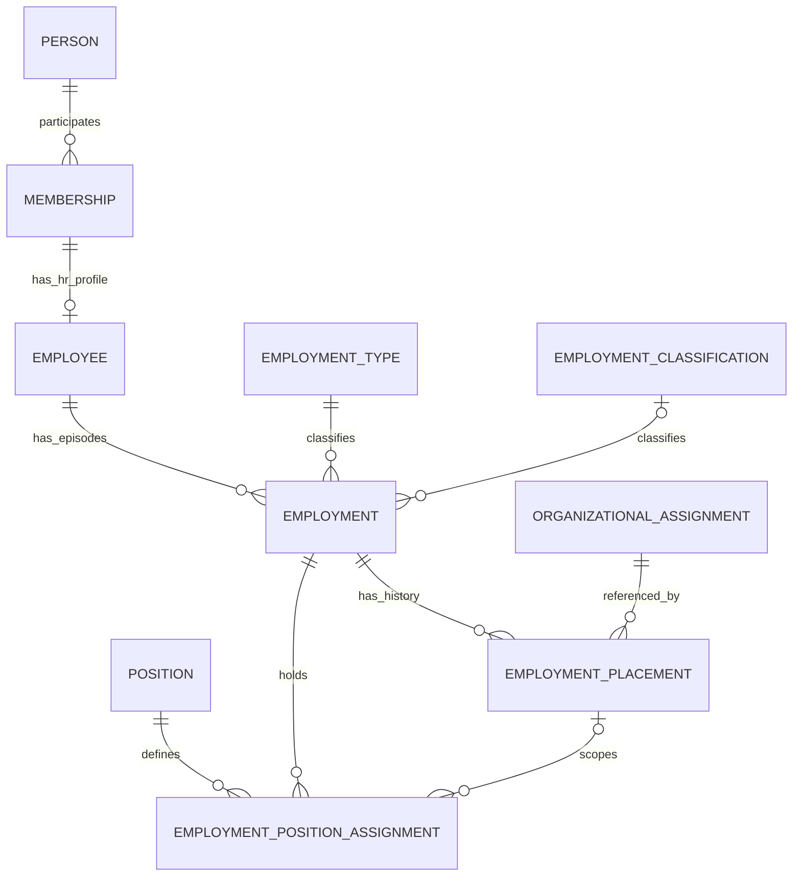

# HR-002 — Workforce Foundation System Architecture & Data Design

**Version** : 0.9  
**Status** : Approved — Locked  
**Date** : 2026-08-22  
**Scope** : HR Workforce Foundation only  
**Baseline Repository** : `26b475b695aa4511064b1410db03d1f0c8bdd6ce`  
**Product Requirement** : `HR-001 — Human Resources Management PRD` (Approved)  
**Architecture Decision** : `ADR-032 — HR Domain Boundary & Workforce Architecture` (Accepted)

---

> ## Design Summary
>
> EduCore mempertahankan `Employee` existing sebagai stable HR profile yang terhubung ke canonical `Membership`. Employment lifecycle, position catalog/history, dan HR placement history ditambahkan secara additive di `Modules/HR`. Core tetap owner `Person`, `Membership`, `Organization`, `OrganizationUnit`, `OrganizationalAssignment`, RBAC, dan Audit. Tidak ada `organization_id`, `organization_unit_id`, `role_id`, atau duplicate human identity pada `employees`. Legacy `employees.jabatan` dipertahankan sementara sebagai compatibility field dan tidak menjadi canonical position source.

---

# 1. Project Resource Audit

## 1.1 Resource yang diverifikasi

Repository terbaru yang tersedia telah diaudit pada commit:

```text
26b475b695aa4511064b1410db03d1f0c8bdd6ce
```

Resource utama:

- `Modules/HR/Models/Employee.php`
- `Modules/HR/Contracts/EmployeeRepositoryInterface.php`
- `Modules/HR/Repositories/EloquentEmployeeRepository.php`
- `Modules/HR/Services/EmployeeProvisioningService.php`
- `Modules/HR/Http/Requests/StoreEmployeeRequest.php`
- `Modules/HR/Routes/api.php`
- `Modules/HR/Database/Migrations/2026_07_17_000005_create_employees_table.php`
- `Modules/HR/Tests/Feature/EmployeeManagementTest.php`
- `Modules/Core/Organization/*`
- `Modules/Core/Authorization/*`
- `Modules/Core/Person/*`
- `ADR-013`, `ADR-014`, `ADR-016`, `ADR-018`
- `HR-001`
- `ADR-032`
- recent Academic/Dormitory migrations for persistence/concurrency conventions.

## 1.2 [FAKTA] Current HR persistence

Existing `employees`:

```text
employees
├── id UUID PK
├── tenant_id UUID FK
├── membership_id UUID UNIQUE FK
├── nip VARCHAR(50) NULL
├── jabatan VARCHAR(100) NOT NULL
├── timestamps
└── deleted_at
```

Existing invariants:

- `Employee → Membership → Person` is canonical.
- one Membership has at most one Employee profile because `membership_id` is unique.
- `nip` uniqueness is tenant-scoped.
- Employee provisioning does not automatically create User.
- Employee provisioning currently creates Person + Membership + Employee atomically.
- Employee list reads name from `persons`, not duplicate HR identity.

## 1.3 [FAKTA] Existing organization contract

Core owns:

```text
Tenant
  ↓
Organization
  ↓
OrganizationUnit
```

Operational participation:

```text
Membership
  ↓
OrganizationalAssignment
```

`OrganizationalAssignment` has `ACTIVE/INACTIVE`, but does not carry HR effective-dated employment history.

## 1.4 [CONFLICT] Database configuration baseline

`.env.example` still defaults to `sqlite`, while recent Core/Academic/Dormitory migrations explicitly use PostgreSQL-specific partial indexes and `ALTER TABLE ... CHECK` constraints.

**Resolution for this design:** follow the most recent implemented persistence pattern and define PostgreSQL-grade constraints. This does not introduce a new database decision; it follows current repository behavior. `.env.example` remains a repository hygiene item to reconcile before implementation verification.

## 1.5 [CONFLICT] NIP validation

- database: `employees.nip` is nullable;
- `StoreEmployeeRequest`: `nip` is required.

No HR requirement currently defines whether every tenant requires NIP.

**Decision for Phase 2A:** do not change the existing column or validation contract as part of workforce-foundation migration. Tenant-configurable employee identifier policy is deferred.

---

# 2. Scope

## 2.1 IN SCOPE

- existing Employee profile compatibility;
- Employment lifecycle foundation;
- Employment Type tenant catalog;
- Employment Classification tenant catalog;
- Position tenant catalog;
- effective-dated Employment Placement history;
- effective-dated Position Assignment history;
- relationship to Core OrganizationalAssignment;
- workforce authorization capability catalog;
- API contract for this foundation;
- migration/backfill strategy;
- data integrity, indexes, concurrency, audit, and test contract.

## 2.2 OUT OF SCOPE

- Recruitment/Candidate;
- Onboarding checklist;
- Leave/permit;
- Attendance ownership/device integration;
- Compensation/benefit/payroll calculation;
- Performance/PKG;
- Competency/PKB;
- HR document storage/e-signature;
- Discipline;
- complete Offboarding workflow;
- government export;
- automatic future-effective scheduler.

## 2.3 DEFERRED

- future-dated automatic activation of employment/placement/position;
- configurable NIP policy;
- contract entity/history;
- transfer approval workflow;
- default HR role templates;
- hard removal of legacy `employees.jabatan`.

---

# 3. Locked Data Decisions

The following decisions were approved by the user and are normative for Phase 2A.

| ID             | Accepted Decision                                                                                                                                                        |
| -------------- | ------------------------------------------------------------------------------------------------------------------------------------------------------------------------ |
| OD-HR-DATA-001 | One Employee may have multiple Employment episodes over time, but at most one `ACTIVE` Employment at the same time. Rehire creates a new Employment, not a new Employee. |
| OD-HR-DATA-002 | Employment Type and Employment Classification are separate tenant-scoped catalogs, not hardcoded database enums.                                                         |
| OD-HR-DATA-003 | Position is a tenant-scoped HR catalog, is not an RBAC Role, and an Employment may hold multiple positions.                                                              |
| OD-HR-DATA-004 | HR placement history references Core `organizational_assignment_id`; HR does not copy Organization/Unit ownership into Employee.                                         |
| OD-HR-DATA-005 | Position Assignment may optionally reference an Employment Placement; null placement represents a tenant-level position.                                                 |
| OD-HR-DATA-006 | `employees.jabatan` uses additive gradual migration and remains a compatibility field until consumers migrate.                                                           |

---

# 4. Target Domain Model



Canonical responsibilities:

```text
Employee
= stable HR profile inside tenant

Employment
= one employment relationship episode

EmploymentType
= relationship model, e.g. TETAP / KONTRAK / HONORER

EmploymentClassification
= institutional classification, e.g. GTY / GTT / PTY / PTT

Position
= HR business position catalog

EmploymentPlacement
= effective-dated HR history referencing Core organizational participation

EmploymentPositionAssignment
= effective-dated position history, optionally scoped to a placement
```

---

# 5. Data Dictionary

## 5.1 `employees` — EXISTING / KEEP

No business column is added in Phase 2A except an integrity-supporting composite unique key if needed by downstream composite FK.

| Column          | Type         | Null | Ownership / Rule                                                      |
| --------------- | ------------ | ---: | --------------------------------------------------------------------- |
| `id`            | UUID         |   No | Existing Employee identity.                                           |
| `tenant_id`     | UUID         |   No | Existing Tenant boundary.                                             |
| `membership_id` | UUID         |   No | Canonical Membership link; remains unique.                            |
| `nip`           | varchar(50)  |  Yes | Existing tenant-scoped employee identifier.                           |
| `jabatan`       | varchar(100) |   No | **LEGACY compatibility only** after canonical Position is introduced. |
| `created_at`    | timestamp    |   No | Existing.                                                             |
| `updated_at`    | timestamp    |   No | Existing.                                                             |
| `deleted_at`    | timestamp    |  Yes | Existing soft-delete capability; not normal offboarding mechanism.    |

Add supporting constraint:

```text
UNIQUE (id, tenant_id)
```

This changes no Employee cardinality; it enables tenant-safe composite references.

## 5.2 `employment_types`

| Column        | Type         | Null | Rule                                                                                    |
| ------------- | ------------ | ---: | --------------------------------------------------------------------------------------- |
| `id`          | UUID         |   No | UUIDv7 generated in application/model layer.                                            |
| `tenant_id`   | UUID         |   No | Catalog belongs to Tenant.                                                              |
| `code`        | varchar(50)  |   No | Stable tenant-scoped machine/business code; normalized by service.                      |
| `name`        | varchar(100) |   No | Display label.                                                                          |
| `description` | text         |  Yes | Optional description.                                                                   |
| `is_active`   | boolean      |   No | Default `true`; inactive means unavailable for new assignment, not historical deletion. |
| `created_at`  | timestamp    |   No | Audit-supporting metadata.                                                              |
| `updated_at`  | timestamp    |   No | Audit-supporting metadata.                                                              |

Constraints:

```text
UNIQUE (tenant_id, code)
UNIQUE (id, tenant_id)
FK tenant_id → tenants.id RESTRICT
```

No hard delete API is exposed in Phase 2A.

## 5.3 `employment_classifications`

Same catalog pattern as `employment_types`.

| Column        | Type         | Null | Rule                       |
| ------------- | ------------ | ---: | -------------------------- |
| `id`          | UUID         |   No | UUIDv7.                    |
| `tenant_id`   | UUID         |   No | Tenant-owned catalog.      |
| `code`        | varchar(50)  |   No | Tenant-scoped stable code. |
| `name`        | varchar(100) |   No | Display label.             |
| `description` | text         |  Yes | Optional.                  |
| `is_active`   | boolean      |   No | Default `true`.            |
| `created_at`  | timestamp    |   No | Standard timestamp.        |
| `updated_at`  | timestamp    |   No | Standard timestamp.        |

Constraints:

```text
UNIQUE (tenant_id, code)
UNIQUE (id, tenant_id)
FK tenant_id → tenants.id RESTRICT
```

Classification is nullable on Employment because not every workforce category is guaranteed to use GTY/GTT/PTY/PTT-like classifications.

## 5.4 `positions`

| Column        | Type         | Null | Rule                                                 |
| ------------- | ------------ | ---: | ---------------------------------------------------- |
| `id`          | UUID         |   No | UUIDv7.                                              |
| `tenant_id`   | UUID         |   No | Position catalog is Tenant-owned.                    |
| `code`        | varchar(50)  |   No | Stable tenant-scoped code.                           |
| `name`        | varchar(150) |   No | Human-readable position name.                        |
| `description` | text         |  Yes | Optional.                                            |
| `is_active`   | boolean      |   No | Default `true`; blocks new assignment when inactive. |
| `created_at`  | timestamp    |   No | Standard timestamp.                                  |
| `updated_at`  | timestamp    |   No | Standard timestamp.                                  |

Constraints:

```text
UNIQUE (tenant_id, code)
UNIQUE (id, tenant_id)
FK tenant_id → tenants.id RESTRICT
```

Position does **not** contain:

```text
role_id
permission_id
organization_id
organization_unit_id
subject_id
class_id
```

Those fields belong to other domain responsibilities.

## 5.5 `employments`

| Column                         | Type        |  Null | Rule                                                                                                     |
| ------------------------------ | ----------- | ----: | -------------------------------------------------------------------------------------------------------- |
| `id`                           | UUID        |    No | Employment episode identity.                                                                             |
| `tenant_id`                    | UUID        |    No | Explicit tenant qualification.                                                                           |
| `employee_id`                  | UUID        |    No | Stable Employee profile.                                                                                 |
| `employment_type_id`           | UUID        | Yes\* | Required for new canonical activation; nullable only to avoid fabricating legacy data during transition. |
| `employment_classification_id` | UUID        |   Yes | Optional classification.                                                                                 |
| `status`                       | varchar(20) |    No | `PLANNED`, `ACTIVE`, `ENDED`, `CANCELLED`.                                                               |
| `start_date`                   | date        |    No | Intended/effective employment start.                                                                     |
| `end_date`                     | date        |   Yes | Required only when `ENDED`.                                                                              |
| `cancelled_at`                 | timestamptz |   Yes | Required only when `CANCELLED`.                                                                          |
| `created_at`                   | timestamp   |    No | Standard timestamp.                                                                                      |
| `updated_at`                   | timestamp   |    No | Standard timestamp.                                                                                      |

Lifecycle rules:

```text
PLANNED   → end_date NULL, cancelled_at NULL
ACTIVE    → end_date NULL, cancelled_at NULL
ENDED     → end_date NOT NULL, cancelled_at NULL
CANCELLED → end_date NULL, cancelled_at NOT NULL

end_date >= start_date when end_date exists
```

Tenant-safe references:

```text
FK (employee_id, tenant_id)
  → employees(id, tenant_id) RESTRICT

FK (employment_type_id, tenant_id)
  → employment_types(id, tenant_id) RESTRICT

FK (employment_classification_id, tenant_id)
  → employment_classifications(id, tenant_id) RESTRICT
```

`MATCH SIMPLE`/nullable-FK semantics are used for nullable catalog references where supported by the current PostgreSQL pattern.

## 5.6 `employment_placements`

This table is HR history, not a replacement for Core `organizational_assignments`.

| Column                         | Type      | Null | Rule                                                  |
| ------------------------------ | --------- | ---: | ----------------------------------------------------- |
| `id`                           | UUID      |   No | HR placement-history identity.                        |
| `tenant_id`                    | UUID      |   No | Tenant qualification.                                 |
| `employment_id`                | UUID      |   No | Owning Employment episode.                            |
| `organizational_assignment_id` | UUID      |   No | Reference to Core operational placement.              |
| `effective_from`               | date      |   No | Start of HR placement history.                        |
| `effective_to`                 | date      |  Yes | Null means open/current HR placement record.          |
| `is_primary`                   | boolean   |   No | Default `false`; max one open primary per Employment. |
| `created_at`                   | timestamp |   No | Standard timestamp.                                   |
| `updated_at`                   | timestamp |   No | Standard timestamp.                                   |

Constraints:

```text
CHECK effective_to IS NULL OR effective_to >= effective_from

FK (employment_id, tenant_id)
  → employments(id, tenant_id) RESTRICT

FK (organizational_assignment_id, tenant_id)
  → organizational_assignments(id, tenant_id) RESTRICT
```

To support the second composite FK, Core should add an integrity-only supporting constraint:

```text
UNIQUE (id, tenant_id)
ON organizational_assignments
```

This is classified **EXTEND — integrity support only** and does not alter Core ownership/cardinality.

**Cross-domain application invariant:** referenced `OrganizationalAssignment.membership_id` must equal `Employment → Employee.membership_id`. This invariant is verified by the HR application service because it spans multiple aggregate tables and should be covered by feature tests.

## 5.7 `employment_position_assignments`

| Column                    | Type      | Null | Rule                                                           |
| ------------------------- | --------- | ---: | -------------------------------------------------------------- |
| `id`                      | UUID      |   No | Position-history identity.                                     |
| `tenant_id`               | UUID      |   No | Tenant qualification.                                          |
| `employment_id`           | UUID      |   No | Owning Employment.                                             |
| `position_id`             | UUID      |   No | HR Position catalog.                                           |
| `employment_placement_id` | UUID      |  Yes | Optional placement scope; null means tenant-level position.    |
| `effective_from`          | date      |   No | Effective start.                                               |
| `effective_to`            | date      |  Yes | Null means open/current assignment.                            |
| `is_primary`              | boolean   |   No | Default `false`; max one open primary position per Employment. |
| `created_at`              | timestamp |   No | Standard timestamp.                                            |
| `updated_at`              | timestamp |   No | Standard timestamp.                                            |

Constraints:

```text
CHECK effective_to IS NULL OR effective_to >= effective_from

FK (employment_id, tenant_id)
  → employments(id, tenant_id) RESTRICT

FK (position_id, tenant_id)
  → positions(id, tenant_id) RESTRICT

FK (employment_placement_id, employment_id, tenant_id)
  → employment_placements(id, employment_id, tenant_id) RESTRICT
```

The nullable composite placement FK preserves tenant-level positions without copying Organization/Unit ownership.

---

# 6. Required Indexes and Database Guards

## 6.1 Employment

```text
uq_employments_id_tenant
UNIQUE (id, tenant_id)

uq_employments_active_employee
UNIQUE (tenant_id, employee_id)
WHERE status = 'ACTIVE'

idx_employments_tenant_status
(tenant_id, status)

idx_employments_employee_status
(employee_id, status)

idx_employments_type_status
(tenant_id, employment_type_id, status)

idx_employments_classification_status
(tenant_id, employment_classification_id, status)
```

The partial unique index is the final concurrency guard for OD-HR-DATA-001.

## 6.2 Placement

Supporting unique:

```text
uq_employment_placements_id_employment_tenant
UNIQUE (id, employment_id, tenant_id)
```

Open-record guards:

```text
uq_employment_placements_open_assignment
UNIQUE (tenant_id, employment_id, organizational_assignment_id)
WHERE effective_to IS NULL

uq_employment_placements_open_primary
UNIQUE (tenant_id, employment_id)
WHERE is_primary = true AND effective_to IS NULL
```

Indexes:

```text
idx_employment_placements_employment_open
(employment_id, effective_to)

idx_employment_placements_assignment_open
(tenant_id, organizational_assignment_id, effective_to)
```

## 6.3 Position Assignment

Open primary guard:

```text
uq_emp_position_assignments_open_primary
UNIQUE (tenant_id, employment_id)
WHERE is_primary = true AND effective_to IS NULL
```

Prevent duplicate open scoped assignment:

```text
uq_emp_position_assignments_open_scoped
UNIQUE (tenant_id, employment_id, position_id, employment_placement_id)
WHERE effective_to IS NULL
  AND employment_placement_id IS NOT NULL
```

Prevent duplicate open tenant-level assignment:

```text
uq_emp_position_assignments_open_unscoped
UNIQUE (tenant_id, employment_id, position_id)
WHERE effective_to IS NULL
  AND employment_placement_id IS NULL
```

Indexes:

```text
idx_emp_position_assignments_employment_open
(employment_id, effective_to)

idx_emp_position_assignments_position_open
(tenant_id, position_id, effective_to)

idx_emp_position_assignments_placement_open
(employment_placement_id, effective_to)
```

---

# 7. Lifecycle & Business Invariants

## INV-HR-001 — Employee identity remains stable

Rehire does not create another Employee when the same canonical Employee already exists in the Tenant.

```text
Employee E1
├── Employment 2023–2025 ENDED
└── Employment 2026–... ACTIVE
```

## INV-HR-002 — Maximum one active Employment

Application service checks inside a transaction and database partial unique index is the final race-condition guard.

## INV-HR-003 — Position is not authorization

A user having:

```text
Position = KEPALA_SEKOLAH
```

does not obtain any Core Role or Permission automatically.

## INV-HR-004 — Placement references same Membership

For every Employment Placement:

```text
employment
→ employee.membership_id
=
organizational_assignment.membership_id
```

Mismatch is rejected even when both rows are in the same Tenant.

## INV-HR-005 — Open placement must reference active Core assignment

New/open HR placement creation requires an `ACTIVE` Core OrganizationalAssignment.

HR does not make OrganizationalAssignment the historical source; it only verifies operational validity.

## INV-HR-006 — HR does not automatically deactivate Core assignment when HR history ends

Ending an Employment Placement sets HR `effective_to` but does not blindly deactivate Core OrganizationalAssignment because Core assignment may still be referenced for authorization/other domain participation.

Full access-review/deactivation orchestration belongs to Offboarding/organizational lifecycle integration.

## INV-HR-007 — Position Assignment cannot outlive scoped Placement

When a scoped Employment Placement ends, every open Position Assignment referencing that placement must be ended at the same effective date in the same transaction, or the operation is rejected.

## INV-HR-008 — Employment end closes open HR children

Ending an Employment must atomically close all open:

- Employment Placements;
- Employment Position Assignments.

It does not delete Employee, Person, Membership, or User.

## INV-HR-009 — Primary is optional but unique

An Employment may temporarily have zero primary placement/position, but never more than one open primary placement and never more than one open primary position.

## INV-HR-010 — No normal hard delete

Catalog entries are deactivated. Historical Employment/Placement/Position Assignment rows are lifecycle-ended/cancelled rather than hard-deleted.

`Employee.deleted_at` remains for legacy/error-correction compatibility but must not be used as normal resignation/offboarding behavior.

---

# 8. Service Boundaries

Existing structure is preserved; no broad refactor of HR module is required before feature work.

## 8.1 KEEP

```text
EmployeeRepositoryInterface
EloquentEmployeeRepository
EmployeeProvisioningService
EmployeeManagementController
Employee model
```

## 8.2 ADD

Recommended application services:

```text
EmploymentLifecycleService
├── createPlanned()
├── activate()
├── updateClassification()
├── end()
└── cancel()

EmploymentPlacementService
├── assign()
├── end()
└── makePrimary()

PositionAssignmentService
├── assign()
├── end()
└── makePrimary()

WorkforceCatalogService
├── employment types
├── employment classifications
└── positions

WorkforceAccessService
└── resolve tenant-wide vs organizationally scoped access
```

Recommended repository contracts:

```text
EmploymentRepositoryInterface
EmploymentPlacementRepositoryInterface
PositionRepositoryInterface
PositionAssignmentRepositoryInterface
EmploymentCatalogRepositoryInterface
```

Avoid one generic `HRRepository` because it would collapse unrelated aggregate responsibilities.

## 8.3 Cross-module services consumed

```text
AuthorizationServiceInterface
OrganizationalAuthorizationServiceInterface
OrganizationalAssignmentServiceInterface
OrganizationalContextInterface / resolver contract
AuditTrailServiceInterface
TenantContext / verified request context
```

HR must consume these contracts rather than query/modify Core authorization semantics directly.

---

# 9. Concurrency & Transaction Contract

## 9.1 Activate Employment

Transaction algorithm:

1. resolve current verified Tenant;
2. lock Employee row (`FOR UPDATE` or repository equivalent);
3. verify Employee belongs Tenant and is not soft-deleted;
4. verify Membership is ACTIVE;
5. lock/inspect Employment to activate;
6. verify status is `PLANNED`;
7. verify `employment_type_id` is present and catalog entry is active;
8. verify optional classification belongs Tenant and is active;
9. verify no other `ACTIVE` Employment for Employee;
10. update status to `ACTIVE`;
11. commit;
12. translate final DB unique conflict `uq_employments_active_employee` into domain conflict response.

The database guard remains authoritative against concurrent activation races.

## 9.2 Create Placement

1. lock Employment;
2. require Employment `ACTIVE`;
3. require `effective_from >= employment.start_date`;
4. Phase 2A requires `effective_from <= current business date`; future activation is deferred;
5. resolve referenced OrganizationalAssignment in current Tenant;
6. require assignment `ACTIVE`;
7. verify assignment Membership equals Employee Membership;
8. reject duplicate open placement;
9. enforce max one open primary placement;
10. insert history record.

## 9.3 Create Position Assignment

1. lock Employment;
2. require Employment `ACTIVE`;
3. resolve active Position in same Tenant;
4. if placement is supplied, require open Placement owned by same Employment;
5. require `effective_from` not earlier than Employment/Placement effective start;
6. Phase 2A requires `effective_from <= current business date`;
7. reject duplicate open assignment;
8. enforce max one open primary position;
9. insert.

## 9.4 End Employment

Single transaction:

```text
Employment ACTIVE
    ↓ lock
close open Position Assignments
    ↓
close open Employment Placements
    ↓
Employment → ENDED + end_date
    ↓
audit after successful persistence boundary
```

`end_date` must be `>= start_date` and cannot be a future date in Phase 2A.

---

# 10. API Specification — Phase 2A

Existing routes remain backward compatible while new endpoints are additive.

## 10.1 Existing Employee API

### `GET /api/v1/hr/employees`

**Decision:** KEEP + HARDEN.

Existing response fields remain available. New workforce fields should not be injected into the default list in a way that breaks consumers.

Recommended optional filters:

```text
q
employment_status
employment_type_id
employment_classification_id
position_id
organization_id
organization_unit_id
per_page
```

### `POST /api/v1/hr/employees`

**Decision:** KEEP transitional contract.

Current Person + Membership + Employee transaction is preserved. It does not automatically fabricate Employment facts that are not known.

`jabatan` remains accepted during migration; it is legacy compatibility data, not canonical Position creation.

### `GET /api/v1/hr/employees/{employeeId}`

**ADD.** Detailed Employee identity projection and current workforce summary.

Must read human data from Person-owned source.

## 10.2 Employment Lifecycle

### `GET /api/v1/hr/employees/{employeeId}/employments`

Returns Employment history for Employee in current Tenant/scope.

### `POST /api/v1/hr/employees/{employeeId}/employments`

Creates `PLANNED` Employment.

Request:

```json
{
  "employment_type_id": "uuid",
  "employment_classification_id": "uuid-or-null",
  "start_date": "YYYY-MM-DD"
}
```

`employment_type_id` is required for new canonical writes.

### `PATCH /api/v1/hr/employments/{employmentId}`

Limited to mutable classification/type corrections allowed by lifecycle service. Status cannot be arbitrarily patched through this endpoint.

### `POST /api/v1/hr/employments/{employmentId}/activate`

Explicit lifecycle transition `PLANNED → ACTIVE`.

### `POST /api/v1/hr/employments/{employmentId}/end`

Request:

```json
{
  "end_date": "YYYY-MM-DD"
}
```

Closes open position and placement history transactionally.

### `POST /api/v1/hr/employments/{employmentId}/cancel`

Only valid for `PLANNED` Employment.

## 10.3 Employment Placement

### `GET /api/v1/hr/employments/{employmentId}/placements`

Returns placement history.

### `POST /api/v1/hr/employments/{employmentId}/placements`

Request:

```json
{
  "organizational_assignment_id": "uuid",
  "effective_from": "YYYY-MM-DD",
  "is_primary": true
}
```

Phase 2A accepts an existing Core assignment reference. HR does not persist Organization/Unit IDs.

### `POST /api/v1/hr/employment-placements/{placementId}/end`

Request:

```json
{
  "effective_to": "YYYY-MM-DD"
}
```

Scoped position assignments are closed in the same transaction.

### `POST /api/v1/hr/employment-placements/{placementId}/make-primary`

Atomically moves primary designation within the same Employment.

## 10.4 Position Catalog

### `GET /api/v1/hr/positions`

### `POST /api/v1/hr/positions`

### `PATCH /api/v1/hr/positions/{positionId}`

Create/update/deactivate tenant Position catalog.

Request create example:

```json
{
  "code": "KEPALA_SEKOLAH",
  "name": "Kepala Sekolah",
  "description": null
}
```

No RBAC role is created as a side effect.

## 10.5 Employment Type & Classification Catalog

```text
GET  /api/v1/hr/employment-types
POST /api/v1/hr/employment-types
PATCH /api/v1/hr/employment-types/{id}

GET  /api/v1/hr/employment-classifications
POST /api/v1/hr/employment-classifications
PATCH /api/v1/hr/employment-classifications/{id}
```

No DELETE endpoint in Phase 2A.

## 10.6 Position Assignment

### `GET /api/v1/hr/employments/{employmentId}/position-assignments`

### `POST /api/v1/hr/employments/{employmentId}/position-assignments`

Request:

```json
{
  "position_id": "uuid",
  "employment_placement_id": "uuid-or-null",
  "effective_from": "YYYY-MM-DD",
  "is_primary": true
}
```

### `POST /api/v1/hr/employment-position-assignments/{assignmentId}/end`

### `POST /api/v1/hr/employment-position-assignments/{assignmentId}/make-primary`

---

# 11. API Error Semantics

HR current controller uses ad-hoc JSON error responses while Core already has canonical `ApiErrorResponse` patterns.

**Classification:** REFACTOR during API hardening, not a reason to redesign domain.

Recommended semantics:

| HTTP | Code                                    | Meaning                                                                |
| ---: | --------------------------------------- | ---------------------------------------------------------------------- |
|  401 | `AUTHENTICATION_REQUIRED`               | verified identity/tenant context unavailable.                          |
|  403 | `AUTHORIZATION_DENIED`                  | permission or organizational scope denied.                             |
|  404 | `HR_RESOURCE_NOT_FOUND`                 | resource not visible/found in current tenant scope.                    |
|  409 | `HR_EMPLOYMENT_ACTIVE_CONFLICT`         | second active Employment attempted.                                    |
|  409 | `HR_PLACEMENT_CONFLICT`                 | duplicate/open primary placement conflict.                             |
|  409 | `HR_POSITION_ASSIGNMENT_CONFLICT`       | duplicate/open primary position conflict.                              |
|  409 | `HR_ORGANIZATIONAL_ASSIGNMENT_MISMATCH` | Core assignment does not belong to Employee Membership or is inactive. |
|  422 | `VALIDATION_FAILED`                     | field/date/catalog validation failed.                                  |

Constraint-name-to-domain-error translation should follow the existing Dormitory unique-conflict pattern rather than exposing database exception text.

---

# 12. Authorization Catalog

## 12.1 Permissions

Phase 2A introduces a small capability catalog instead of hardcoding business job titles as roles:

```text
hr.workforce.read
hr.workforce.manage
hr.catalog.read
hr.catalog.manage
```

Permission definitions are seeded into existing Core `permissions` using an HR-owned authorization catalog seeder.

**Do not automatically seed/assign `Kepala Sekolah`, `HR`, `Bendahara`, etc. as security roles from Position data.** Role composition remains governance/RBAC configuration.

## 12.2 Scope semantics

### Tenant-wide permission

Resolved through existing `AuthorizationServiceInterface`.

```text
hr.workforce.read/manage tenant-wide
→ may access workforce resources across Tenant
```

### Organizationally scoped permission

Resolved through existing `OrganizationalAuthorizationServiceInterface` under verified OrganizationalContext.

Resource filtering remains HR responsibility.

Organization context:

```text
visible workforce
= open Employment Placements whose Core assignment.organization_id
  matches current organization
```

Unit context:

```text
visible workforce
= open Employment Placements whose Core assignment.organization_unit_id
  matches current unit
```

An employee with no open placement is not visible to a scoped-only actor because there is no safe organizational ownership proof.

## 12.3 Mutation scope

Initial safe rules:

| Operation               | Tenant-wide manage |                                             Scoped manage                                              |
| ----------------------- | :----------------: | :----------------------------------------------------------------------------------------------------: |
| Provision new Employee  |        Yes         |                       No — unplaced identity/workforce creation is tenant-level.                       |
| Read Employee/workforce |        Yes         |                    Yes, if employee has visible open placement in current context.                     |
| Create/end Employment   |        Yes         | Yes only when employee is already visible in current context; transfer/onboarding exceptions deferred. |
| Assign Position         |        Yes         |                           Yes if target placement is within current context.                           |
| Create/move Placement   |        Yes         |                   Limited to current scope; cross-scope transfer workflow deferred.                    |
| Manage tenant catalog   |        Yes         |                                                  No.                                                   |
| Read tenant catalog     |        Yes         |                              Yes when effective `hr.catalog.read` exists.                              |

This is intentionally fail-closed. More permissive transfer/recruitment flows require explicit workflow requirements later.

---

# 13. Audit Contract

Use existing `AuditTrailServiceInterface`.

Recommended event types:

```text
employee.created                         existing
employment.created
employment.activated
employment.updated
employment.ended
employment.cancelled
employment_placement.created
employment_placement.ended
employment_placement.primary_changed
position.created
position.updated
position.deactivated
employment_position_assignment.created
employment_position_assignment.ended
employment_position_assignment.primary_changed
employment_type.created
employment_type.updated
employment_type.deactivated
employment_classification.created
employment_classification.updated
employment_classification.deactivated
```

Audit metadata contains identifiers only unless additional fields are required for forensic value:

```text
employee_id
employment_id
position_id
employment_placement_id
organizational_assignment_id
```

Do not copy names, NIP, contact data, documents, compensation, or other unnecessary personal/sensitive payload into audit metadata.

---

# 14. Migration & Backfill Strategy

Migration is additive and reversible until legacy deprecation.

## Step 1 — Repository hygiene before HR migration

- normalize the existing case-only migration/ADR path issue;
- confirm the runtime/test database engine against the recent PostgreSQL-specific migration baseline;
- do not silently rewrite existing Employee data.

## Step 2 — Add integrity supporting keys

HR-owned:

```text
employees: UNIQUE(id, tenant_id)
```

Core-owned integrity support:

```text
organizational_assignments: UNIQUE(id, tenant_id)
```

No ownership semantics change.

## Step 3 — Create catalogs

```text
employment_types
employment_classifications
positions
```

No default employment type/classification should be inferred from Employee data unless explicitly known.

## Step 4 — Create Employment and history tables

```text
employments
employment_placements
employment_position_assignments
```

## Step 5 — Legacy `jabatan` catalog discovery

Existing `employees.jabatan` values may be used only to discover candidate Position catalog values.

Safe rule:

- known distinct value is preserved as source evidence;
- do not infer Employment Type, Employment Classification, Organization placement, or start date from `jabatan`;
- unknown/non-normalized values are emitted in a migration report for human mapping;
- do not silently merge semantically different legacy values.

Current known API values:

```text
GURU
KEPALA_SEKOLAH
STAFF
```

must not be treated as the complete future position catalog.

## Step 6 — Do NOT fabricate historical Employment

Existing Employee rows lack reliable:

- employment start date;
- employment type;
- employment classification;
- historical placement dates.

Therefore migration must **not** create fake Employment history using `created_at` or arbitrary defaults.

Legacy Employees remain valid Employee profiles until their canonical workforce facts are normalized.

## Step 7 — Controlled normalization

For each legacy Employee, HR administrator/import process supplies verified facts:

```text
Employment Type
Classification if applicable
start_date
Core OrganizationalAssignment
canonical Position
```

Then canonical Employment/Placement/Position Assignment can be created.

## Step 8 — Compatibility period

Existing consumers continue reading `employees.jabatan`.

New workforce screens/services read canonical Position Assignment.

If a current primary canonical Position exists, application may maintain `employees.jabatan` as a compatibility projection during the transition. The projection must not become the source used to recreate canonical Position.

## Step 9 — Consumer migration

Known consumers to regression-check:

- HR employee API;
- frontend Employee form/list;
- Academic actor resolution (`Membership → Employee`);
- any report reading `employees.jabatan`.

Academic `student_grades.teacher_id → employees.id` remains unchanged.

## Step 10 — Future deprecation

Only after all consumers are verified canonical:

```text
StoreEmployeeRequest.jabatan → deprecated
employees.jabatan → nullable/deprecated
future major migration → drop only with explicit ADR/migration approval
```

---

# 15. Read Model Strategy

Avoid making every HR list endpoint perform an unbounded cross-module graph load.

## Employee list

Default list remains lightweight and backward compatible.

Canonical filtering may join:

```text
employees
→ memberships/persons
→ active employments
→ open position assignments / positions
→ open employment placements
→ organizational_assignments
```

All joins must include Tenant qualification where available.

## Employee detail

A detail query may return:

```text
Employee profile
Person identity projection
Membership status
Current Employment
Employment history
Current/open Placements
Current/open Positions
```

Do not persist flattened Organization/Person copies to make the query easier. Add query-layer projections/indexes instead.

---

# 16. Folder / Code Impact

Maintain current module conventions; do not perform a wholesale namespace rewrite.

Recommended additive shape:

```text
Modules/HR/
├── Contracts/
│   ├── EmployeeRepositoryInterface.php              KEEP
│   ├── EmploymentRepositoryInterface.php            ADD
│   ├── EmploymentPlacementRepositoryInterface.php   ADD
│   ├── PositionRepositoryInterface.php              ADD
│   ├── PositionAssignmentRepositoryInterface.php    ADD
│   └── EmploymentCatalogRepositoryInterface.php     ADD
├── Models/
│   ├── Employee.php                                 KEEP
│   ├── Employment.php                               ADD
│   ├── EmploymentType.php                           ADD
│   ├── EmploymentClassification.php                 ADD
│   ├── Position.php                                 ADD
│   ├── EmploymentPlacement.php                      ADD
│   └── EmploymentPositionAssignment.php             ADD
├── Services/
│   ├── EmployeeProvisioningService.php              KEEP / EXTEND LATER
│   ├── EmploymentLifecycleService.php               ADD
│   ├── EmploymentPlacementService.php               ADD
│   ├── PositionAssignmentService.php                ADD
│   ├── WorkforceCatalogService.php                  ADD
│   └── WorkforceAccessService.php                   ADD
├── Repositories/
│   └── Eloquent...                                  ADD matching contracts
├── Http/
│   ├── Controllers/Api/v1/...
│   └── Requests/...
├── Database/
│   ├── Migrations/...
│   └── Seeders/HRAuthorizationCatalogSeeder.php
└── Tests/
```

**No required change:** Core Person, Membership, RBAC, Academic teacher identity model.

**Minimal Core extension:** supporting unique index/constraint on `organizational_assignments(id, tenant_id)` if composite FK enforcement is implemented at database level.

---

# 17. Test & Validation Contract

Implementation is not complete until the following are green.

## 17.1 Existing regression

- all existing HR EmployeeManagement tests;
- Core Membership/Person/Tenant tests;
- Core OrganizationalAssignment tests;
- Core Authorization tests;
- Academic grading actor regression.

## 17.2 Persistence tests

- every new table uses UUIDv7-compatible IDs;
- cross-tenant Employment FK rejected;
- cross-tenant catalog reference rejected;
- cross-tenant OrganizationalAssignment reference rejected;
- scoped Position Assignment cannot reference Placement from another Employment;
- end date cannot precede effective/start date.

## 17.3 Employment lifecycle

- PLANNED → ACTIVE succeeds;
- second ACTIVE Employment for same Employee is rejected;
- two concurrent activations result in exactly one ACTIVE row;
- ENDED Employment preserves history;
- CANCELLED Employment never becomes active without valid transition;
- rehire creates new Employment under same Employee.

## 17.4 Placement

- assignment Membership mismatch rejected;
- inactive Core OrganizationalAssignment rejected for new placement;
- duplicate open placement rejected;
- max one open primary placement enforced;
- ending Placement closes scoped Position Assignments;
- ending Placement does not delete/deactivate Core assignment implicitly.

## 17.5 Position

- Position does not grant Role/Permission;
- duplicate position code within Tenant rejected;
- same code across different Tenants allowed;
- inactive Position cannot be used for new assignment;
- multiple simultaneous different positions allowed;
- duplicate open same Position/scope rejected;
- max one open primary Position enforced.

## 17.6 Authorization / scope

- tenant HR read sees permitted tenant workforce;
- organization-scoped HR read cannot see sibling organization data;
- unit-scoped HR read cannot see sibling unit data;
- unplaced Employee is not leaked to scoped-only actor;
- position/job title alone never authorizes endpoint;
- catalog manage is denied to scoped-only actor in Phase 2A.

## 17.7 Audit

- critical mutations emit expected audit event;
- audit metadata contains IDs but not employee name/NIP/contact;
- audit failure policy follows existing platform contract and is tested consistently with Core.

## 17.8 Migration compatibility

- existing Employee API still accepts current request contract during transition;
- existing `jabatan` remains readable;
- no fake Employment is produced from `Employee.created_at`;
- Academic `teacher_id` remains Employee ID;
- existing Person/Membership/User cardinality remains unchanged.

---

# 18. Traceability

| Business Rule / Requirement | Design Component                                | Validation                         |
| --------------------------- | ----------------------------------------------- | ---------------------------------- |
| BR-001, FR-001              | Employee → Membership → Person unchanged        | canonical identity regression      |
| BR-002                      | User remains optional                           | Employee provisioning regression   |
| BR-003                      | one Employee per Membership                     | existing `membership_id UNIQUE`    |
| BR-004, FR-002              | Employment Type + Classification catalogs       | catalog FK/persistence tests       |
| BR-005, FR-007, FR-008      | Employment Placement → OrganizationalAssignment | membership/tenant mismatch tests   |
| BR-006, FR-006              | Position catalog separate from RBAC             | permission non-inheritance test    |
| BR-010                      | Employment/Placement/Position history           | lifecycle history tests            |
| BR-011                      | employment end != Person/User deletion          | lifecycle regression               |
| BR-019                      | Core audit trail                                | mutation audit tests               |
| BR-020                      | tenant/org/unit scoped access                   | authorization isolation tests      |
| BR-022                      | historical rows not hard-deleted                | lifecycle persistence tests        |
| OD-HR-DATA-001              | one ACTIVE Employment                           | partial unique + concurrency tests |
| OD-HR-DATA-006              | gradual `jabatan` deprecation                   | compatibility tests                |

---

# 19. Change Impact Classification

| Existing Resource                | Decision                            | Impact                                                                      |
| -------------------------------- | ----------------------------------- | --------------------------------------------------------------------------- |
| `Modules/HR` bounded context     | **EXTEND**                          | Add workforce foundation inside existing module.                            |
| `Employee`                       | **KEEP**                            | Stable profile remains canonical HR profile.                                |
| `employees.membership_id`        | **KEEP**                            | No alternate Person link.                                                   |
| `employees.nip`                  | **KEEP**                            | No policy redesign in Phase 2A.                                             |
| `employees.jabatan`              | **DEPRECATE GRADUALLY**             | Compatibility only; do not drop.                                            |
| `EmployeeProvisioningService`    | **KEEP**                            | Existing transaction remains valid; canonical Employment is not fabricated. |
| `EmployeeRepositoryInterface`    | **KEEP / EXTEND CAREFULLY**         | Do not turn into a generic workforce repository.                            |
| Core Person                      | **NO CHANGE**                       | Human identity remains Core-owned.                                          |
| Core Membership                  | **NO CHANGE**                       | Tenant participation unchanged.                                             |
| Core Organization topology       | **NO BUSINESS CHANGE**              | HR only references assignments.                                             |
| Core OrganizationalAssignment    | **KEEP + MINIMAL INTEGRITY EXTEND** | Optional supporting composite unique only.                                  |
| Core RBAC                        | **KEEP / CONSUME**                  | HR adds permissions, not a new auth mechanism.                              |
| Core Audit                       | **KEEP / CONSUME**                  | Existing service used.                                                      |
| Academic `teacher_id → Employee` | **KEEP**                            | No migration required.                                                      |
| OpenAPI HR deferred entries      | **EXTEND / HARDEN**                 | Add canonical contracts as endpoints are implemented.                       |

---

# 20. Open Items / Resource Gaps

These do not invalidate the foundation but must not be silently invented.

### [RESOURCE GAP] RG-HR-002A-001 — Automatic future-effective scheduling

Phase 2A supports effective dates/history but command validation assumes immediate/non-future activation for placement/position. Scheduler/automatic activation requires a later explicit design.

### [RESOURCE GAP] RG-HR-002A-002 — Tenant-specific NIP policy

Existing schema and request disagree on nullability. Keep current behavior until business policy is specified.

### [RESOURCE GAP] RG-HR-002A-003 — Default Employment catalogs

Examples such as TETAP/KONTRAK/HONORER and GTY/GTT/PTY/PTT are product examples, not yet an approved universal seed list for every Tenant.

### [RESOURCE GAP] RG-HR-002A-004 — Transfer workflow

Cross-unit move approval semantics are not part of this foundation. Database supports history, but workflow is deferred.

### [RESOURCE GAP] RG-HR-002A-005 — Core assignment deactivation ownership during offboarding

ADR-032 requires access review rather than deleting Person/User. Exact orchestration of Core assignment/role revocation belongs to Offboarding/security design.

### [CONFLICT] CF-HR-002A-001 — SQLite default vs PostgreSQL migrations

Recent implementation is stronger evidence for PostgreSQL semantics than the stale-looking default config. Resolve operationally before implementation/test sign-off.

---

# 21. Reviewer Assessment

**Quality Score: 9.5/10**

**Gaps:** future-effective scheduler, tenant NIP policy, default catalog seed list, transfer workflow, and offboarding assignment-deactivation orchestration are intentionally outside this foundation.

**Risks:**

1. legacy `jabatan` may remain in use too long and become a second source of truth;
2. cross-module Membership equality for OrganizationalAssignment requires strict service-level validation;
3. scoped HR reads can leak data if filtering is applied only in UI rather than repository/query layer;
4. active-employment and primary-assignment races must rely on database guards, not request validation alone;
5. repository DB configuration mismatch can cause migration verification inconsistency.

**Recommendations:**

- approve this foundation before designing Recruitment/Leave/Payroll;
- implement additive migrations first and preserve existing HR regression;
- do not fabricate legacy Employment dates/types;
- enforce scoped filtering in backend query/policy layer;
- use constraint-name conflict translation patterned after Dormitory;
- keep Core changes limited to integrity-supporting constraints only.

**Status: READY FOR APPROVAL**

---

# 22. Next Phase After Approval

After HR-002 Phase 2A is approved, continue Phase 2 **one capability at a time**. Recommended next design slice:

```text
Phase 2B
Recruitment → Hiring → Onboarding → canonical Employee/Employment conversion
```

Reason: it directly consumes the workforce foundation and forces canonical identity resolution/idempotency to be solved before Leave, Attendance, or Payroll depend on employee lifecycle data.

Do not implement Payroll/Attendance ownership inside HR; ADR-032 remains authoritative.
