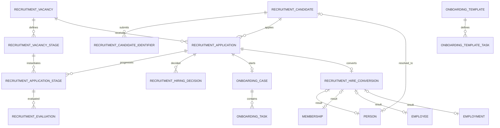

# HR-003 — Recruitment, Hiring & Onboarding System/Data Design

**Version:** 1.0  
**Status:** Approved — Locked  
**Phase:** 2B — System Architecture & Data Design  
**Module:** `Modules/HR`  
**Baseline Repository:** `26b475b695aa4511064b1410db03d1f0c8bdd6ce`  
**Depends On:** HR-001 (Approved), ADR-032 (Accepted), HR-002 (Approved)

---

## 1. Executive Summary

Dokumen ini mendesain capability Recruitment → Hiring → Onboarding yang memperluas `Modules/HR` tanpa membuat parallel human identity atau mengubah ownership Core.

Canonical flow:

```text
Vacancy
  ↓
Candidate                ← HR-owned pre-employment application identity
  ↓
Application
  ↓
Selection Stages / Evaluations
  ↓
Hiring Approval
  ↓
Onboarding Case
  ↓
Identity Resolution
  ↓
Person                    ← Core canonical human identity
  ↓
Membership                ← Core Person × Tenant participation
  ↓
Employee                  ← HR stable workforce profile
  ↓
Employment (PLANNED)      ← HR employment episode
  ↓
Onboarding completion
  ↓
Employment activation + initial placement/position
```

Recruitment candidate data adalah **application/submission record**, bukan canonical Person. Person hanya di-resolve atau dibuat ketika hiring conversion dijalankan. Candidate yang belum diterima tidak menyebabkan Person, Membership, Employee, atau User dibuat.

---

# 2. Resource Audit

## 2.1 Resources reviewed

Repository resources yang menjadi authority:

- `Modules/HR/*`
- `Modules/Core/Person/*`
- `Modules/Core/Tenancy/*`
- `Modules/Core/Authorization/*`
- `Modules/Core/Organization/*`
- Core Audit capability
- `docs/architecture/adr/ADR-013-canonical-human-identity.md`
- `HR-001-human-resources-management.md`
- `ADR-032-hr-domain-boundary-workforce-architecture.md`
- `HR-002-workforce-foundation-system-data-design.md`

## 2.2 Existing facts

**[FAKTA]** Current HR implementation only provides Employee provisioning/listing.

**[FAKTA]** Existing Employee provisioning creates:

```text
Person → Membership → Employee
```

in one transaction and does not create User.

**[FAKTA]** `persons` does not provide natural-key uniqueness by name/birth date.

**[FAKTA]** `person_identifiers` provides encrypted identifier storage plus `value_fingerprint`, with uniqueness:

```text
(type, issuing_country_code, value_fingerprint)
```

This is the strongest existing canonical duplicate-prevention mechanism.

**[FAKTA]** Person contacts intentionally allow two different Persons to share the same email/phone. Therefore email/phone cannot be treated as globally unique human identity.

**[FAKTA]** Membership uniqueness is:

```text
UNIQUE(person_id, tenant_id)
```

regardless of Membership status.

**[FAKTA]** Core currently has no general membership lifecycle service for `INACTIVE → ACTIVE` hiring reuse.

**[FAKTA]** Core `OrganizationalAssignmentServiceInterface` can assign/reactivate an active Membership to Organization or Unit and is idempotent by assignment scope.

---

# 3. Scope

## IN SCOPE — Phase 2B

- recruitment vacancy lifecycle;
- vacancy approval;
- candidate master inside tenant recruitment context;
- one candidate applying to multiple vacancies;
- configurable vacancy selection stages;
- application stage progression;
- evaluations and decision evidence;
- hiring approval;
- onboarding template/checklist;
- candidate → Person identity resolution;
- canonical Membership reuse/create/reactivation contract;
- canonical Employee reuse/create;
- creation of `PLANNED` Employment;
- idempotent hiring conversion;
- onboarding completion and initial Employment activation orchestration;
- initial Position/Organization intent inherited from Vacancy;
- recruitment/onboarding permissions;
- audit/privacy/error/test contracts.

## OUT OF SCOPE

- public careers portal UI;
- job board integrations;
- candidate account/login portal;
- automatic User provisioning;
- payroll;
- attendance;
- PKG/performance;
- HR document binary-storage architecture;
- electronic signature provider;
- background-check provider;
- AI candidate scoring/ranking;
- Person merge engine.

## FUTURE SCOPE

- reusable recruitment pipeline templates;
- interview scheduling integrations;
- offer-letter generation/e-signature;
- external candidate self-service;
- job board publishing adapters;
- candidate talent pool across vacancies;
- regulatory retention automation after exact policy is defined.

---

# 4. Proposed Design Decisions

| ID | Decision |
|---|---|
| OD-HR-REC-001 | Candidate is an HR-owned pre-employment/application entity and is not canonical Person before hiring conversion. |
| OD-HR-REC-002 | One Candidate may have many Applications, but at most one Application for the same Vacancy. |
| OD-HR-REC-003 | Exact verified legal identifier may resolve an existing Person automatically. Name, birth date, email, and phone are only weak-match evidence and may never auto-merge/auto-resolve a Person. |
| OD-HR-REC-004 | If identity cannot be resolved confidently, hiring conversion stops for explicit HR identity review: select an existing Person or explicitly confirm creation of a new Person. |
| OD-HR-REC-005 | Existing Membership for `(person_id, tenant_id)` must be reused. HR may not create a second Membership. Reactivation must pass through a Core membership lifecycle contract. |
| OD-HR-REC-006 | Existing Employee for Membership is reused. Rehire creates a new Employment, not a new Employee. Soft-deleted legacy Employee requires explicit recovery instead of silent duplicate creation. |
| OD-HR-REC-007 | Successful hiring conversion creates/reuses canonical identity/profile and creates one `PLANNED` Employment. Employment activation is a separate lifecycle operation. |
| OD-HR-REC-008 | Hiring conversion is semantically idempotent by Application. Repeated/concurrent successful requests must resolve to the same Person/Membership/Employee/Employment result. |
| OD-HR-REC-009 | Recruitment and onboarding never create User automatically. |
| OD-HR-REC-010 | Vacancy position and organization/unit are hiring intent. Canonical employee placement only exists after Core OrganizationalAssignment + HR EmploymentPlacement are created during activation. |
| OD-HR-REC-011 | Position/job title is not authorization. Recruitment approval is based on Core capabilities and organizational scope. |
| OD-HR-REC-012 | Rejected/withdrawn candidate data remains recruitment evidence subject to configurable retention/privacy policy; it is not promoted into Person by default. |

---

# 5. Domain Boundaries

```text
Core Person
├── canonical Person
├── person identifiers
└── identity resolution contract

Core Tenancy
└── Membership lifecycle

Core Organization
└── OrganizationalAssignment

Core Authorization
└── recruitment/onboarding permissions and scope

Core Audit
└── immutable critical-event audit

HR Recruitment
├── Vacancy
├── Candidate
├── Application
├── Selection Stage
├── Evaluation
└── Hiring Decision

HR Onboarding
├── Onboarding Template
├── Onboarding Case
├── Onboarding Task
└── Hire Conversion

HR Workforce Foundation
├── Employee
├── Employment
├── Position
├── EmploymentPlacement
└── EmploymentPositionAssignment
```

Candidate PII before hiring is retained as recruitment submission data. Once Person is resolved, Person becomes the canonical source for ongoing human profile data; historical candidate submission remains immutable recruitment evidence where retention permits.

---

# 6. Aggregate Model



---

# 7. Data Dictionary

## 7.1 `recruitment_vacancies`

Purpose: one approved recruitment need/posting within a Tenant.

| Column | Type | Null | Rule |
|---|---|---:|---|
| `id` | UUID | No | PK. |
| `tenant_id` | UUID | No | Tenant boundary. |
| `code` | varchar(50) | No | Tenant unique vacancy code. |
| `title` | varchar(255) | No | Vacancy display title. |
| `position_id` | UUID | No | HR Position catalog target. |
| `organization_id` | UUID | No | Core Organization hiring target. |
| `organization_unit_id` | UUID | Yes | Optional target unit under organization. |
| `requested_headcount` | integer | No | `> 0`. |
| `description` | text | Yes | Vacancy description. |
| `status` | varchar(24) | No | `DRAFT`, `PENDING_APPROVAL`, `APPROVED`, `OPEN`, `CLOSED`, `CANCELLED`. |
| `open_at` | timestamptz | Yes | Publication/opening timestamp. |
| `close_at` | timestamptz | Yes | Planned/actual closing timestamp. |
| `created_by_membership_id` | UUID | No | Core Membership actor. |
| timestamps | | | |

Constraints:

```text
UNIQUE(tenant_id, code)
CHECK requested_headcount > 0
CHECK close_at IS NULL OR open_at IS NULL OR close_at >= open_at
```

Tenant-safe FK should be used for Position/Organization/Unit where supporting unique constraints already exist.

`organization_id`/`organization_unit_id` are valid here because Vacancy owns a **recruitment target**, not Employee placement truth.

## 7.2 `recruitment_vacancy_decisions`

Purpose: explicit business approval/rejection evidence.

| Column | Rule |
|---|---|
| `id` | UUID PK |
| `tenant_id` | same Vacancy tenant |
| `vacancy_id` | FK |
| `decision` | `APPROVED` / `REJECTED` |
| `decided_by_membership_id` | authorized actor |
| `reason` | nullable text |
| `decided_at` | timestamptz |

No decision is inferred only from generic audit logs.

## 7.3 `recruitment_vacancy_stages`

Purpose: ordered selection stages for one Vacancy.

| Column | Rule |
|---|---|
| `id` | UUID PK |
| `tenant_id` | tenant boundary |
| `vacancy_id` | FK |
| `code` | e.g. `ADMIN_SCREEN`, `TEST`, `INTERVIEW`, `MICRO_TEACHING` |
| `name` | display label |
| `sequence` | positive integer |
| `is_required` | boolean |
| `is_active` | boolean |

Constraints:

```text
UNIQUE(vacancy_id, code)
UNIQUE(vacancy_id, sequence)
```

Micro-teaching is simply an optional stage; no special teacher-only workflow is hardcoded into the engine.

## 7.4 `recruitment_candidates`

Purpose: tenant-scoped applicant identity/profile before canonical workforce conversion.

| Column | Type | Null | Rule |
|---|---|---:|---|
| `id` | UUID | No | PK. |
| `tenant_id` | UUID | No | Tenant ownership. |
| `person_id` | UUID | Yes | Set only after confident resolution/successful conversion. Core-owned identity. |
| `display_name` | varchar(255) | No | Submitted applicant name snapshot. |
| `birth_date` | date | Yes | Weak matching signal only. |
| `primary_email` | varchar(320) | Yes | Submission/contact value. |
| `normalized_email` | varchar(320) | Yes | Search/dedup hint, not human unique key. |
| `primary_phone` | varchar(32) | Yes | Submission/contact value. |
| `normalized_phone` | varchar(32) | Yes | Search/dedup hint, not human unique key. |
| `source` | varchar(50) | Yes | Manual/import/referral/etc. |
| `status` | varchar(20) | No | `ACTIVE`, `ARCHIVED`. |
| timestamps | | | |

Rules:

- `person_id` is nullable before conversion.
- assigning/changing `person_id` requires identity-resolution capability and audit.
- email/phone/name/birth date never produce automatic canonical merge.

## 7.5 `recruitment_candidate_identifiers`

Purpose: securely retain strong applicant identity claims used for duplicate detection and canonical Person resolution.

| Column | Rule |
|---|---|
| `id` | UUID PK |
| `tenant_id` | tenant boundary |
| `candidate_id` | FK |
| `type` | `NATIONAL_ID`, `PASSPORT`, etc. aligned with Core supported values |
| `issuing_country_code` | ISO alpha-2 |
| `encrypted_value` | application-encrypted ciphertext |
| `value_fingerprint` | deterministic HMAC fingerprint using Core-compatible normalization/fingerprint contract |
| `verified_at` | nullable; only set after verification process |
| `status` | `ACTIVE`, `REVOKED` |
| timestamps | | |

Constraints:

```text
UNIQUE(tenant_id, type, issuing_country_code, value_fingerprint)
```

This prevents creating two tenant Candidate masters for the same strong identifier while still allowing one Candidate to apply to many Vacancies.

Raw legal identifier is never logged in Audit metadata.

## 7.6 `recruitment_applications`

Purpose: Candidate × Vacancy lifecycle.

| Column | Rule |
|---|---|
| `id` | UUID PK |
| `tenant_id` | tenant boundary |
| `vacancy_id` | FK |
| `candidate_id` | FK |
| `status` | `SUBMITTED`, `IN_PROCESS`, `HIRING_APPROVED`, `REJECTED`, `WITHDRAWN`, `HIRED` |
| `submitted_at` | timestamptz |
| `finalized_at` | nullable timestamptz |
| timestamps | | |

Constraint:

```text
UNIQUE(vacancy_id, candidate_id)
```

A second application to the same Vacancy must not create another application row.

## 7.7 `recruitment_application_stages`

Purpose: concrete stage execution per Application.

| Column | Rule |
|---|---|
| `id` | UUID PK |
| `tenant_id` | tenant boundary |
| `application_id` | FK |
| `vacancy_stage_id` | FK |
| `status` | `PENDING`, `IN_PROGRESS`, `PASSED`, `FAILED`, `SKIPPED` |
| `started_at` | nullable |
| `completed_at` | nullable |
| `completed_by_membership_id` | nullable |
| `decision_note` | nullable text |

Constraint:

```text
UNIQUE(application_id, vacancy_stage_id)
```

Stage records should be instantiated from Vacancy stage configuration at application submission so future Vacancy-stage edits do not silently rewrite the applicant's historical path.

## 7.8 `recruitment_evaluations`

Purpose: explicit evaluator evidence for one selection stage.

| Column | Rule |
|---|---|
| `id` | UUID PK |
| `tenant_id` | tenant boundary |
| `application_stage_id` | FK |
| `evaluator_membership_id` | Core Membership actor |
| `score` | nullable decimal |
| `max_score` | nullable decimal |
| `recommendation` | nullable `PASS`, `FAIL`, `HOLD` |
| `remarks` | nullable text |
| `submitted_at` | timestamptz |

Phase 2B does not introduce a generic dynamic form engine. Rubric-specific sub-scores can be added later if actually required.

## 7.9 `recruitment_hiring_decisions`

Purpose: explicit final hiring approval evidence.

| Column | Rule |
|---|---|
| `id` | UUID PK |
| `tenant_id` | tenant boundary |
| `application_id` | FK |
| `decision` | `APPROVED`, `REJECTED` |
| `decided_by_membership_id` | authorized actor |
| `reason` | nullable text |
| `decided_at` | timestamptz |

Only latest valid approved decision allows hire conversion. Decision history is never overwritten.

## 7.10 `onboarding_templates`

Purpose: reusable tenant onboarding checklist template.

| Column | Rule |
|---|---|
| `id` | UUID PK |
| `tenant_id` | tenant boundary |
| `code` | tenant unique |
| `name` | display name |
| `is_active` | boolean |
| timestamps | | |

No Position/RBAC permission is embedded into the template.

## 7.11 `onboarding_template_tasks`

| Column | Rule |
|---|---|
| `id` | UUID PK |
| `tenant_id` | tenant boundary |
| `template_id` | FK |
| `code` | template-local unique |
| `title` | task title |
| `category` | e.g. `DOCUMENT`, `ORIENTATION`, `CONTRACT`, `ADMIN` |
| `sequence` | positive integer |
| `is_required` | boolean |
| `requires_evidence` | boolean |

Document binary persistence is not defined by Phase 2B. A DOCUMENT task is a business requirement/checkpoint, not a new storage subsystem.

## 7.12 `onboarding_cases`

Purpose: one onboarding process for one successful Application.

| Column | Rule |
|---|---|
| `id` | UUID PK |
| `tenant_id` | tenant boundary |
| `application_id` | unique FK |
| `template_id` | nullable template source |
| `employee_id` | nullable until conversion |
| `employment_id` | nullable until conversion |
| `status` | `NOT_STARTED`, `IN_PROGRESS`, `READY_FOR_ACTIVATION`, `COMPLETED`, `CANCELLED` |
| `started_at` | nullable |
| `completed_at` | nullable |
| timestamps | | |

`employee_id` and `employment_id` are populated only by successful canonical hire conversion.

## 7.13 `onboarding_tasks`

Purpose: immutable-ish task snapshot copied from template.

| Column | Rule |
|---|---|
| `id` | UUID PK |
| `tenant_id` | tenant boundary |
| `onboarding_case_id` | FK |
| `template_task_id` | nullable origin reference |
| `code` | case-local code |
| `title` | snapshot title |
| `category` | snapshot category |
| `sequence` | ordering |
| `is_required` | required flag snapshot |
| `requires_evidence` | flag snapshot |
| `status` | `PENDING`, `COMPLETED`, `WAIVED` |
| `completed_by_membership_id` | nullable |
| `completed_at` | nullable |
| `completion_note` | nullable text |

Constraint:

```text
UNIQUE(onboarding_case_id, code)
```

Changing a template never rewrites an existing onboarding case.

## 7.14 `recruitment_hire_conversions`

Purpose: semantic-idempotency record and immutable conversion result evidence.

| Column | Rule |
|---|---|
| `id` | UUID PK |
| `tenant_id` | tenant boundary |
| `application_id` | unique FK; exactly one conversion record per Application |
| `resolution_status` | `UNRESOLVED`, `MATCHED_EXISTING`, `CREATE_NEW_CONFIRMED`, `CONFLICT` |
| `conversion_status` | `PENDING`, `SUCCEEDED`, `CANCELLED` |
| `person_id` | nullable until resolved |
| `membership_id` | nullable until success |
| `employee_id` | nullable until success |
| `employment_id` | nullable until success |
| `resolved_by_membership_id` | nullable actor for manual decision |
| `converted_by_membership_id` | nullable actor |
| `converted_at` | nullable |
| timestamps | | |

Constraint:

```text
UNIQUE(tenant_id, application_id)
```

Repeated successful conversion requests return the existing successful result rather than creating new domain rows.

---

# 8. State Machines

## 8.1 Vacancy

```text
DRAFT
  ↓ submit
PENDING_APPROVAL
  ├── approve → APPROVED
  └── reject  → DRAFT + decision evidence

APPROVED → OPEN → CLOSED
DRAFT / APPROVED / OPEN → CANCELLED
```

A Vacancy may only receive new Applications while `OPEN` unless explicit admin/import policy is introduced later.

## 8.2 Application

```text
SUBMITTED
   ↓
IN_PROCESS
   ├── REJECTED
   ├── WITHDRAWN
   └── HIRING_APPROVED
           ↓ successful hire conversion
         HIRED
```

`HIRING_APPROVED` does not mean Employment is active.

## 8.3 Onboarding

```text
NOT_STARTED
   ↓
IN_PROGRESS
   ↓ all required tasks complete/waived
READY_FOR_ACTIVATION
   ↓ activation succeeds
COMPLETED
```

`CANCELLED` is allowed before completion with explicit authorized reason.

## 8.4 Hire Conversion

```text
PENDING / UNRESOLVED
   ├── exact strong match → MATCHED_EXISTING
   ├── explicit create-new confirmation → CREATE_NEW_CONFIRMED
   └── conflicting strong claims → CONFLICT

MATCHED_EXISTING or CREATE_NEW_CONFIRMED
   ↓ canonical transaction
SUCCEEDED
```

No silent fallback from identity conflict to "create new Person".

---

# 9. Identity Resolution Contract

## 9.1 Strong vs weak evidence

### Strong evidence eligible for automatic exact resolution

- verified National ID;
- verified Passport;
- another Core-supported legal identifier with deterministic normalization/fingerprint.

### Weak evidence — suggestions only

- name;
- birth date;
- email;
- phone;
- address;
- school/work history.

Reason: Core explicitly permits shared contact values across Persons and has no natural-key uniqueness for names/birth dates.

## 9.2 Minimal Core extension

**[REKOMENDASI]** Add a small Core contract instead of HR querying `person_identifiers` directly:

```text
PersonIdentityResolutionServiceInterface
```

Responsibilities:

1. normalize supported identifier claim;
2. compute canonical fingerprint securely;
3. exact lookup against `person_identifiers`;
4. return zero/one canonical Person result;
5. detect inconsistent claims that resolve to different Persons;
6. create Person + canonical identifiers only when explicitly requested by an authorized workflow;
7. rely on Core database unique constraint as final concurrency guard.

HR never owns or copies the canonical Person identifier table.

## 9.3 No automatic fuzzy merge

Possible weak matches may be presented to HR as review candidates, but:

```text
same name + same birth date
```

is not enough to automatically reuse a Person.

A Person merge engine is explicitly outside Phase 2B.

---

# 10. Membership Lifecycle Contract

Current Core repository only exposes active Membership lookup by ID; it does not provide Person+Tenant ensure/reactivation lifecycle.

**[RESOURCE GAP]** A generic service does not exist yet.

**[REKOMENDASI]** Add Core-owned:

```text
MembershipLifecycleServiceInterface
```

Required operation semantics:

```text
ensureActiveForPersonAndTenant(person_id, tenant_id)
```

Behavior:

1. lock/select existing `(person_id, tenant_id)` Membership;
2. if ACTIVE → return it;
3. if INACTIVE and business action is allowed → reactivate same row and audit;
4. if none → create ACTIVE Membership;
5. never create duplicate Membership;
6. database `UNIQUE(person_id, tenant_id)` remains final concurrency guard.

HR must consume this Core contract instead of direct `Membership::create()` inside the new hiring flow.

Existing `EmployeeProvisioningService` may remain for compatibility during migration, but new Recruitment conversion must not reproduce its unconditional create behavior.

---

# 11. Employee Resolution

Hiring conversion resolves Employee using canonical Membership.

```text
Membership
  ↓
EmployeeRepositoryInterface::findByMembershipForTenant
```

Rules:

- existing normal Employee → reuse;
- no Employee → create profile;
- soft-deleted Employee row exists → block automatic conversion and require explicit profile recovery;
- never create a second Employee for the same Membership;
- no User is created.

**[REKOMENDASI]** Extend Employee repository/service with an explicit `ensureProfileForMembership` use-case while preserving existing public API compatibility.

---

# 12. Hiring Conversion Transaction

## 12.1 Preconditions

Application must:

- belong to current Tenant;
- be `HIRING_APPROVED`;
- have a valid latest approved hiring decision;
- not be withdrawn/rejected;
- have a Candidate;
- include required Employment inputs: planned start date and employment type;
- have no prior conflicting successful conversion.

## 12.2 Transaction sequence

```text
BEGIN

1. Lock Application
2. Lock/create HireConversion row
3. If conversion already SUCCEEDED → return same result
4. Resolve Candidate identity
   a. candidate.person_id already set → validate Person
   b. exact strong identifier match → reuse Person
   c. explicit create-new → Core creates Person + identifiers
   d. unresolved/conflict → stop before workforce mutation
5. Ensure/reuse ACTIVE Membership through Core lifecycle service
6. Resolve Employee
   a. existing → reuse
   b. absent → create
   c. legacy soft-deleted → reject recovery-required
7. Assert Employee has no ACTIVE Employment
8. Create one Employment with status PLANNED
9. Link Onboarding Case to Employee + Employment
10. Link Candidate to resolved Person
11. Mark Application HIRED
12. Mark HireConversion SUCCEEDED + result IDs
13. Persist critical audit event without raw sensitive identifier

COMMIT
```

If any canonical mutation fails, no partial Person/Membership/Employee/Employment graph may remain from this conversion.

## 12.3 Concurrency

Application row + conversion row locking is application-level serialization.

Database uniqueness remains final protection for:

- Person legal identifier;
- Membership `(person_id, tenant_id)`;
- Employee membership uniqueness;
- one successful conversion per Application;
- one ACTIVE Employment per Employee when later activated.

Race handling must convert uniqueness collisions into deterministic domain conflict/retry resolution, not HTTP 500 leakage.

---

# 13. Onboarding & Employment Activation

Successful hire conversion creates:

```text
Employee
└── Employment PLANNED
```

It does **not** immediately create an active workforce placement simply because the Vacancy has a target Organization/Unit.

When all mandatory onboarding tasks are complete/waived:

```text
OnboardingCase → READY_FOR_ACTIVATION
```

Activation orchestration:

1. lock Onboarding Case and Employment;
2. require `READY_FOR_ACTIVATION`;
3. require Employment `PLANNED`;
4. validate Vacancy target Position is active;
5. validate target Organization/Unit is active;
6. activate Employment via HR-002 lifecycle service;
7. call Core `OrganizationalAssignmentServiceInterface` to ensure active target assignment;
8. create HR EmploymentPlacement referencing returned Core assignment;
9. create EmploymentPositionAssignment using Vacancy Position;
10. mark Onboarding Case `COMPLETED`;
11. audit the activation.

All state changes should participate in one application-level transaction boundary where current architecture permits it.

If Organization/Unit or Position has become inactive between recruitment approval and activation, activation fails safely and HR must select a valid replacement target. Historical Vacancy intent is not rewritten.

---

# 14. Service Boundaries

## KEEP

- `EmployeeRepositoryInterface`
- `EloquentEmployeeRepository`
- `EmployeeProvisioningService` for existing compatibility until migrated
- Core Person ownership
- Core Membership ownership
- Core Organization services
- Core Audit
- Core RBAC

## ADD in HR

```text
RecruitmentVacancyService
RecruitmentApplicationService
RecruitmentEvaluationService
RecruitmentHiringDecisionService
OnboardingTemplateService
OnboardingService
HireConversionService
OnboardingActivationService
CandidateRepositoryInterface
VacancyRepositoryInterface
ApplicationRepositoryInterface
OnboardingRepositoryInterface
HireConversionRepositoryInterface
```

## ADD minimal contracts in Core

```text
PersonIdentityResolutionServiceInterface
MembershipLifecycleServiceInterface
```

These are platform extensions required by an already accepted downstream requirement. Core does not become dependent on HR.

---

# 15. API Specification

All endpoints remain under existing HR API namespace.

## 15.1 Vacancies

```text
GET  /api/v1/hr/recruitment/vacancies
POST /api/v1/hr/recruitment/vacancies
GET  /api/v1/hr/recruitment/vacancies/{vacancyId}
PATCH /api/v1/hr/recruitment/vacancies/{vacancyId}
POST /api/v1/hr/recruitment/vacancies/{vacancyId}/submit-approval
POST /api/v1/hr/recruitment/vacancies/{vacancyId}/approve
POST /api/v1/hr/recruitment/vacancies/{vacancyId}/reject
POST /api/v1/hr/recruitment/vacancies/{vacancyId}/open
POST /api/v1/hr/recruitment/vacancies/{vacancyId}/close
POST /api/v1/hr/recruitment/vacancies/{vacancyId}/cancel
```

Lifecycle changes use explicit command endpoints, not generic status PATCH.

## 15.2 Vacancy stages

```text
GET  /api/v1/hr/recruitment/vacancies/{vacancyId}/stages
POST /api/v1/hr/recruitment/vacancies/{vacancyId}/stages
PATCH /api/v1/hr/recruitment/vacancy-stages/{stageId}
```

Stage definition changes are restricted once Applications exist. Existing ApplicationStage snapshots are never rewritten.

## 15.3 Candidates & applications

```text
GET  /api/v1/hr/recruitment/candidates
POST /api/v1/hr/recruitment/candidates
GET  /api/v1/hr/recruitment/candidates/{candidateId}
PATCH /api/v1/hr/recruitment/candidates/{candidateId}

GET  /api/v1/hr/recruitment/applications
POST /api/v1/hr/recruitment/applications
GET  /api/v1/hr/recruitment/applications/{applicationId}
POST /api/v1/hr/recruitment/application-stages/{stageId}/start
POST /api/v1/hr/recruitment/application-stages/{stageId}/complete
POST /api/v1/hr/recruitment/application-stages/{stageId}/evaluations
POST /api/v1/hr/recruitment/applications/{applicationId}/withdraw
```

Candidate strong identifiers are written through a dedicated sensitive endpoint or nested command; default Candidate response returns masked identifier metadata, not plaintext.

## 15.4 Hiring decision

```text
POST /api/v1/hr/recruitment/applications/{applicationId}/approve-hire
POST /api/v1/hr/recruitment/applications/{applicationId}/reject
```

## 15.5 Onboarding

```text
GET  /api/v1/hr/onboarding/templates
POST /api/v1/hr/onboarding/templates
PATCH /api/v1/hr/onboarding/templates/{templateId}

POST /api/v1/hr/recruitment/applications/{applicationId}/onboarding
GET  /api/v1/hr/onboarding/cases/{caseId}
POST /api/v1/hr/onboarding/tasks/{taskId}/complete
POST /api/v1/hr/onboarding/tasks/{taskId}/waive
```

## 15.6 Identity review & conversion

```text
POST /api/v1/hr/recruitment/applications/{applicationId}/identity-resolution
POST /api/v1/hr/recruitment/applications/{applicationId}/identity-resolution/select-person
POST /api/v1/hr/recruitment/applications/{applicationId}/identity-resolution/confirm-new-person
POST /api/v1/hr/recruitment/applications/{applicationId}/hire-conversion
```

`hire-conversion` is semantically idempotent. If it already succeeded, the endpoint returns the existing canonical result.

## 15.7 Activation

```text
POST /api/v1/hr/onboarding/cases/{caseId}/activate-employment
```

This command performs the approved initial workforce activation orchestration described in Section 13.

---

# 16. Authorization Catalog

Recommended additive permissions:

```text
hr.recruitment.read
hr.recruitment.manage
hr.recruitment.evaluate
hr.recruitment.approve
hr.recruitment.identity.resolve

hr.onboarding.read
hr.onboarding.manage
hr.onboarding.activate
```

Existing Phase 2A permissions remain:

```text
hr.workforce.read
hr.workforce.manage
hr.catalog.read
hr.catalog.manage
```

Rules:

- `approve` is independent from Position title;
- evaluator only needs evaluation permission for applicable scope;
- identity resolution is separated because it exposes sensitive identity operations;
- activation requires workforce and onboarding authorization appropriate to selected target scope;
- tenant-wide actors may operate across organizations according to Core rules;
- organization/unit-scoped actors may only see/manage candidates/applications tied to vacancies in their authorized scope.

Unscoped candidate pools must not be visible to a Unit-scoped actor unless the Vacancy itself belongs to that actor's effective scope.

---

# 17. Audit Contract

Critical business events:

```text
hr.recruitment.vacancy.created
hr.recruitment.vacancy.submitted
hr.recruitment.vacancy.approved
hr.recruitment.vacancy.rejected
hr.recruitment.application.submitted
hr.recruitment.stage.completed
hr.recruitment.evaluation.submitted
hr.recruitment.hire.approved
hr.recruitment.hire.rejected
hr.recruitment.identity.resolved
hr.recruitment.identity.conflict
hr.recruitment.hire.converted
hr.onboarding.task.completed
hr.onboarding.task.waived
hr.onboarding.employment.activated
```

Audit metadata may include resource IDs, status transition, and decision code.

Audit metadata must not include:

- raw NIK/passport value;
- CV content;
- medical records;
- full candidate document payload;
- passwords/tokens;
- unnecessary personal contact values.

Business decision tables remain authoritative evidence; Audit is cross-cutting immutable trace, not a substitute for explicit recruitment decision records.

---

# 18. Privacy & Retention

**[CONSTRAINT]** Candidate data is personal data under EduCore's PDP obligations.

Requirements:

1. collect only recruitment-relevant data;
2. legal identifiers encrypted at rest;
3. raw identifier never exposed in default list/search projection;
4. failed/rejected candidate data retained according to tenant/regulatory policy;
5. exact retention duration remains **[OPEN DECISION]** until legal/business policy is defined;
6. after retention expires, anonymization/deletion must preserve minimum non-personal audit/aggregate reporting evidence where legally appropriate;
7. successful Candidate may retain historical application snapshot, but ongoing human profile reads must use Person as canonical source;
8. recruitment export is capability-protected and audited.

---

# 19. Validation & Invariants

## INV-REC-001 — Candidate does not imply Person

Creating Candidate/Application must not create Person, Membership, Employee, Employment, or User.

## INV-REC-002 — One Application per Candidate per Vacancy

Database uniqueness is authoritative.

## INV-REC-003 — Legal identifier exactness

Only a canonical exact identifier match is eligible for automatic Person reuse.

## INV-REC-004 — Weak match cannot auto-resolve

Name/email/phone/birth date may surface review hints only.

## INV-REC-005 — No duplicate Membership

Hire conversion reuses `(person_id, tenant_id)` Membership.

## INV-REC-006 — No duplicate Employee

Hire conversion reuses Employee by Membership.

## INV-REC-007 — One conversion result per Application

Successful conversion is immutable/idempotent.

## INV-REC-008 — Hire conversion produces PLANNED Employment

No ACTIVE Employment is created directly by conversion.

## INV-REC-009 — No User side effect

Recruitment/onboarding never provisions login automatically.

## INV-REC-010 — Vacancy placement is intent only

No Employee placement is considered canonical until Core OrganizationalAssignment + HR EmploymentPlacement exist.

## INV-REC-011 — Required onboarding tasks gate activation

Employment activation cannot complete unless Onboarding Case is `READY_FOR_ACTIVATION`.

## INV-REC-012 — No partial activation

Employment activation, initial Core assignment, HR Placement, Position Assignment, and Onboarding completion must succeed consistently or fail without partial final state.

---

# 20. Error Semantics

| HTTP | Code | Meaning |
|---:|---|---|
| 400 | `HR_RECRUITMENT_INVALID_TRANSITION` | invalid vacancy/application/onboarding state transition |
| 403 | `HR_RECRUITMENT_FORBIDDEN` | capability/scope denied |
| 404 | `HR_RECRUITMENT_RESOURCE_NOT_FOUND` | tenant-safe resource not found |
| 409 | `HR_CANDIDATE_IDENTIFIER_CONFLICT` | same strong candidate identifier already belongs to another Candidate in tenant |
| 409 | `HR_IDENTITY_RESOLUTION_REQUIRED` | no confident Person resolution; manual decision required |
| 409 | `HR_IDENTITY_RESOLUTION_CONFLICT` | strong claims resolve inconsistently |
| 409 | `HR_MEMBERSHIP_LIFECYCLE_CONFLICT` | existing Membership cannot be activated by allowed lifecycle |
| 409 | `HR_EMPLOYEE_PROFILE_RECOVERY_REQUIRED` | legacy soft-deleted Employee blocks silent recreation |
| 409 | `HR_EMPLOYMENT_ALREADY_ACTIVE` | candidate/person already has active employment in tenant |
| 409 | `HR_HIRE_CONVERSION_CONFLICT` | conversion state incompatible with request |
| 409 | `HR_ONBOARDING_NOT_READY` | mandatory onboarding requirements incomplete |
| 409 | `HR_ONBOARDING_TARGET_INVALID` | selected Position/Organization/Unit no longer valid |
| 422 | `VALIDATION_ERROR` | malformed/missing request fields |

Cross-module Core errors should be mapped to stable HR-facing error codes without exposing internal database exceptions.

---

# 21. Indexing Strategy

Recommended read-path indexes:

```text
recruitment_vacancies(tenant_id, status, created_at)
recruitment_vacancies(tenant_id, organization_id, organization_unit_id, status)
recruitment_candidates(tenant_id, status, created_at)
recruitment_candidates(tenant_id, normalized_email)
recruitment_candidates(tenant_id, normalized_phone)
recruitment_applications(tenant_id, vacancy_id, status)
recruitment_applications(tenant_id, candidate_id, status)
recruitment_application_stages(application_id, status)
onboarding_cases(tenant_id, status, created_at)
onboarding_tasks(onboarding_case_id, status, sequence)
recruitment_hire_conversions(tenant_id, conversion_status)
```

Strong candidate identifier lookup uses the unique fingerprint index rather than decrypt-and-scan.

---

# 22. Migration Strategy

This capability is additive. No existing HR table is destructively changed to introduce Recruitment.

Recommended migration order:

```text
1. Core identity-resolution support
2. Core membership lifecycle support
3. recruitment_vacancies
4. recruitment_vacancy_decisions
5. recruitment_vacancy_stages
6. recruitment_candidates
7. recruitment_candidate_identifiers
8. recruitment_applications
9. recruitment_application_stages
10. recruitment_evaluations
11. recruitment_hiring_decisions
12. onboarding_templates
13. onboarding_template_tasks
14. onboarding_cases
15. onboarding_tasks
16. recruitment_hire_conversions
17. authorization catalog seed
18. API/OpenAPI contracts
```

No backfill is required because Recruitment does not exist in the current implementation.

Existing `POST /api/v1/hr/employees` remains backward-compatible during this phase. Its future UX replacement by Recruitment flow is a separate deprecation decision, not part of Phase 2B.

---

# 23. Test / Regression Contract

## 23.1 Vacancy

- create DRAFT vacancy in current Tenant;
- reject invalid position/org/unit tenant mismatch;
- approval requires permission;
- unit-scoped approver cannot approve another unit vacancy;
- rejected approval does not delete Vacancy;
- closed/cancelled Vacancy rejects normal application submission.

## 23.2 Candidate/Application

- candidate creation does not create Person/User/Membership/Employee;
- same strong identifier cannot create second Candidate in same Tenant;
- shared email/phone across Candidates is allowed;
- same Candidate cannot submit twice to same Vacancy;
- same Candidate can apply to different Vacancies;
- Application stage snapshot is not rewritten after Vacancy stage edit.

## 23.3 Identity resolution

- exact National ID resolves existing Person;
- same name/birth date without strong identifier does not auto-resolve;
- shared email does not auto-resolve;
- conflicting strong claims block conversion;
- explicit existing-Person selection is audited;
- explicit create-new Person uses Core canonical identifier uniqueness;
- concurrent create-new with same identifier results in one canonical Person.

## 23.4 Membership/Employee

- existing active Membership reused;
- existing inactive Membership reactivated through Core contract;
- no duplicate `(person, tenant)` Membership;
- existing Employee reused;
- rehire with ended Employment creates new Employment;
- existing active Employment blocks second hire;
- soft-deleted Employee produces recovery-required error;
- User count is unchanged after hire conversion.

## 23.5 Idempotency/concurrency

- repeating conversion after success returns same IDs;
- two concurrent conversion requests produce one Employment result;
- failed transaction leaves no partial workforce graph;
- database unique collision is mapped to domain conflict, not raw DB error.

## 23.6 Onboarding/activation

- template copies task snapshots;
- template edit does not mutate existing case tasks;
- incomplete required tasks block activation;
- waived required task requires permission/audit;
- inactive target Position/Organization/Unit blocks activation;
- successful activation creates/reuses Core assignment, HR Placement, Position Assignment, and completes Onboarding;
- failure mid-activation does not leave partial canonical final state.

## 23.7 Tenant/security

- all recruitment resources are tenant isolated;
- scoped actors only access Vacancy/Application target scope;
- candidate identifier plaintext absent from default responses and logs;
- raw sensitive value absent from audit metadata.

---

# 24. Traceability

| Requirement | Design |
|---|---|
| BR-001, BR-008, BR-009 | Candidate remains pre-canonical; hire conversion resolves Core Person atomically |
| FR-009 | `recruitment_vacancies` + approval lifecycle |
| FR-010 | vacancy stages + application stages + status machine |
| FR-011 | evaluations + hiring decision evidence + audit |
| FR-012 | onboarding case starts after hire approval; conversion creates PLANNED Employment |
| FR-013 | template/task checklist with document/orientation/contract/admin categories |
| US-004 AC1 | stage/evaluation/decision actor + audit trace |
| US-004 AC2 | Candidate/Application create no Employee before final hiring flow |
| US-004 AC3 | exact Person resolution + Membership/Employee reuse + idempotent conversion |
| NFR security/PDP | encrypted identifier + capability + masked projection + retention policy |
| ADR-032 | Candidate is HR-owned until canonical conversion; Core stays owner Person/Membership |
| HR-002 | conversion produces Employee + PLANNED Employment; activation creates workforce placement/position |

---

# 25. Change Classification

| Component | Decision | Reason |
|---|---|---|
| `Modules/HR` | **EXTEND** | Recruitment/onboarding belongs to HR context. |
| Existing Employee schema | **KEEP** | Recruitment does not require duplicate identity fields. |
| `EmployeeProvisioningService` | **KEEP compatibility / REFACTOR internally later** | Existing endpoint remains; new hire flow needs resolve/reuse semantics. |
| `EmployeeRepositoryInterface` | **EXTEND** | Need ensure/recovery-aware employee profile resolution. |
| Core Person tables | **KEEP** | Canonical identity already correct. |
| Core person identifier persistence | **KEEP / CONSUME via new contract** | Existing fingerprint uniqueness is suitable. |
| Core Person repository direct HR access | **AVOID** for identifier lookup | HR should consume identity-resolution service. |
| Membership table | **KEEP** | Existing uniqueness is correct. |
| Core Membership lifecycle API/service | **EXTEND** | Required to reuse/reactivate same membership safely. |
| Core OrganizationalAssignmentService | **KEEP / CONSUME** | Already supports idempotent assign/reactivate behavior. |
| Core RBAC | **KEEP / EXTEND catalog** | Add HR permissions only. |
| Core Audit | **KEEP / CONSUME** | Existing audit foundation. |
| User provisioning | **NO CHANGE** | User remains optional. |

---

# 26. Risks

| ID | Risk | Mitigation |
|---|---|---|
| RISK-REC-001 | Duplicate Person due fuzzy/weak matching | only exact strong identifier auto-resolves; otherwise manual decision |
| RISK-REC-002 | Concurrent hire creates duplicate Membership/Employee | transaction + row lock + DB uniqueness + semantic idempotency |
| RISK-REC-003 | Direct Core table reads couple HR to internals | introduce narrow Core identity/membership contracts |
| RISK-REC-004 | Candidate PII leakage | encryption, masking, scoped permission, audit sanitization |
| RISK-REC-005 | Employee becomes active before onboarding ready | conversion only creates PLANNED Employment |
| RISK-REC-006 | Vacancy target changes after hiring decision | preserve historical intent; revalidate actual target at activation |
| RISK-REC-007 | Legacy soft-deleted Employee collides with membership unique | explicit recovery-required path |
| RISK-REC-008 | Dynamic recruitment engine overengineering | per-vacancy ordered stages only; no generic workflow/form engine |

---

# 27. Resource Gaps / Deferred Decisions

These items do not block Phase 2B architecture:

1. **[OPEN DECISION]** exact legal candidate retention duration after rejection/withdrawal;
2. **[OPEN DECISION]** whether offer acceptance must become a distinct state before `HIRING_APPROVED`;
3. **[OPEN DECISION]** exact rubric structure for micro-teaching/interview scoring;
4. **[OPEN DECISION]** document binary storage/e-signature contract;
5. **[OPEN DECISION]** whether inactive Person itself may be reactivated by hiring or requires separate Core governance action;
6. **[DEFERRED]** Person merge tooling;
7. **[DEFERRED]** automatic external job-board integration;
8. **[DEFERRED]** candidate self-service authentication.

Default safe behavior for item 5: an inactive/archived/deceased/non-hireable Person blocks conversion until an authorized Core lifecycle action makes the Person eligible. HR does not reactivate Person silently.

---

# 28. ADR Assessment

No new ADR is mandatory for Phase 2B because ADR-032 already accepts:

```text
Candidate → Hiring → resolve/create Person → Membership → Employee → Employment
```

The identity-resolution and membership-lifecycle additions are implementation-level platform contracts supporting that accepted decision.

A future ADR is only justified if EduCore introduces a **platform-wide fuzzy Person matching/merge policy**, because that would affect Academic, Guardian, Student, HR, and other modules—not Recruitment alone.

---

# 29. Reviewer Assessment

**Quality Score:** 9.5/10

**Gaps:** exact retention duration, offer-state semantics, scoring rubric, and HR document/e-signature storage are intentionally unresolved and non-blocking for recruitment foundation.

**Risks:** identity duplication, privacy leakage, cross-module coupling, and concurrency have explicit architectural guards.

**Recommendations:**

1. Keep identity resolution exact and conservative.
2. Add narrow Core contracts instead of allowing HR to query Person/Membership internals directly.
3. Keep hire conversion idempotent by Application.
4. Create `PLANNED` Employment first; activate only after onboarding readiness.
5. Do not add a generic workflow engine yet.

**Status:** `READY FOR APPROVAL`

---

# 30. Recommended Next Phase

After approval of HR-003, Phase 2B is locked.

Recommended next technical slice:

```text
FASE 2C — Leave & Permit Domain Design
```

Reason: Leave directly consumes Employee/Employment/Placement foundation but has lower cross-domain financial complexity than Payroll and lower external-device complexity than Attendance. It is the safest next HR-owned lifecycle capability after Recruitment/Onboarding.
