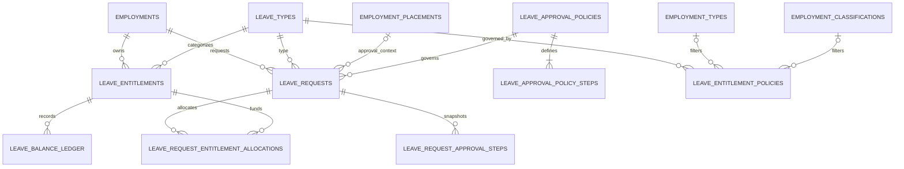

# HR-004 — Leave & Permit System/Data Design

**Version:** 1.0  
**Status:** Approved — Locked  
**Phase:** 2C — System Architecture & Data Design  
**Module:** `Modules/HR`  
**Baseline Repository:** `26b475b695aa4511064b1410db03d1f0c8bdd6ce`  
**Depends On:** HR-001 (Approved), ADR-032 (Accepted), HR-002 (Approved), HR-003 (Approved)

---

# 1. Executive Summary

Dokumen ini mendesain capability **Leave & Permit** untuk EduCore HR dengan prinsip bahwa saldo/hak cuti adalah HR-owned workforce fact, approval menggunakan Core authorization + organizational scope, dan teaching-related permit hanya berintegrasi ke Academic tanpa mengambil alih jadwal akademik.

Canonical flow:

```text
Employment ACTIVE
   ↓
Applicable Leave Type + Entitlement Policy
   ↓
Leave Entitlement / Balance Ledger
   ↓
Leave Request
   ↓
Resolve Approval Policy Version
   ↓
Sequential Approval Steps
   ↓
APPROVED / REJECTED
   ↓
Balance Consumption (if entitlement-backed)
   ↓
Attendance / Academic integration (downstream, when available)
```

Desain ini **tidak membuat generic workflow engine**. Approval policy yang dibangun hanya untuk HR Leave/Permit dan dapat diekstrak menjadi platform workflow capability di masa depan hanya bila terdapat kebutuhan lintas-domain yang nyata.

---

# 2. Resource Audit

## 2.1 Resources reviewed

Repository dan dokumen yang menjadi authority:

- `Modules/HR/*`
- `Modules/Core/Authorization/*`
- `Modules/Core/Organization/*`
- `Modules/Core/Governance/Audit/*`
- `Modules/Core/Tenancy/*`
- `Modules/Academic/*`
- `HR-001-human-resources-management.md`
- `ADR-032-hr-domain-boundary-workforce-architecture.md`
- `HR-002-workforce-foundation-system-data-design.md`
- `HR-003-recruitment-hiring-onboarding-system-data-design.md`

## 2.2 Existing facts

**[FAKTA]** `Modules/HR` saat ini belum mempunyai Leave/Permit implementation.

**[FAKTA]** HR-001 sudah mengunci:

- `FR-018`: configurable leave/permit types;
- `FR-019`: entitlement, balance, request, approval/rejection, cancellation, historical ledger;
- `FR-020`: approval flow configurable berdasarkan organizational policy + scope;
- `FR-021`: teaching permit/substitution dapat mengacu ke Academic context;
- `FR-022`: employee self-service dapat melihat request history dan saldo;
- `BR-016`: entitlement/balance mengikuti configured policy;
- `BR-017`: independent approval tidak boleh dilakukan oleh requester sendiri;
- `BR-019`: critical HR mutations/approvals wajib diaudit.

**[FAKTA]** HR-002 menetapkan `Employment` sebagai canonical employment episode dan `EmploymentPlacement` sebagai HR historical reference ke Core `OrganizationalAssignment`.

**[FAKTA]** Core `OrganizationalAuthorizationService` melakukan permission evaluation berdasarkan verified current organizational context serta tenant/scoped role yang database-backed.

**[FAKTA]** Core Audit sudah menyediakan `AuditTrailServiceInterface`; metadata sensitif tidak boleh disalin tanpa kebutuhan.

**[FAKTA]** Academic repository saat ini **belum mempunyai canonical teaching schedule / teaching assignment / substitution model**. Existing teacher usage baru terlihat pada grading/assessment melalui `Employee`.

**[RESOURCE GAP]** Karena belum ada stable Academic teaching-assignment identifier, Phase 2C tidak boleh mengarang FK ke schedule/lesson/substitute-teacher tables yang belum ada.

**[CONFLICT]** Repository terbaru memakai PostgreSQL-specific partial indexes/check constraints, sementara `.env.example` masih default SQLite. Seperti HR-002, desain ini mengikuti persistence semantics PostgreSQL yang sudah nyata di Core/Academic/Dormitory.

---

# 3. Scope

## IN SCOPE — Phase 2C

- configurable Leave/Permit Type;
- entitlement policy per tenant/organization/unit/employment type/classification;
- entitlement bucket per Employment + Leave Type + period;
- append-only balance ledger;
- manual balance adjustment dengan authorization/audit;
- Leave/Permit Request lifecycle;
- organizationally scoped approval policy;
- sequential approval steps;
- self-service request/history/balance;
- independent-approver guard;
- approval-time balance concurrency protection;
- cancellation/withdrawal semantics;
- leave reporting/read model foundation;
- integration contract boundary untuk Attendance dan Academic;
- permissions, audit, API, schema, indexes, transaction rules, tests.

## OUT OF SCOPE

- employee work-shift/schedule engine;
- Attendance event ownership;
- automatic attendance marking from leave;
- Academic lesson schedule ownership;
- substitute-teacher assignment ownership;
- payroll calculation/deduction;
- medical-document binary storage architecture;
- e-signature;
- government/legal rule hardcoding;
- generic enterprise workflow engine;
- automated monthly accrual engine.

## FUTURE SCOPE

- true periodic accrual;
- configurable holiday/work-calendar duration calculator;
- automatic Attendance synchronization;
- Academic teaching-absence/substitution adapter;
- employee delegation during leave;
- cancellation approval workflow if required by tenant policy;
- document requirement rules by leave type/duration;
- notification/reminder automation.

---

# 4. Proposed Design Decisions

| ID | Decision |
|---|---|
| **OD-HR-LEAVE-001** | `LeaveType` is a tenant-scoped HR catalog. It classifies `LEAVE` or `PERMIT`, and defines whether the type is entitlement-backed (`BALANCE`) or non-balance (`NONE`). |
| **OD-HR-LEAVE-002** | Balance unit is explicit (`DAY` or `HOUR`) and supports decimal values such as `0.5 DAY`. Unit cannot be silently changed after the type has historical transactions. |
| **OD-HR-LEAVE-003** | Entitlement applies to an `Employment`, not directly to Person/User. Rehire therefore gets a new Employment entitlement lifecycle while historical entitlement remains attached to the old Employment. |
| **OD-HR-LEAVE-004** | Fixed-period entitlement and manual adjustment are Phase 2C baseline. Monthly/pro-rata accrual is future scope; the ledger is designed so accrual can be added without schema replacement. |
| **OD-HR-LEAVE-005** | Leave balance is derived from an append-only ledger. No mutable `current_balance` column is the source of truth. |
| **OD-HR-LEAVE-006** | Pending requests do not consume balance. Balance is rechecked and consumed atomically at final approval. This avoids reservation complexity while keeping approval authoritative under concurrency. |
| **OD-HR-LEAVE-007** | A request is always attached to one active Employment. An optional `approval_context_placement_id` selects the employment placement used to resolve scoped approval; it does not redefine Organization ownership. |
| **OD-HR-LEAVE-008** | Approval policy is HR-owned, versioned/effective-dated, and resolved from leave type + employment attributes + organizational scope. A request stores the resolved policy version so later policy changes do not rewrite historical approval semantics. |
| **OD-HR-LEAVE-009** | Approval steps identify required **permission + scope strategy**, not a hardcoded job title/Position. Position remains distinct from RBAC. |
| **OD-HR-LEAVE-010** | If policy resolution produces zero applicable policies or an equal-specificity tie, submission fails explicitly. The system never chooses an arbitrary policy. |
| **OD-HR-LEAVE-011** | Independent-approver steps reject approval when approver Membership equals the Employee Membership whose leave is being requested. |
| **OD-HR-LEAVE-012** | Requester may withdraw `DRAFT/SUBMITTED/IN_REVIEW` requests according to lifecycle rules. Cancelling a final `APPROVED` request requires an authorized HR/approval capability and produces a balance restoration ledger entry when applicable. Employee self-cancellation after final approval is deferred until a tenant cancellation-policy requirement is defined. |
| **OD-HR-LEAVE-013** | Teaching permit does not create/copy Academic schedule/substitute data. A future Academic contract provides stable teaching context; until that contract exists, Leave remains functional without a fabricated Academic FK. |
| **OD-HR-LEAVE-014** | Attendance consumes approved leave facts through an integration contract/event/read interface. HR does not create Attendance events as its own source of truth. |
| **OD-HR-LEAVE-015** | Request reason and supporting-document content are sensitive HR data. Audit logs record IDs/status/decision metadata only, not full reason/document payload. |

---

# 5. Domain Boundaries

```text
Core
├── Person / Membership
├── Organization / OrganizationalAssignment
├── RBAC / OrganizationalAuthorization
└── Audit

HR Workforce
├── Employee
├── Employment
├── EmploymentPlacement
├── EmploymentType
└── EmploymentClassification

HR Leave & Permit
├── LeaveType
├── LeaveEntitlementPolicy
├── LeaveEntitlement
├── LeaveBalanceLedger
├── LeaveApprovalPolicy
├── LeaveApprovalPolicyStep
├── LeaveRequest
└── LeaveRequestApprovalStep

Academic (future integration)
├── TeachingAssignment
├── TeachingSchedule
└── Substitution

Attendance (future/integrated)
└── Attendance source of truth
```

---

# 6. Aggregate Model



Approval-policy applicability also references Core Organization/OrganizationUnit as policy scope, but does not own those records.

---

# 7. Data Dictionary & Schema

## 7.1 `leave_types`

Tenant-scoped Leave/Permit catalog.

| Column | Type | Null | Rule |
|---|---|---:|---|
| `id` | UUID | No | UUIDv7. |
| `tenant_id` | UUID | No | Tenant-owned. |
| `code` | varchar(50) | No | Stable tenant-scoped code. |
| `name` | varchar(120) | No | Display label. |
| `category` | varchar(20) | No | `LEAVE` / `PERMIT`. |
| `balance_mode` | varchar(20) | No | `BALANCE` / `NONE`. |
| `unit` | varchar(10) | No | `DAY` / `HOUR`. |
| `description` | text | Yes | Optional. |
| `is_active` | boolean | No | Default true. |
| `created_at` | timestamp | No | Standard. |
| `updated_at` | timestamp | No | Standard. |

Constraints:

```text
UNIQUE (tenant_id, code)
UNIQUE (id, tenant_id)
CHECK category IN ('LEAVE', 'PERMIT')
CHECK balance_mode IN ('BALANCE', 'NONE')
CHECK unit IN ('DAY', 'HOUR')
FK tenant_id → tenants.id RESTRICT
```

Once referenced by entitlement/ledger/request history, `category`, `balance_mode`, and `unit` must not be mutated in ways that reinterpret historical data. Create a new type/version when semantics materially change.

---

## 7.2 `leave_entitlement_policies`

Defines fixed entitlement generation rules. This table is policy configuration, not employee balance.

| Column | Type | Null | Rule |
|---|---|---:|---|
| `id` | UUID | No | UUIDv7. |
| `tenant_id` | UUID | No | Tenant qualification. |
| `leave_type_id` | UUID | No | Must reference `balance_mode=BALANCE`. |
| `organization_id` | UUID | Yes | Optional organizational scope. |
| `organization_unit_id` | UUID | Yes | Optional narrower scope; requires organization. |
| `employment_type_id` | UUID | Yes | Optional applicability filter. |
| `employment_classification_id` | UUID | Yes | Optional applicability filter. |
| `period_basis` | varchar(30) | No | `CALENDAR_YEAR`, `EMPLOYMENT_ANNIVERSARY`, `MANUAL`. |
| `grant_units` | numeric(10,2) | No | Fixed grant for generated period; `> 0`. |
| `carryover_mode` | varchar(20) | No | `NONE`, `LIMITED`. |
| `carryover_limit_units` | numeric(10,2) | Yes | Required only for `LIMITED`. |
| `effective_from` | date | No | Policy validity start. |
| `effective_to` | date | Yes | Null = open. |
| `priority` | integer | No | Default 0; tie does not silently resolve equal-specificity conflicts. |
| `is_active` | boolean | No | Operational flag. |
| `created_at` | timestamp | No | Standard. |
| `updated_at` | timestamp | No | Standard. |

Constraints include tenant-safe FKs to Leave Type, Organization, OrganizationUnit, Employment Type, and Employment Classification.

```text
CHECK effective_to IS NULL OR effective_to >= effective_from
CHECK grant_units > 0
CHECK organization_unit_id IS NULL OR organization_id IS NOT NULL
CHECK carryover_mode IN ('NONE', 'LIMITED')
CHECK (carryover_mode = 'LIMITED' AND carryover_limit_units >= 0)
   OR (carryover_mode = 'NONE' AND carryover_limit_units IS NULL)
```

**Policy selection order:**

1. policy must be effective on entitlement-period start;
2. Leave Type must match;
3. organization/unit filters must match an active Employment Placement where relevant;
4. employment type/classification filters must match Employment;
5. greater scope specificity wins: unit > organization > tenant;
6. greater employment-filter specificity wins;
7. `priority` breaks intentionally configured non-equal candidates;
8. unresolved equal specificity + equal priority = configuration conflict.

No arbitrary first-row selection is allowed.

---

## 7.3 `leave_entitlements`

One entitlement bucket for one Employment + Leave Type + period.

| Column | Type | Null | Rule |
|---|---|---:|---|
| `id` | UUID | No | UUIDv7. |
| `tenant_id` | UUID | No | Tenant qualification. |
| `employment_id` | UUID | No | Owning Employment. |
| `leave_type_id` | UUID | No | Balance-backed Leave Type. |
| `entitlement_policy_id` | UUID | Yes | Policy source; null only for explicit manual entitlement. |
| `period_start` | date | No | Inclusive. |
| `period_end` | date | No | Inclusive business period. |
| `status` | varchar(20) | No | `ACTIVE`, `CLOSED`, `CANCELLED`. |
| `created_at` | timestamp | No | Standard. |
| `updated_at` | timestamp | No | Standard. |

Constraints:

```text
UNIQUE (tenant_id, employment_id, leave_type_id, period_start, period_end)
UNIQUE (id, tenant_id)
CHECK period_end >= period_start
CHECK status IN ('ACTIVE', 'CLOSED', 'CANCELLED')
```

There is deliberately **no** `current_balance` source-of-truth column.

---

## 7.4 `leave_balance_ledger`

Append-only entitlement ledger.

| Column | Type | Null | Rule |
|---|---|---:|---|
| `id` | UUID | No | UUIDv7. |
| `tenant_id` | UUID | No | Tenant qualification. |
| `entitlement_id` | UUID | No | Bucket. |
| `entry_type` | varchar(30) | No | See values below. |
| `units_delta` | numeric(10,2) | No | Signed balance effect; cannot be 0 except explicit future informational types (not used in Phase 2C). |
| `leave_request_id` | UUID | Yes | Source request for consume/restore. |
| `reverses_entry_id` | UUID | Yes | Optional correction chain. |
| `idempotency_key` | varchar(100) | No | Stable semantic operation key. |
| `actor_membership_id` | UUID | Yes | Actor; system-generated grants may be null. |
| `note` | text | Yes | Controlled administrative note. |
| `occurred_at` | timestamptz | No | Event time. |
| `created_at` | timestamp | No | Persistence timestamp. |

Allowed `entry_type` baseline:

```text
GRANT
CARRYOVER_IN
CARRYOVER_OUT
ADJUSTMENT
CONSUME
RESTORE
EXPIRE
REVERSAL
```

Guards:

```text
UNIQUE (tenant_id, idempotency_key)
CHECK units_delta <> 0
```

Rules:

- ledger rows are not updated/deleted through normal application APIs;
- corrections use a new compensating entry;
- final balance = `SUM(units_delta)` for entitlement;
- negative resulting balance is rejected in Phase 2C unless a future explicit policy introduces it;
- `CONSUME` for a request is idempotent;
- `RESTORE` cannot exceed the request's net consumed amount.

---

## 7.5 `leave_approval_policies`

Versioned Leave approval configuration.

| Column | Type | Null | Rule |
|---|---|---:|---|
| `id` | UUID | No | Policy-version identity. |
| `tenant_id` | UUID | No | Tenant-owned. |
| `policy_code` | varchar(50) | No | Logical policy family. |
| `version_no` | integer | No | Monotonic within policy code. |
| `name` | varchar(150) | No | Display name. |
| `leave_type_id` | UUID | Yes | Null = generic fallback. |
| `organization_id` | UUID | Yes | Optional scope. |
| `organization_unit_id` | UUID | Yes | Optional narrow scope. |
| `employment_type_id` | UUID | Yes | Optional filter. |
| `employment_classification_id` | UUID | Yes | Optional filter. |
| `decision_mode` | varchar(20) | No | `SEQUENTIAL` / `AUTO`. |
| `effective_from` | date | No | Validity start. |
| `effective_to` | date | Yes | Validity end. |
| `priority` | integer | No | Default 0. |
| `is_active` | boolean | No | Operational flag. |
| `created_at` | timestamp | No | Standard. |
| `updated_at` | timestamp | No | Standard. |

Constraints:

```text
UNIQUE (tenant_id, policy_code, version_no)
UNIQUE (id, tenant_id)
CHECK decision_mode IN ('SEQUENTIAL', 'AUTO')
CHECK version_no > 0
CHECK effective_to IS NULL OR effective_to >= effective_from
CHECK organization_unit_id IS NULL OR organization_id IS NOT NULL
```

Once referenced by a submitted request, a policy version and its steps are immutable. Changes create the next version.

---

## 7.6 `leave_approval_policy_steps`

| Column | Type | Null | Rule |
|---|---|---:|---|
| `id` | UUID | No | UUIDv7. |
| `tenant_id` | UUID | No | Tenant qualification. |
| `approval_policy_id` | UUID | No | Owning policy version. |
| `step_order` | smallint | No | Starts at 1. |
| `required_permission` | varchar(120) | No | E.g. `hr.leave.approve`. |
| `scope_strategy` | varchar(30) | No | `REQUEST_PLACEMENT`, `ORGANIZATION`, `TENANT`. |
| `independent_approver` | boolean | No | Default true. |
| `created_at` | timestamp | No | Standard. |

Constraints:

```text
UNIQUE (approval_policy_id, step_order)
CHECK step_order > 0
CHECK scope_strategy IN ('REQUEST_PLACEMENT', 'ORGANIZATION', 'TENANT')
```

`required_permission` is a stable capability code, **not** a Position name.

---

## 7.7 `leave_requests`

| Column | Type | Null | Rule |
|---|---|---:|---|
| `id` | UUID | No | UUIDv7. |
| `tenant_id` | UUID | No | Tenant qualification. |
| `employment_id` | UUID | No | Leave subject Employment. |
| `leave_type_id` | UUID | No | Requested type. |
| `approval_context_placement_id` | UUID | Yes | HR placement used for scoped approval. |
| `approval_policy_id` | UUID | Yes | Resolved immutable policy version; required after submit. |
| `submitted_by_membership_id` | UUID | Yes | Actor who submitted; null only while draft created by system import. |
| `status` | varchar(25) | No | Lifecycle below. |
| `starts_at` | timestamptz | No | Canonical interval start. |
| `ends_at` | timestamptz | No | Exclusive interval end. |
| `request_timezone` | varchar(64) | No | IANA timezone used to interpret user-entered local period. |
| `requested_units` | numeric(10,2) | No | Positive amount in Leave Type unit. |
| `unit` | varchar(10) | No | Snapshot `DAY` / `HOUR`. |
| `reason` | text | Yes | Sensitive HR reason. |
| `submitted_at` | timestamptz | Yes | Submission time. |
| `final_decided_at` | timestamptz | Yes | Approved/rejected. |
| `withdrawn_at` | timestamptz | Yes | Withdrawal. |
| `cancelled_at` | timestamptz | Yes | Approved cancellation. |
| `created_at` | timestamp | No | Standard. |
| `updated_at` | timestamp | No | Standard. |

Lifecycle:

```text
DRAFT
SUBMITTED
IN_REVIEW
APPROVED
REJECTED
WITHDRAWN
CANCELLED
```

Constraints:

```text
UNIQUE (id, tenant_id)
CHECK ends_at > starts_at
CHECK requested_units > 0
CHECK unit IN ('DAY', 'HOUR')
CHECK status IN (...above...)
```

Tenant-safe FKs must ensure:

- Employment belongs same Tenant;
- Leave Type belongs same Tenant;
- approval context placement belongs same Employment + Tenant;
- approval policy belongs same Tenant;
- submitter Membership belongs same Tenant.

### Time semantics

Repository/application default timezone is UTC and Tenant has flexible JSON settings but no dedicated typed timezone field. Therefore Phase 2C stores canonical UTC timestamps plus an explicit `request_timezone` snapshot. Tenant timezone configuration should later be formalized platform-wide; Leave must not infer timezone from server locale.

---

## 7.8 `leave_request_entitlement_allocations`

Allocation table between one balance-backed Leave Request and one or more entitlement buckets. This avoids incorrectly assuming every request fits inside exactly one entitlement period.

| Column | Type | Null | Rule |
|---|---|---:|---|
| `id` | UUID | No | UUIDv7. |
| `tenant_id` | UUID | No | Tenant qualification. |
| `leave_request_id` | UUID | No | Balance-backed Leave Request. |
| `entitlement_id` | UUID | No | Entitlement bucket used by the request. |
| `allocated_units` | numeric(10,2) | No | Positive units assigned to this bucket. |
| `created_at` | timestamp | No | Standard. |
| `updated_at` | timestamp | No | Standard. |

Constraints:

```text
UNIQUE (tenant_id, leave_request_id, entitlement_id)
CHECK allocated_units > 0
```

Application invariants:

```text
SUM(allocated_units for request) = request.requested_units

allocation.entitlement.employment_id = request.employment_id
allocation.entitlement.leave_type_id  = request.leave_type_id
allocation.entitlement.tenant_id      = request.tenant_id
```

For a request fully covered by one entitlement period there is one allocation row. A request crossing entitlement periods can have multiple rows. Allocation is finalized/revalidated at final approval because available balance is authoritative at that time.

---

## 7.9 `leave_request_approval_steps`

Snapshot/runtime approval instance generated when request is submitted.

| Column | Type | Null | Rule |
|---|---|---:|---|
| `id` | UUID | No | UUIDv7. |
| `tenant_id` | UUID | No | Tenant qualification. |
| `leave_request_id` | UUID | No | Request. |
| `policy_step_id` | UUID | No | Historical policy step. |
| `step_order` | smallint | No | Snapshot order. |
| `required_permission` | varchar(120) | No | Snapshot capability code. |
| `scope_strategy` | varchar(30) | No | Snapshot scope strategy. |
| `independent_approver` | boolean | No | Snapshot rule. |
| `status` | varchar(20) | No | `PENDING`, `APPROVED`, `REJECTED`, `SKIPPED`. |
| `decided_by_membership_id` | UUID | Yes | Actual approver. |
| `decision_note` | text | Yes | Optional controlled note. |
| `decided_at` | timestamptz | Yes | Decision time. |
| `created_at` | timestamp | No | Standard. |
| `updated_at` | timestamp | No | Standard. |

Constraints:

```text
UNIQUE (leave_request_id, step_order)
CHECK step_order > 0
CHECK status IN ('PENDING','APPROVED','REJECTED','SKIPPED')
```

Only the current actionable step can be approved/rejected. Later steps remain pending but not actionable until earlier steps are approved.

---

# 8. Required Indexes & Database Guards

## 8.1 Catalog/policy indexes

```text
idx_leave_types_tenant_active
(tenant_id, is_active)

idx_leave_entitlement_policies_lookup
(tenant_id, leave_type_id, is_active, effective_from, effective_to)

idx_leave_approval_policies_lookup
(tenant_id, leave_type_id, is_active, effective_from, effective_to)
```

## 8.2 Entitlements

```text
uq_leave_entitlements_period
UNIQUE (tenant_id, employment_id, leave_type_id, period_start, period_end)

idx_leave_entitlements_employment_status
(tenant_id, employment_id, status)
```

## 8.3 Ledger

```text
uq_leave_ledger_idempotency
UNIQUE (tenant_id, idempotency_key)

idx_leave_ledger_entitlement_time
(entitlement_id, occurred_at)

idx_leave_ledger_request
(leave_request_id)
```

The ledger plus entitlement row lock is the final concurrency guard for balance mutations.

## 8.4 Request entitlement allocations

```text
idx_leave_request_allocations_request
(leave_request_id)

idx_leave_request_allocations_entitlement
(entitlement_id)
```

## 8.5 Requests

```text
idx_leave_requests_employment_status
(tenant_id, employment_id, status)

idx_leave_requests_period
(tenant_id, starts_at, ends_at)

idx_leave_requests_approval_context_status
(tenant_id, approval_context_placement_id, status)

idx_leave_requests_policy
(approval_policy_id)
```

### Approved overlap guard

For Phase 2C, overlapping **approved** leave for the same Employment must be rejected. Because PostgreSQL is the effective persistence baseline, implementation SHOULD use a GiST exclusion constraint over the canonical interval where status is `APPROVED`, in addition to application validation.

Conceptually:

```text
EXCLUDE USING gist (
  tenant_id WITH =,
  employment_id WITH =,
  tstzrange(starts_at, ends_at, '[)') WITH &&
)
WHERE (status = 'APPROVED')
```

If the project elects not to enable the required PostgreSQL extension/operator support, application locking plus overlap query is acceptable only as a documented weaker fallback; database protection remains preferred.

---

# 9. Lifecycle & Business Invariants

## INV-HR-LEAVE-001 — Active Employment required

New request submission requires Employment `ACTIVE` for the request period. Historical requests remain readable after Employment ends.

## INV-HR-LEAVE-002 — Leave Type must be active at submission

Deactivating a Leave Type blocks new requests but does not alter historical requests/ledger.

## INV-HR-LEAVE-003 — Unit consistency

Request `unit` must equal the Leave Type unit snapshot. A historical type's unit cannot be silently reinterpreted.

## INV-HR-LEAVE-004 — Entitlement-backed request requires matching entitlement

At final approval of a `BALANCE` Leave Type, one or more allocation rows must cover the complete requested units:

```text
SUM(allocation.allocated_units) = request.requested_units

for each allocation:
entitlement.employment_id = request.employment_id
entitlement.leave_type_id  = request.leave_type_id
entitlement period is applicable to the allocated portion
```

This supports requests crossing entitlement periods without collapsing multiple balances into one mutable bucket.

## INV-HR-LEAVE-005 — Balance cannot go negative

Final approval locks every entitlement referenced by the request allocations in deterministic ID order, recomputes each balance, and rejects if any allocation exceeds its bucket balance. Deterministic lock order prevents cross-bucket deadlock patterns.

## INV-HR-LEAVE-006 — Approval is sequential

Step `N+1` cannot decide before step `N` is approved.

## INV-HR-LEAVE-007 — No self approval where independent approver required

```text
approver_membership_id != employee.membership_id
```

## INV-HR-LEAVE-008 — Authorization is execution-time authority

A historical request stores the policy/permission requirement, but actual approval checks current effective Core authorization/scope at decision time. A person who lost permission cannot approve merely because they were eligible when the request was submitted.

## INV-HR-LEAVE-009 — Placement scope is contextual, not ownership

`approval_context_placement_id` is used to identify organizational scope for approval. Organization/Unit remain Core-owned.

## INV-HR-LEAVE-010 — Final approval consumes once

Exactly one semantic `CONSUME` ledger effect may be produced per `(request, entitlement allocation)`. Retry/concurrent approval returns the same final result or a deterministic conflict, never double debit.

## INV-HR-LEAVE-011 — Cancellation restores once

Approved balance-backed cancellation produces one idempotent `RESTORE` per consumed entitlement allocation. The sum restored equals the request net consumed units, and cancellation retry cannot duplicate balance.

## INV-HR-LEAVE-012 — Rejection/withdrawal does not mutate balance

Because Phase 2C consumes only at final approval, rejected/withdrawn pre-approval requests require no balance release transaction.

## INV-HR-LEAVE-013 — Approved overlap forbidden

An Employment cannot have overlapping approved requests. Pending overlaps may exist, but only one conflicting request can reach APPROVED.

## INV-HR-LEAVE-014 — Audit does not copy sensitive reason

Critical events log request ID, employee/employment ID, type ID, status transition, actor, and policy/step IDs, but not full reason or attachment contents.

---

# 10. Approval Policy Resolution

At `submit()`:

1. load/lock request and Employment;
2. verify request owner + tenant;
3. verify Employment is ACTIVE;
4. resolve Leave Type;
5. determine request organizational context from explicit active Employment Placement or approved default/primary placement;
6. find effective policies matching Leave Type (or generic fallback), Employment Type, Classification, Organization, Unit, and submission business date;
7. rank by scope specificity and employment-filter specificity;
8. apply explicit priority;
9. if zero candidate: reject `LEAVE_APPROVAL_POLICY_NOT_FOUND`;
10. if unresolved tie: reject `LEAVE_APPROVAL_POLICY_AMBIGUOUS`;
11. store `approval_policy_id`;
12. snapshot policy steps into `leave_request_approval_steps`;
13. transition request to `SUBMITTED` or auto-decision path.

For `decision_mode=AUTO`, no manual steps are generated. The service immediately runs the same final-approval validation, including entitlement lock/balance check.

---

# 11. Approval Scope Strategy

## `REQUEST_PLACEMENT`

Approver must execute from verified organizational context that corresponds to request placement scope and must have the required permission through Core effective authorization.

## `ORGANIZATION`

Approver must have applicable tenant-wide permission or an organization-level Core organizational context for the request Organization with the required permission.

## `TENANT`

Approver must have tenant-wide effective permission.

**[REKOMENDASI]** HR should not enumerate “Kaur”, “Kepsek”, or “Yayasan” in service code. Administrators express that hierarchy through Core role/permission grants and Leave Approval Policy steps.

Example policy:

```text
Step 1
permission: hr.leave.approve
scope: REQUEST_PLACEMENT

Step 2
permission: hr.leave.approve
scope: ORGANIZATION

Step 3
permission: hr.leave.approve
scope: TENANT
```

The actual human approver is whoever currently holds the capability in the required scope.

---

# 12. Entitlement & Balance Calculation

## 12.1 Baseline grant

For a fixed policy:

```text
Entitlement Bucket
  ↓
GRANT +12 DAY
  ↓
Current balance = 12
```

Approved request:

```text
CONSUME -2 DAY
Current balance = 10
```

Authorized correction:

```text
ADJUSTMENT +1 DAY
Current balance = 11
```

Approved cancellation:

```text
RESTORE +2 DAY
Current balance = 13
```

## 12.2 Carryover

At period close:

```text
old entitlement: CARRYOVER_OUT -N / EXPIRE -remaining
new entitlement: CARRYOVER_IN +N
```

`N` is limited by policy `carryover_limit_units`.

## 12.3 Duration calculation resource gap

**[RESOURCE GAP]** Repository currently has no canonical employee work calendar/shift schedule and Tenant has no typed timezone field.

Therefore:

- request stores canonical interval + explicit requested units;
- application validates basic consistency and Leave Type unit;
- Phase 2C does **not** claim to automatically calculate working-day entitlement across holidays/shifts;
- a future `LeaveDurationCalculatorInterface` may consume Work Calendar/Attendance scheduling when that domain exists;
- manual/administrative request unit entry must remain auditable until automatic calendar calculation is available.

This is preferable to hardcoding Monday–Friday or Indonesian holiday assumptions that may be wrong for schools/pesantren.

---

# 13. Service Boundaries

## 13.1 ADD — HR application services

```text
LeaveTypeService
LeaveEntitlementPolicyService
LeaveEntitlementService
LeaveBalanceService
LeaveApprovalPolicyService
LeaveRequestService
LeaveApprovalService
LeaveCancellationService
LeaveAccessService
```

Recommended responsibility:

### `LeaveEntitlementService`

```text
generateForPeriod()
closePeriod()
carryOver()
createManualEntitlement()
```

### `LeaveBalanceService`

```text
balance()
adjust()
consumeForApprovedRequest()
restoreForCancelledRequest()
```

### `LeaveRequestService`

```text
createDraft()
submit()
withdraw()
getHistory()
```

### `LeaveApprovalService`

```text
approveCurrentStep()
rejectCurrentStep()
resolvePolicy()
finalizeApproval()
```

### `LeaveCancellationService`

```text
cancelApproved()
```

Do not create one broad `HRWorkflowService`.

## 13.2 Cross-module contracts consumed

```text
AuthorizationServiceInterface
OrganizationalAuthorizationServiceInterface
OrganizationalContextInterface / Resolver
AuditTrailServiceInterface
EmploymentRepositoryInterface
EmploymentPlacementRepositoryInterface
```

## 13.3 Future integration contracts

```text
AttendanceLeaveIntegrationInterface
  └── consumeApprovedLeaveFact(...)

AcademicTeachingAbsenceContextInterface
  ├── validateTeachingContext(...)
  └── requestSubstitution(...)
```

These are conceptual boundaries only until the respective canonical models exist. HR must not create direct dependencies on guessed Academic tables.

---

# 14. Transaction & Concurrency Contract

## 14.1 Final approval — balance-backed request

Single transaction:

1. lock `leave_requests` row;
2. verify current request status and current actionable step;
3. revalidate approver authorization/scope;
4. enforce independent approver rule;
5. mark current step approved;
6. if more steps remain: set request `IN_REVIEW`, commit;
7. otherwise resolve/revalidate request entitlement allocations;
8. require `SUM(allocated_units) = requested_units`;
9. lock all referenced `leave_entitlements` in deterministic ID order;
10. recompute each ledger balance inside transaction;
11. require every allocation to fit its entitlement balance;
12. validate no conflicting approved request interval;
13. append one idempotent `CONSUME` ledger entry per allocation;
14. transition request to `APPROVED`;
15. set final decision timestamp;
16. persist audit event after successful state mutation boundary;
17. commit;
18. dispatch post-commit domain/integration event where configured.

The DB overlap constraint and ledger idempotency unique key are final protection against concurrent races.

## 14.2 Final approval — non-balance Permit

Same approval algorithm except no entitlement lock/ledger mutation.

## 14.3 Reject

1. lock request;
2. require actionable current step;
3. revalidate authorization/scope;
4. independent-approver check where applicable;
5. mark current step rejected;
6. request → `REJECTED`;
7. later steps → `SKIPPED`;
8. audit;
9. no ledger mutation.

## 14.4 Withdraw before approval

Requester/authorized HR may withdraw only from allowed pre-final states. No ledger mutation occurs.

## 14.5 Cancel approved request

1. lock request;
2. require `APPROVED`;
3. require `hr.leave.cancel` or equivalent authorized capability/scope;
4. apply temporal/business cancellation rules;
5. if balance-backed, lock all consumed entitlement buckets in deterministic order and append one idempotent `RESTORE` per allocation;
6. request → `CANCELLED`;
7. audit;
8. publish post-commit cancellation fact for downstream consumers.

---

# 15. API Specification — Phase 2C

All endpoints are additive under `/api/v1/hr` and use verified tenant context.

## 15.1 Leave Type

```text
GET  /leave-types
POST /leave-types
GET  /leave-types/{id}
PATCH /leave-types/{id}
POST /leave-types/{id}/deactivate
```

Historical semantic fields cannot be mutated incompatibly after use.

## 15.2 Entitlement Policy

```text
GET  /leave-entitlement-policies
POST /leave-entitlement-policies
GET  /leave-entitlement-policies/{id}
POST /leave-entitlement-policies/{id}/deactivate
```

No generic destructive delete.

## 15.3 Entitlements / Balance

```text
GET  /employees/{employeeId}/leave-balances
GET  /employments/{employmentId}/leave-entitlements
POST /employments/{employmentId}/leave-entitlements/generate
POST /leave-entitlements/{id}/adjustments
```

Adjustment request example fields:

```json
{
  "units_delta": 1.0,
  "reason": "Administrative correction",
  "idempotency_key": "..."
}
```

`reason` is stored in HR data but not copied verbatim to audit metadata.

## 15.4 Approval Policy

```text
GET  /leave-approval-policies
POST /leave-approval-policies
GET  /leave-approval-policies/{id}
POST /leave-approval-policies/{id}/deactivate
```

Publishing a changed configuration creates a new version rather than editing a historical referenced version.

## 15.5 Leave Request

```text
GET  /leave-requests
POST /leave-requests
GET  /leave-requests/{id}
PATCH /leave-requests/{id}          # DRAFT only
POST /leave-requests/{id}/submit
POST /leave-requests/{id}/withdraw
POST /leave-requests/{id}/cancel
```

Status is never accepted as a client-controlled PATCH field.

## 15.6 Approval queue / decision

```text
GET  /leave-approvals/pending
POST /leave-requests/{id}/approve
POST /leave-requests/{id}/reject
```

Approval service derives the current step and actor from authenticated Membership. Client cannot submit `decided_by_membership_id`.

## 15.7 Self-service

Recommended explicit self endpoints:

```text
GET  /self/leave-balances
GET  /self/leave-requests
POST /self/leave-requests
GET  /self/leave-requests/{id}
POST /self/leave-requests/{id}/submit
POST /self/leave-requests/{id}/withdraw
```

Employee identity is resolved from authenticated Membership → Employee. Client cannot request another `employee_id` through self routes.

---

# 16. Authorization Catalog

Recommended capabilities:

```text
hr.leave.self.read
hr.leave.self.request

hr.leave.read
hr.leave.manage
hr.leave.approve
hr.leave.cancel

hr.leave.policy.read
hr.leave.policy.manage

hr.leave.balance.read
hr.leave.balance.adjust
```

Interpretation:

- `self.*` remains limited to authenticated Employee-owned data;
- tenant-wide permissions apply tenant-wide;
- scoped `read/manage/approve` are evaluated through Core organizational context;
- `balance.adjust` should normally be tightly granted and always audited;
- Position/job title does not imply any capability.

---

# 17. Access & Data-Scoping Rules

## Self-service

Authenticated Membership may access only Employee/Employment linked to itself.

## HR scoped reader/manager

When actor lacks tenant-wide HR permission:

- requests are visible only where employee's relevant active/historical Placement intersects actor's authorized organizational scope;
- `approval_context_placement_id` is used for approval queue routing;
- employees with no matching placement are not exposed to scoped-only actors.

## Historical requests

After placement changes, historical request visibility follows authorized HR historical-data policy. Phase 2C recommends retaining the request's approval context so the decision remains explainable even if current placement changes.

---

# 18. Audit Contract

Critical events:

```text
hr.leave.type.created
hr.leave.policy.created
hr.leave.entitlement.granted
hr.leave.balance.adjusted
hr.leave.request.submitted
hr.leave.request.approval_step_approved
hr.leave.request.approval_step_rejected
hr.leave.request.approved
hr.leave.request.rejected
hr.leave.request.withdrawn
hr.leave.request.cancelled
```

Allowed audit metadata examples:

```text
leave_request_id
employment_id
leave_type_id
entitlement_allocation_ids
approval_policy_id
approval_step_id
old_status
new_status
units_delta
```

Do **not** put into generic Core audit metadata:

```text
full medical reason
medical diagnosis
attachment content
identity-document content
unnecessary free-text HR notes
```

---

# 19. Error Contract

Recommended stable domain codes:

```text
LEAVE_TYPE_INACTIVE
LEAVE_EMPLOYMENT_NOT_ACTIVE
LEAVE_REQUEST_INVALID_PERIOD
LEAVE_REQUEST_INVALID_UNIT
LEAVE_REQUEST_OVERLAP
LEAVE_ENTITLEMENT_NOT_FOUND
LEAVE_INSUFFICIENT_BALANCE
LEAVE_APPROVAL_POLICY_NOT_FOUND
LEAVE_APPROVAL_POLICY_AMBIGUOUS
LEAVE_APPROVAL_STEP_NOT_ACTIONABLE
LEAVE_APPROVER_NOT_AUTHORIZED
LEAVE_SELF_APPROVAL_FORBIDDEN
LEAVE_REQUEST_ALREADY_FINAL
LEAVE_CANCELLATION_NOT_ALLOWED
LEAVE_LEDGER_CONFLICT
LEAVE_SCOPE_MISMATCH
```

HTTP guidance:

```text
400 malformed/validation input
401 unauthenticated
403 authorization/scope violation
404 not found within verified tenant/scope
409 lifecycle/concurrency/balance/overlap/policy ambiguity conflict
422 semantically invalid business input where existing API convention prefers it
```

Exact error envelope should follow existing EduCore API conventions.

---

# 20. Integration Boundary

## 20.1 Attendance

Approved/cancelled leave should expose immutable facts such as:

```text
LeaveApproved
- tenant_id
- employee_id
- employment_id
- leave_request_id
- leave_type_code/id
- starts_at
- ends_at
- unit
- requested_units

LeaveCancelled
- same stable identity
- cancelled_at
```

Attendance decides how those facts affect attendance classification. HR does not write `attendance_events` directly unless a later explicit adapter contract says so.

## 20.2 Academic

For teacher permits:

```text
HR Leave Request
   ↓ optional Academic contract
validate relevant teaching assignment/schedule
   ↓
Academic owns substitution/replacement teacher workflow
```

**[RESOURCE GAP]** Current Academic implementation has no stable teaching schedule/assignment model. Therefore no FK/API is locked in HR-004 beyond the integration boundary.

This prevents HR-004 from forcing a speculative Academic schema.

---

# 21. Migration & Rollout Strategy

There is no existing Leave data in repository, so no legacy leave-table migration is required.

Recommended rollout:

```text
Step 1  Add authorization permissions
Step 2  Add Leave Type + policy schemas
Step 3  Add Entitlement + ledger schemas
Step 4  Add Leave Request + approval schemas
Step 5  Implement repositories/services + transaction guards
Step 6  Implement admin policy/catalog APIs
Step 7  Implement self-service request/balance APIs
Step 8  Implement approval queue/decision APIs
Step 9  Add audit events
Step 10 Add read/report projection
Step 11 Add Attendance/Academic adapter only when contracts exist
```

No existing Employee API behavior should be broken.

---

# 22. Test Contract

Minimum test matrix:

## Catalog / policy

- tenant isolation for Leave Types;
- cannot use inactive type for new request;
- incompatible semantic mutation rejected after history exists;
- entitlement policy specificity resolution;
- ambiguous policy resolution rejected;
- approval policy version becomes immutable after request submission.

## Entitlement / ledger

- one entitlement bucket per Employment/Type/period;
- one request may allocate across multiple entitlement periods;
- allocation sum must equal requested units at final approval;
- fixed grant produces correct balance;
- manual adjustment requires capability;
- ledger entry idempotency;
- ledger correction uses compensating entry;
- negative resulting balance rejected;
- carryover limit enforced.

## Request

- self endpoint cannot spoof Employee;
- request requires active Employment;
- invalid interval rejected;
- unit mismatch rejected;
- inactive Leave Type rejected;
- approval placement must belong same Employment/Tenant;
- pending overlap may exist but conflicting final approval rejected;
- approved overlap DB/application guard.

## Approval

- exact step order enforced;
- self-approval rejected for independent step;
- lost permission at decision time rejects approval;
- wrong organizational context rejects scoped approval;
- final approval consumes each allocated entitlement bucket once;
- concurrent approvals cannot double-consume;
- insufficient balance returns deterministic conflict;
- rejection marks later steps skipped and does not change balance.

## Cancellation

- pre-final withdrawal changes no balance;
- unauthorized approved cancellation rejected;
- authorized cancellation restores balance once;
- retry cancellation is idempotent;
- cancellation publishes/audits stable event metadata without reason payload.

## Isolation / security

- cross-tenant IDs return not-found/forbidden according to existing contract;
- scoped approver cannot see other unit requests;
- sensitive reason does not appear in generic audit metadata;
- SQL constraints protect composite tenant ownership.

---

# 23. Traceability

| PRD | Phase 2C design |
|---|---|
| BR-007 | Versioned approval policy uses capability + scope, not hardcoded hierarchy. |
| BR-016 | Entitlement policy + entitlement bucket + ledger. |
| BR-017 | Independent approver invariant. |
| BR-019 | Audit contract for mutations/decisions. |
| BR-020 | Tenant/org/unit scoping through Core authorization. |
| FR-018 | `leave_types`. |
| FR-019 | entitlement, multi-bucket request allocation, balance ledger, request lifecycle, approval/rejection/cancellation. |
| FR-020 | `leave_approval_policies` + steps + scope strategy. |
| FR-021 | explicit future Academic teaching-context integration boundary. |
| FR-022 | self-service balances + request history APIs. |
| NFR security/audit | tenant-safe FKs, execution-time auth, immutable ledger/policy history. |

---

# 24. Change Impact Classification

| Existing component | Decision | Impact |
|---|---|---|
| `Modules/HR` | **EXTEND** | Add Leave bounded capability inside HR. |
| Employee | **KEEP** | No Leave columns added. |
| Employment | **KEEP / CONSUME** | Leave request/entitlement reference Employment. |
| EmploymentPlacement | **KEEP / CONSUME** | Used as approval context. |
| Core Person/Membership | **KEEP / CONSUME** | Self-service and actor identity. |
| Core Organization | **KEEP / CONSUME** | Policy scope + contextual authorization only. |
| Core RBAC | **KEEP / EXTEND CATALOG** | Add `hr.leave.*` permissions, no new auth engine. |
| Core Audit | **KEEP / CONSUME** | Log critical events with minimized metadata. |
| Academic | **NO CHANGE NOW** | Future stable contract required before teaching permit integration. |
| Attendance | **NO CHANGE NOW** | Future consumer/adapter of approved Leave facts. |
| Finance | **NO CHANGE** | Payroll implications remain separate boundary. |

---

# 25. Open Decisions / Resource Gaps

These items do not block the Phase 2C foundation but must be resolved before corresponding advanced behavior is implemented.

### RG-HR-004-001 — Canonical work calendar

No employee work-calendar/shift domain exists. Automatic conversion of a date range into working days/hours remains deferred.

### RG-HR-004-002 — Tenant timezone

Tenant has flexible settings but no strongly typed canonical timezone contract. Phase 2C therefore stores `request_timezone` snapshot and UTC timestamps.

### RG-HR-004-003 — Employee self-cancellation after final approval

Foundation supports authorized cancellation. Whether employee may cancel approved leave directly or must request cancellation approval is tenant-policy dependent and not yet specified.

### RG-HR-004-004 — Academic teaching/substitution identifiers

No canonical teaching assignment/schedule exists yet. Integration is intentionally contract-only.

### RG-HR-004-005 — Supporting documents

Exact document requirement, storage, retention, medical privacy, and e-signature architecture are deferred to HR Document/Security design.

### RG-HR-004-006 — Legal/default entitlement catalog

No default statutory entitlement values are hardcoded. Tenant policy values must be separately approved/verified against applicable regulations and institutional policy.

---

# 26. Reviewer Assessment

**Quality Score:** 9.5/10

**Gaps:** typed Tenant timezone, employee work calendar, Academic teaching schedule/substitution model, approved-leave self-cancellation policy, and document-retention rules are not yet available from project resources.

**Risks:**

1. hardcoding working-day calculation without a work-calendar domain can produce incorrect balances;
2. approval policy ambiguity could produce inconsistent decisions if not rejected deterministically;
3. balance race conditions can over-consume entitlement without entitlement row locking + idempotent ledger;
4. embedding Position names into approval logic would violate ADR-032/Core RBAC;
5. copying Academic schedule or Attendance state into HR would create competing sources of truth;
6. sensitive medical/leave reasons could leak through generic audit/log metadata if payload minimization is ignored.

**Recommendations:**

- adopt OD-HR-LEAVE-001 through OD-HR-LEAVE-015;
- keep ledger append-only and debit at final approval;
- require explicit policy resolution with ambiguity failure;
- keep approval execution-time authorization based on Core capability/scope;
- defer automatic working-day calculation until a canonical work-calendar source exists;
- do not create speculative Academic FK for teaching permit.

**Status:** `READY FOR APPROVAL`

---

# 27. Recommended Next Phase

After HR-004 is approved/locked, the recommended next design phase is:

```text
FASE 2D — Attendance Integration & Workforce Attendance Boundary
```

Reason:

- Leave now exposes approved absence facts;
- HR-001 requires employee attendance integration;
- Attendance was already identified by ADR-032 as a separate downstream bounded context;
- designing Attendance next will establish the canonical source for presence/late/absence before Compensation/Payroll inputs consume it.

Payroll/Finance integration should follow only after Employment + Leave + Attendance input boundaries are stable.
