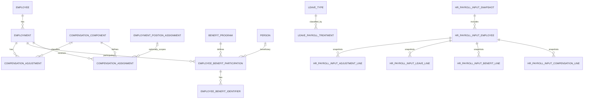

# HR-006 — Compensation, Benefit & Payroll Input System/Data Design

**Version:** 1.0  
**Status:** Approved — Locked  
**Phase:** 2E — System Architecture & Data Design  
**Primary Module:** `Modules/HR`  
**Future Consumer:** `Modules/Finance` (not yet present in repository)  
**Baseline Repository:** `26b475b695aa4511064b1410db03d1f0c8bdd6ce`  
**Depends On:** HR-001 (Approved), ADR-032 (Accepted), HR-002 (Approved), HR-003 (Approved), HR-004 (Approved), HR-005 (Approved)

---

# 1. Executive Summary

HR-006 mendesain fondasi **Compensation, Benefit, dan HR Payroll Input** untuk EduCore tanpa memindahkan payroll/financial ownership ke HR.

Keputusan paling penting:

```text
HR owns
├── employment compensation facts
├── fixed/rate compensation assignments
├── position/functional allowance eligibility facts
├── benefit program & employee participation facts
├── BPJS/TPG/THR/employee-benefit eligibility tracking
├── approved HR compensation adjustments
├── paid/unpaid leave payroll-impact classification
└── immutable HR payroll-input snapshot

Attendance owns
└── finalized attendance facts

Academic owns
└── verified teaching workload / teaching quantity

Finance owns
├── payroll period/run
├── gross/net calculation
├── statutory/tax formulas
├── PPh 21 calculation
├── BPJS contribution calculation
├── deduction calculation
├── payable
├── payslip final
├── bank/payment/disbursement
├── reconciliation
└── accounting
```

HR **tidak** menjadi payroll engine.

Canonical future payroll composition:

```text
HR Payroll Input Snapshot
(compensation + benefit + leave-impact + HR adjustment)
             +
Attendance Finalized Payroll Facts
             +
Academic Verified Teaching Quantity
             ↓
        Finance Payroll Run
             ↓
financial calculation / tax / contribution / deduction
             ↓
      payable / payslip / payment
```

Arsitektur ini mencegah dependency cycle. `Academic` dan `Attendance` sudah/akan bergantung pada HR, sehingga HR tidak boleh bergantung balik kepada Academic/Attendance untuk membangun canonical HR payroll input.

---

# 2. Project Resource Audit

## 2.1 Resources reviewed

Resource yang diverifikasi ulang:

- repository `educore(3)` pada commit `26b475b695aa4511064b1410db03d1f0c8bdd6ce`;
- `Modules/HR/module.yaml`;
- `Modules/Academic/module.yaml`;
- `Modules/Dormitory/*` untuk pattern integrity/concurrency;
- Core Person, Tenancy, Organization, Authorization, dan Audit contracts;
- `docs/architecture/architecture-principles.md`;
- `docs/architecture/folder-structure.md`;
- ADR-013, ADR-032;
- HR-001 sampai HR-005;
- project file search untuk Finance/payroll PRD yang tersedia pada current tool context.

## 2.2 Existing facts

**[FAKTA]** `Modules/HR` sekarang bergantung pada `core` dan `Auth`.

**[FAKTA]** `Modules/Academic` bergantung pada `core`, `HR`, dan `Auth`.

**[FAKTA]** HR-005 menetapkan Attendance sebagai module downstream yang bergantung pada HR, bukan sebaliknya.

**[FAKTA]** Repository belum memiliki `Modules/Finance` atau persistence payroll.

**[FAKTA]** Project file search pada current resource context tidak menemukan PRD Finance/payroll yang dapat diverifikasi. Karena itu HR-006 tidak mengklaim detail schema/contract Finance existing.

**[FAKTA]** HR-001 sudah mengunci:

- `OD-HR-003`: HR owns compensation/employment/payroll-input facts; Finance owns payroll run, payable, payment, accounting, dan settlement;
- `BR-014`: payroll financial finalization/tax/payment/accounting adalah Finance concern;
- `BR-015`: payroll input harus traceable ke source facts;
- `FR-023`: HR mengelola compensation profile dan benefit eligibility facts;
- `FR-024`: HR menghasilkan payroll input traceable untuk Finance;
- `FR-025`: payroll run/payment/tax/accounting bukan HR source of truth;
- `FR-026`: final payroll/slip adalah Finance result;
- `FR-027`: HR mendukung tracking BPJS, THR, TPG, dan employee-child education benefit jika diaktifkan tenant.

**[FAKTA]** HR-002 menetapkan `Employment` sebagai episode hubungan kerja canonical dan Position Assignment sebagai historical HR position record.

**[FAKTA]** HR-004 memiliki Leave Type, entitlement, approval, dan ledger tetapi belum mengklasifikasikan apakah sebuah Leave Type berdampak sebagai paid/unpaid absence.

**[FAKTA]** HR-005 menjadikan Attendance Record finalized sebagai source attendance canonical dan melarang raw attendance event dianggap sebagai payroll result.

## 2.3 Resource gaps

**[RESOURCE GAP]** Belum tersedia Finance domain specification yang dapat diverifikasi pada current project resources.

**[RESOURCE GAP]** Belum ada canonical Payroll Calendar / Payroll Period / Payroll Run.

**[RESOURCE GAP]** Belum ada typed Tenant currency/default currency.

**[RESOURCE GAP]** Belum ada Academic canonical teaching workload/schedule contract yang dapat memberikan verified billable teaching quantity.

**[RESOURCE GAP]** Belum ada employee-dependent relationship model yang cukup untuk membuktikan benefit anak pegawai.

**[RESOURCE GAP]** Formula/rate statutory seperti PPh 21, BPJS, dan peraturan TPG/THR bersifat regulatory/time-sensitive dan tidak boleh di-hardcode di HR-006 tanpa Finance/regulatory specification yang tervalidasi.

---

# 3. Scope

## 3.1 IN SCOPE — Phase 2E

- tenant-scoped Compensation Component catalog;
- employee/employment Compensation Assignment;
- fixed periodic amount dan rate-per-unit compensation facts;
- optional linkage compensation ke Employment Position Assignment;
- effective-dated compensation history;
- compensation change/correction lifecycle;
- Benefit Program catalog;
- employee Benefit Participation/Eligibility tracking;
- external benefit membership identifier storage secara encrypted/fingerprinted;
- BPJS enrollment/eligibility tracking;
- TPG tracking/eligibility facts;
- THR eligibility facts;
- employee-child benefit foundation dengan canonical beneficiary Person reference bila tersedia;
- approved one-time HR compensation adjustment;
- Leave Type → payroll-impact mapping;
- immutable HR Payroll Input Snapshot;
- HR payroll-input query contract untuk future Finance;
- authorization, audit, indexing, constraints, API, migration strategy;
- self-service read view untuk compensation/benefit sesuai capability.

## 3.2 OUT OF SCOPE

- payroll run;
- gross salary calculation;
- net salary calculation;
- PPh 21 calculation;
- BPJS contribution amount calculation;
- tax withholding;
- employer contribution calculation;
- attendance monetary deduction calculation;
- unpaid-leave monetary deduction calculation;
- loan/cooperative balance ownership;
- arbitrary payroll deductions;
- payable/accounting journal;
- bank transfer/payment gateway;
- bank reconciliation;
- final payslip persistence;
- Finance ledger/account code;
- student/guardian billing;
- Academic teaching schedule ownership;
- Attendance event/result ownership;
- statutory formula hardcoding.

## 3.3 FUTURE SCOPE

- `Modules/Finance` payroll engine;
- Finance Payroll Calendar/Period/Run;
- regulatory policy/version catalog for statutory calculations;
- Academic verified teaching-workload contract;
- Attendance payroll-summary contract;
- employee dependent relationship verification;
- Finance result/payslip UI composition;
- bank disbursement;
- employee loan/cooperative module integration.

## 3.4 DEFERRED

- exact PPh 21 formula;
- exact BPJS percentages/bases/caps;
- exact THR statutory formula;
- exact TPG government data mapping;
- default tenant currency;
- salary-grade architecture unless a concrete business requirement emerges;
- retroactive payroll recalculation mechanism;
- generic rules engine.

---

# 4. Architectural Decisions Proposed for Approval

| ID | Decision |
|---|---|
| **OD-HR-COMP-001** | HR stores compensation **facts/entitlements**, not final payroll calculation. Money-bearing HR facts use fixed precision decimal + explicit ISO 4217 currency code; floating point is prohibited. |
| **OD-HR-COMP-002** | Compensation is effective-dated per `Employment`. An approved historical assignment is not overwritten; changes end/supersede the old assignment and create a new record. |
| **OD-HR-COMP-003** | Position/functional allowance may reference `employment_position_assignment_id`; it does not infer system Role/Permission and does not duplicate Position ownership. |
| **OD-HR-COMP-004** | Hourly teaching compensation stores the **rate** in HR. Verified teaching quantity remains Academic-owned and is consumed directly by future Finance; HR must not depend on Academic. |
| **OD-HR-COMP-005** | Attendance lateness/absence/worked-time facts remain Attendance-owned and are consumed directly by future Finance; HR must not depend on Attendance. |
| **OD-HR-COMP-006** | HR adds effective-dated `LeaveType → payroll impact` mapping (`PAID_ABSENCE`, `UNPAID_ABSENCE`, `NO_PAYROLL_IMPACT`, `FINANCE_POLICY`) instead of reopening HR-004 Leave schema or calculating deduction amounts. |
| **OD-HR-COMP-007** | BPJS/TPG/THR/other benefits are tracked as HR Benefit Programs + employee participation/eligibility facts. Statutory contribution/payment formula remains Finance/external-policy concern. |
| **OD-HR-COMP-008** | One-time HR compensation adjustments require explicit approval capability and maker-checker separation by default; approved adjustments are immutable business evidence and never silently edited. |
| **OD-HR-COMP-009** | HR may generate an immutable **HR Payroll Input Snapshot containing HR-owned facts only**. It does not aggregate Attendance or Academic data, preventing module dependency cycles. |
| **OD-HR-COMP-010** | Future Finance is the downstream composer of HR + Attendance + Academic payroll inputs. HR must not add a backend dependency on Finance merely to display payslips. |
| **OD-HR-COMP-011** | Final payslip/result remains Finance-owned. UI may surface Finance-owned data under an HR/self-service navigation experience without changing backend domain ownership. |
| **OD-HR-COMP-012** | Sensitive external benefit/member numbers are not stored in Core `person_identifiers`; HR uses encrypted value + deterministic HMAC fingerprint pattern because these identifiers are benefit-domain facts, not canonical legal identity. |
| **OD-HR-COMP-013** | Negative compensation assignments are prohibited in HR. Deductions, tax, BPJS employee contribution, cooperative/loan deductions, and financial recovery are Finance-owned calculations/instructions. |
| **OD-HR-COMP-014** | Existing `employees.jabatan` remains unrelated to compensation authority. Compensation uses canonical Employment/Position Assignment from HR-002. |

---

# 5. Dependency Topology

## 5.1 Existing and proposed dependency direction

```text
Core
 ↑
HR
 ↑           ↑
Academic   Attendance
    \       /
     \     /
      Finance   (future)
```

More explicitly:

```text
HR         → Core, Auth
Academic   → Core, HR, Auth
Attendance → Core, HR, Auth
Finance    → Core, HR, Attendance, Academic, Auth   [future recommendation]
```

## 5.2 Forbidden dependency directions

```text
HR → Academic      FORBIDDEN
HR → Attendance    FORBIDDEN
HR → Finance       FORBIDDEN as canonical backend dependency

Attendance → Finance   not required
Academic → Finance     not required
```

Reason:

- `Academic → HR` already exists;
- `Attendance → HR` was approved in HR-005;
- introducing `HR → Academic` or `HR → Attendance` would create cycles;
- future Finance can safely depend downstream on all input-owner modules.

## 5.3 Payslip UX

Requirement `FR-026` is fulfilled through composition, not ownership reversal.

Recommended future shape:

```text
Frontend HR/Self-Service navigation
        ↓
Finance-owned payroll result endpoint
        ↓
Finance authorization + Finance source of truth
```

A menu placement under HR does not require `Modules/HR` to query Finance internally.

---

# 6. Domain Model



---

# 7. Data Dictionary & Schema

## 7.1 Monetary storage convention

**[REKOMENDASI]** Semua monetary/rate values dalam HR memakai PostgreSQL/Laravel equivalent:

```text
numeric(19,4)
```

with:

```text
currency_code char(3)
```

Rules:

- no `float` / `double` for money;
- amount/rate must be `>= 0`;
- currency code uppercase ISO 4217-compatible format;
- no DB default `IDR` because repository has no canonical tenant currency configuration;
- UI may suggest IDR only after tenant configuration exists; persistence stays explicit.

Four decimal places support rate precision while remaining safe for IDR amounts.

---

## 7.2 `compensation_components`

Tenant-scoped catalog describing the **meaning** of a compensation fact, not its employee-specific value.

| Column | Type | Null | Rule |
|---|---|---:|---|
| `id` | UUID | No | UUIDv7. |
| `tenant_id` | UUID | No | Tenant owner. |
| `code` | varchar(60) | No | Stable tenant code. |
| `name` | varchar(150) | No | Display name. |
| `category` | varchar(30) | No | `BASE_PAY`, `ALLOWANCE`, `RATE`, `OTHER_EARNING_INPUT`. |
| `value_mode` | varchar(30) | No | `FIXED_AMOUNT`, `RATE_PER_UNIT`. |
| `unit_code` | varchar(20) | Yes | Required for `RATE_PER_UNIT`; examples `HOUR`, `DAY`, `SESSION`. |
| `periodicity` | varchar(20) | No | `MONTHLY`, `DAILY`, `PER_UNIT`, `ONE_TIME`, `OTHER`. |
| `description` | text | Yes | Non-sensitive description. |
| `is_active` | boolean | No | Default true. |
| timestamps | | | Standard. |

Constraints:

```text
UNIQUE (tenant_id, code)
UNIQUE (id, tenant_id)

CHECK category IN (
  'BASE_PAY',
  'ALLOWANCE',
  'RATE',
  'OTHER_EARNING_INPUT'
)

CHECK value_mode IN ('FIXED_AMOUNT', 'RATE_PER_UNIT')

CHECK (
  value_mode = 'RATE_PER_UNIT' AND unit_code IS NOT NULL
) OR (
  value_mode = 'FIXED_AMOUNT' AND unit_code IS NULL
)
```

`compensation_components` intentionally contains no:

- taxability;
- accounting code;
- debit/credit account;
- BPJS percentage;
- PPh formula;
- deduction rule.

Those are Finance concerns.

Example catalog:

```text
BASE_SALARY          BASE_PAY   FIXED_AMOUNT  MONTHLY
POSITION_ALLOWANCE   ALLOWANCE  FIXED_AMOUNT  MONTHLY
FUNCTIONAL_ALLOWANCE ALLOWANCE  FIXED_AMOUNT  MONTHLY
TEACHING_HOUR_RATE   RATE       RATE_PER_UNIT HOUR
```

---

## 7.3 `compensation_assignments`

Effective-dated compensation fact for one Employment.

| Column | Type | Null | Rule |
|---|---|---:|---|
| `id` | UUID | No | UUIDv7. |
| `tenant_id` | UUID | No | Tenant qualification. |
| `employment_id` | UUID | No | Canonical Employment. |
| `compensation_component_id` | UUID | No | Catalog component. |
| `employment_position_assignment_id` | UUID | Yes | Optional position scope. |
| `status` | varchar(20) | No | `DRAFT`, `APPROVED`, `ENDED`, `CANCELLED`, `SUPERSEDED`. |
| `amount` | numeric(19,4) | Yes | `FIXED_AMOUNT` value. |
| `rate` | numeric(19,4) | Yes | `RATE_PER_UNIT` value. |
| `currency_code` | char(3) | No | Explicit currency. |
| `effective_from` | date | No | Inclusive. |
| `effective_to` | date | Yes | Inclusive/end-of-validity according to service convention; null = open. |
| `supersedes_assignment_id` | UUID | Yes | Correction/change chain. |
| `approved_by_membership_id` | UUID | Yes | Required for approved state. |
| `approved_at` | timestamptz | Yes | Required for approved state. |
| `ended_at` | timestamptz | Yes | Operational end timestamp. |
| `reason` | text | Yes | Sensitive HR note; restricted. |
| timestamps | | | Standard. |

Value rules:

```text
FIXED_AMOUNT → amount > 0 AND rate IS NULL
RATE_PER_UNIT → rate > 0 AND amount IS NULL

currency_code ~ '^[A-Z]{3}$'
effective_to IS NULL OR effective_to >= effective_from
```

Tenant-safe relationships:

```text
(employment_id, tenant_id)
  → employments(id, tenant_id)

(compensation_component_id, tenant_id)
  → compensation_components(id, tenant_id)

(employment_position_assignment_id, tenant_id)
  → employment_position_assignments(id, tenant_id)
```

Application invariants:

```text
position_assignment.employment_id = compensation_assignment.employment_id

compensation effective range must be inside Employment lifecycle
```

### Approved-history rule

Once `APPROVED`, value fields are immutable through normal update API.

Change:

```text
old assignment effective_to = previous day/date boundary
new assignment effective_from = new effective date
```

Correction:

```text
create replacement assignment
supersedes_assignment_id = incorrect assignment
mark incorrect record SUPERSEDED
```

Historical payroll snapshots remain unchanged.

---

## 7.4 Effective-range overlap rule

For the same:

```text
tenant_id
employment_id
compensation_component_id
employment_position_assignment_id (same nullable scope)
```

there must not be overlapping `APPROVED` effective periods.

**[REKOMENDASI]** PostgreSQL exclusion constraint/range semantics should be used where practical, following the repository's PostgreSQL-grade integrity direction.

If nullable position scope complicates a single exclusion constraint, use separate constraints/indexes for:

- employment-level component assignment;
- position-scoped component assignment.

Application validation remains defense-in-depth; DB is final race-condition guard.

---

## 7.5 `benefit_programs`

Tenant-scoped benefit catalog.

| Column | Type | Null | Rule |
|---|---|---:|---|
| `id` | UUID | No | UUIDv7. |
| `tenant_id` | UUID | No | Tenant owner. |
| `code` | varchar(60) | No | Stable code. |
| `name` | varchar(150) | No | Display. |
| `category` | varchar(30) | No | `STATUTORY`, `GOVERNMENT`, `INSTITUTIONAL`, `OTHER`. |
| `beneficiary_scope` | varchar(20) | No | `EMPLOYEE`, `DEPENDENT`, `EITHER`. |
| `payroll_relevance` | varchar(20) | No | `NONE`, `ELIGIBILITY_INPUT`, `EXTERNAL_PAYMENT_TRACKING`. |
| `description` | text | Yes | Non-sensitive description. |
| `is_active` | boolean | No | Operational flag. |
| timestamps | | | Standard. |

Examples:

```text
BPJS_KESEHATAN
BPJS_KETENAGAKERJAAN
TPG
THR
EMPLOYEE_CHILD_EDUCATION
```

Codes are tenant-configurable; the above are examples, not mandatory global enums.

No statutory percentage or payment formula is stored here.

---

## 7.6 `employee_benefit_participations`

Tracks eligibility/enrollment/participation, not final monetary settlement.

| Column | Type | Null | Rule |
|---|---|---:|---|
| `id` | UUID | No | UUIDv7. |
| `tenant_id` | UUID | No | Tenant qualification. |
| `employment_id` | UUID | No | Employment receiving benefit. |
| `benefit_program_id` | UUID | No | Program. |
| `beneficiary_person_id` | UUID | Yes | Optional dependent/other canonical Person beneficiary. Null means Employee is beneficiary. |
| `status` | varchar(25) | No | `ELIGIBLE`, `ENROLLED`, `SUSPENDED`, `ENDED`, `INELIGIBLE`. |
| `effective_from` | date | No | Validity start. |
| `effective_to` | date | Yes | Null = open. |
| `verified_at` | timestamptz | Yes | Administrative verification. |
| `verified_by_membership_id` | UUID | Yes | Actor. |
| `notes` | text | Yes | Sensitive HR note. |
| timestamps | | | Standard. |

Invariants:

- program and Employment must belong to same Tenant;
- `beneficiary_person_id = NULL` means employee/self beneficiary;
- dependent beneficiary is allowed only when `beneficiary_scope` permits it;
- dependent relationship verification is **[RESOURCE GAP]** and must be solved before automatic employee-child benefit approval;
- no overlapping active participation for same Employment + Program + beneficiary unless program explicitly supports multiples in future.

No raw child identity is duplicated into HR; beneficiary uses Core `Person` when needed.

---

## 7.7 `employee_benefit_identifiers`

Stores benefit-domain identifiers such as BPJS participant numbers.

| Column | Type | Null | Rule |
|---|---|---:|---|
| `id` | UUID | No | UUIDv7. |
| `tenant_id` | UUID | No | Tenant qualification. |
| `employee_benefit_participation_id` | UUID | No | Parent participation. |
| `benefit_program_id` | UUID | No | Redundant-but-validated program key to support tenant-safe uniqueness/query without joining sensitive data. Must equal parent participation program. |
| `identifier_type` | varchar(50) | No | Tenant/domain stable type code. |
| `encrypted_value` | text | No | Application encryption ciphertext. |
| `value_fingerprint` | char(64) | No | HMAC-SHA256 hex for exact duplicate detection. |
| `issuer` | varchar(150) | Yes | External issuer. |
| `issued_at` | date | Yes | Optional. |
| `expires_at` | date | Yes | Optional. |
| `status` | varchar(20) | No | `ACTIVE`, `INACTIVE`. |
| timestamps | | | Standard. |

Pattern follows Core `person_identifiers`, but remains HR-owned because BPJS/benefit identifiers are not canonical legal human identity.

Recommended uniqueness:

```text
UNIQUE (
  tenant_id,
  benefit_program_id,
  identifier_type,
  value_fingerprint
)
```

Application/DB tenant-safe validation must ensure `benefit_program_id` equals the program of the referenced participation. The intentional duplicated key is an integrity/indexing aid, not a second ownership source.

Raw identifier must never be logged.

---

## 7.8 `compensation_adjustments`

One-time approved HR earning/correction input.

This is **not** a generic deduction table.

| Column | Type | Null | Rule |
|---|---|---:|---|
| `id` | UUID | No | UUIDv7. |
| `tenant_id` | UUID | No | Tenant qualification. |
| `employment_id` | UUID | No | Target Employment. |
| `compensation_component_id` | UUID | Yes | Optional classification. |
| `adjustment_type` | varchar(30) | No | `ONE_TIME_EARNING`, `COMPENSATION_CORRECTION`. |
| `amount` | numeric(19,4) | No | Positive. |
| `currency_code` | char(3) | No | Explicit currency. |
| `target_period_start` | date | No | Target Finance period window hint. |
| `target_period_end` | date | No | Must be >= start. |
| `status` | varchar(20) | No | `DRAFT`, `SUBMITTED`, `APPROVED`, `REJECTED`, `CANCELLED`. |
| `reason` | text | No | Sensitive HR justification. |
| `requested_by_membership_id` | UUID | No | Maker. |
| `approved_by_membership_id` | UUID | Yes | Checker. |
| `approved_at` | timestamptz | Yes | Final approval. |
| `idempotency_key` | varchar(120) | No | Stable business idempotency key. |
| timestamps | | | Standard. |

Constraints:

```text
amount > 0
currency_code ~ '^[A-Z]{3}$'
target_period_end >= target_period_start
UNIQUE (tenant_id, idempotency_key)
```

Maker-checker:

```text
approved_by_membership_id != requested_by_membership_id
```

for normal approved adjustments.

HR does not create negative amount rows. Financial deductions/corrections that reduce payable remain Finance concern.

---

## 7.9 `leave_payroll_treatments`

Additive Phase 2E mapping that preserves locked HR-004.

| Column | Type | Null | Rule |
|---|---|---:|---|
| `id` | UUID | No | UUIDv7. |
| `tenant_id` | UUID | No | Tenant qualification. |
| `leave_type_id` | UUID | No | HR-004 Leave Type. |
| `treatment` | varchar(30) | No | `PAID_ABSENCE`, `UNPAID_ABSENCE`, `NO_PAYROLL_IMPACT`, `FINANCE_POLICY`. |
| `effective_from` | date | No | Effective dating. |
| `effective_to` | date | Yes | Null = open. |
| `is_active` | boolean | No | Operational. |
| timestamps | | | Standard. |

Rules:

```text
UNIQUE open/effective treatment per Leave Type at a point in time
CHECK effective_to IS NULL OR effective_to >= effective_from
```

Semantics:

- `PAID_ABSENCE`: HR states absence is paid for compensation eligibility; Finance decides financial treatment;
- `UNPAID_ABSENCE`: HR states absence is unpaid; Finance calculates amount impact;
- `NO_PAYROLL_IMPACT`: leave exists operationally but is not a payroll input;
- `FINANCE_POLICY`: HR intentionally delegates financial interpretation to a Finance policy while still exposing the Leave fact.

No deduction amount/rate is stored here.

---

# 8. HR Payroll Input Snapshot

## 8.1 Purpose

A payroll run may be recalculated after HR data has changed. Finance therefore requires evidence of **what HR knew/provided at a specific cutoff**.

HR-006 introduces an immutable HR-owned snapshot containing only HR facts.

It does **not** include:

- Attendance metrics;
- Academic teaching quantities;
- tax calculation;
- final gross/net;
- Finance deductions.

## 8.2 `hr_payroll_input_snapshots`

| Column | Type | Null | Rule |
|---|---|---:|---|
| `id` | UUID | No | UUIDv7. |
| `tenant_id` | UUID | No | Tenant owner. |
| `period_start` | date | No | Requested period boundary. |
| `period_end` | date | No | Requested period boundary. |
| `cutoff_at` | timestamptz | No | Snapshot cutoff. |
| `status` | varchar(20) | No | `BUILDING`, `READY`, `FAILED`, `INVALIDATED`. |
| `request_key` | varchar(120) | No | Idempotency key supplied/derived by consumer. |
| `generated_by_membership_id` | UUID | Yes | Null when system-to-system generation. |
| `generated_at` | timestamptz | Yes | Set when READY. |
| `failure_code` | varchar(80) | Yes | Non-sensitive failure category. |
| timestamps | | | Standard. |

Constraints:

```text
period_end >= period_start
UNIQUE (tenant_id, request_key)
```

Once `READY`, snapshot content is immutable.

If corrected HR facts require regeneration:

```text
new request_key / new snapshot
```

Historical READY snapshot remains evidence.

`INVALIDATED` may mark a discovered integrity problem but must not delete historical snapshot rows.

---

## 8.3 `hr_payroll_input_employees`

Population snapshot.

| Column | Type | Null | Rule |
|---|---|---:|---|
| `id` | UUID | No | UUIDv7. |
| `tenant_id` | UUID | No | Tenant. |
| `snapshot_id` | UUID | No | Parent. |
| `employee_id` | UUID | No | Employee. |
| `employment_id` | UUID | No | Employment relevant during period. |
| `employment_status` | varchar(20) | No | Snapshot. |
| `employment_start_date` | date | No | Snapshot. |
| `employment_end_date` | date | Yes | Snapshot. |
| timestamps | | | Standard. |

```text
UNIQUE (snapshot_id, employment_id)
```

No Person name/NIP copy is required in the canonical snapshot. Consumer can resolve display projection separately with authorization.

---

## 8.4 `hr_payroll_input_compensation_lines`

Typed snapshot of approved compensation assignments intersecting the requested period.

| Column | Type | Null | Rule |
|---|---|---:|---|
| `id` | UUID | No | UUIDv7. |
| `snapshot_employee_id` | UUID | No | Parent. |
| `source_compensation_assignment_id` | UUID | No | Traceability source. |
| `component_code` | varchar(60) | No | Stable snapshot code. |
| `component_category` | varchar(30) | No | Snapshot semantics. |
| `value_mode` | varchar(30) | No | `FIXED_AMOUNT` / `RATE_PER_UNIT`. |
| `amount` | numeric(19,4) | Yes | Fixed amount. |
| `rate` | numeric(19,4) | Yes | Rate. |
| `unit_code` | varchar(20) | Yes | Rate unit. |
| `currency_code` | char(3) | No | Currency. |
| `effective_from` | date | No | Source snapshot. |
| `effective_to` | date | Yes | Source snapshot. |

Finance may use these facts, but HR does not calculate final period proration.

Example:

```text
BASE_SALARY
amount = 5,000,000 IDR
periodicity = MONTHLY

TEACHING_HOUR_RATE
rate = 50,000 IDR / HOUR
```

Teaching **quantity** is not included; future Finance gets it from Academic.

---

## 8.5 `hr_payroll_input_benefit_lines`

Snapshot of benefit eligibility/participation relevant to the period.

| Column | Type | Null | Rule |
|---|---|---:|---|
| `id` | UUID | No | UUIDv7. |
| `snapshot_employee_id` | UUID | No | Parent. |
| `source_benefit_participation_id` | UUID | No | Traceability. |
| `benefit_program_code` | varchar(60) | No | Snapshot code. |
| `status` | varchar(25) | No | Eligibility/enrollment snapshot. |
| `beneficiary_person_id` | UUID | Yes | If dependent. |
| `effective_from` | date | No | Source. |
| `effective_to` | date | Yes | Source. |
| `payroll_relevance` | varchar(20) | No | Snapshot. |

External encrypted benefit identifiers are **not copied** into payroll snapshots by default. Finance receives them only through a dedicated authorized query if operationally required.

---

## 8.6 `hr_payroll_input_leave_lines`

Snapshot of approved Leave/Permit facts with payroll impact classification.

| Column | Type | Null | Rule |
|---|---|---:|---|
| `id` | UUID | No | UUIDv7. |
| `snapshot_employee_id` | UUID | No | Parent. |
| `source_leave_request_id` | UUID | No | HR-004 source. |
| `leave_type_code` | varchar(50) | No | Snapshot. |
| `treatment` | varchar(30) | No | Payroll-impact snapshot. |
| `starts_at` | timestamptz | No | Approved interval. |
| `ends_at` | timestamptz | No | Approved interval. |
| `units` | numeric(10,2) | No | Approved/requested units as canonical Leave fact. |
| `unit` | varchar(10) | No | `DAY` / `HOUR`. |

No monetary deduction is computed.

---

## 8.7 `hr_payroll_input_adjustment_lines`

Snapshot of approved HR adjustment evidence.

| Column | Type | Null | Rule |
|---|---|---:|---|
| `id` | UUID | No | UUIDv7. |
| `snapshot_employee_id` | UUID | No | Parent. |
| `source_adjustment_id` | UUID | No | Traceability. |
| `adjustment_type` | varchar(30) | No | Snapshot. |
| `component_code` | varchar(60) | Yes | Optional. |
| `amount` | numeric(19,4) | No | Positive HR earning input. |
| `currency_code` | char(3) | No | Currency. |
| `target_period_start` | date | No | Source target. |
| `target_period_end` | date | No | Source target. |

Finance deduplicates on stable `source_adjustment_id` across reruns.

---

# 9. Snapshot Population Rules

## 9.1 Eligible Employment

For a period `[period_start, period_end]`, include Employment whose lifecycle overlaps the period and is payroll-relevant according to Finance request/population criteria.

Baseline HR rule:

```text
Employment.start_date <= period_end
AND
(Employment.end_date IS NULL OR Employment.end_date >= period_start)
AND
Employment.status IN ('ACTIVE', 'ENDED')
```

`PLANNED` is excluded unless future Finance explicitly requests forecast mode.

## 9.2 Compensation inclusion

Include `APPROVED` compensation assignments whose effective range intersects the requested period.

Do not prorate money in HR.

Finance receives:

- amount/rate;
- effective range;
- periodicity/value mode;
- source identity.

Finance calculates period amount.

## 9.3 Benefit inclusion

Include participation whose effective range intersects requested period and whose program is payroll relevant.

## 9.4 Leave inclusion

Include final `APPROVED` Leave Requests overlapping requested period with effective payroll-treatment mapping.

If no applicable payroll-treatment mapping exists for a Leave Type that Finance requires:

```text
snapshot generation returns configuration error
```

rather than silently assuming paid or unpaid.

## 9.5 Adjustment inclusion

Include only `APPROVED` adjustments whose target period overlaps/matches the requested period according to deterministic service rule.

---

# 10. Snapshot Generation Transaction & Consistency

Snapshot is historical evidence; mixed-state reads should be avoided.

Recommended service flow:

```text
1. authorize request
2. validate period + request_key
3. return existing snapshot for same request_key if present
4. create BUILDING snapshot
5. resolve Employment population
6. read HR facts at cutoff boundary
7. write typed snapshot rows
8. validate internal source references and required mappings
9. mark READY with generated_at
```

### Consistency recommendation

Because snapshot may contain many employees, holding row locks over the entire workforce is undesirable.

Preferred approach:

- use PostgreSQL transaction isolation/snapshot semantics appropriate to repository scale;
- capture `cutoff_at` before extraction;
- include only source records committed/effective by the cutoff rule;
- once READY, snapshot rows are immutable;
- if source corrections occur after cutoff, generate a new snapshot.

Exact transaction isolation level is implementation-time decision after performance tests; do not emulate consistency by copying live data incrementally without a cutoff contract.

---

# 11. Cross-Domain Payroll Contracts

## 11.1 HR → Finance contract

Future Finance consumes a narrow HR contract conceptually equivalent to:

```text
HRPayrollInputSnapshotServiceInterface

createOrResolveSnapshot(
  tenantId,
  periodStart,
  periodEnd,
  cutoffAt,
  requestKey
) -> HRPayrollInputSnapshot
```

Finance receives immutable HR-owned facts.

HR implementation must not know Finance PayrollRun tables.

## 11.2 Attendance → Finance contract

Defined as future extension of HR-005 ownership:

```text
WorkforceAttendancePayrollFactsQueryInterface
```

Typical facts:

```text
employee/employment
period
finalized present/absent status
late_minutes
early_departure_minutes
worked_minutes
excused_minutes
source attendance record/revision
```

HR does not proxy this contract.

## 11.3 Academic → Finance contract

Future Academic contract:

```text
VerifiedTeachingWorkloadQueryInterface
```

Typical facts:

```text
employee/employment
teaching assignment
verified quantity
unit = HOUR / SESSION
period
source identity/version
```

HR supplies rate, not teaching quantity.

## 11.4 Finance composition

```text
Finance Payroll Run
    ├── HR snapshot
    ├── Attendance facts
    └── Academic workload facts
          ↓
    Finance policy/version
          ↓
    gross / deduction / tax / contribution / net
```

This is the only place where all payroll input domains are composed for financial calculation.

---

# 12. BPJS, TPG, THR, and Benefit Semantics

## 12.1 BPJS

HR owns:

- program participation/enrollment state;
- external participant identifier;
- effective dates;
- employee eligibility administrative evidence.

Finance owns:

- contribution base;
- statutory percentage;
- employee/employer contribution amounts;
- deduction/payment accounting.

## 12.2 TPG

HR owns:

- eligibility/tracking status;
- association to Employee/Employment;
- relevant external reference/evidence identifiers where appropriate;
- effective period.

HR-006 does not assume TPG is always paid through institutional payroll. Program `payroll_relevance` determines whether Finance receives it as input or it remains external-payment tracking.

## 12.3 THR

HR owns eligibility facts and Employment history required by policy.

Finance owns monetary calculation and payment.

No statutory THR formula is hardcoded in HR.

## 12.4 Employee-child education benefit

Recommended canonical linkage:

```text
Employee Employment
    ↓
Benefit Participation
    ↓
beneficiary_person_id → Core Person
```

**[RESOURCE GAP]** Relationship evidence such as `EMPLOYEE is parent/guardian of PERSON` is not yet a canonical HR/Core contract.

Therefore:

- HR-006 supports canonical beneficiary Person reference;
- automatic eligibility from family relationship is deferred;
- no duplicated child name/NIK record should be created inside benefit table;
- when a future relationship contract exists, eligibility can be validated without schema replacement.

---

# 13. Payroll Deductions Boundary

User/business requirements mention:

- BPJS deductions;
- PPh 21;
- cooperative deductions;
- employee loans.

HR-006 classifies them as follows:

| Item | HR responsibility | Finance responsibility |
|---|---|---|
| BPJS | enrollment/eligibility/member identifier | contribution calculation, deduction, payable/accounting |
| PPh 21 | employment facts required as input | tax rule/version, tax calculation, withholding/accounting |
| Cooperative | optional membership/reference only if HR needs it | deduction instruction/financial balance/settlement |
| Loan | no loan balance ownership | loan balance, installment, deduction, settlement |
| Unpaid leave | approved leave + `UNPAID_ABSENCE` classification | monetary deduction calculation |
| Lateness/absence | none; Attendance owns metrics | monetary effect calculation |

HR must not store arbitrary negative compensation values as a shortcut.

---

# 14. Authorization Catalog

Proposed permissions:

```text
hr.compensation.self.read

hr.compensation.read
hr.compensation.manage
hr.compensation.approve
hr.compensation.adjust

hr.benefit.self.read
hr.benefit.read
hr.benefit.manage
hr.benefit.identifier.read
hr.benefit.identifier.manage

hr.payroll_input.read
hr.payroll_input.generate
hr.payroll_input.invalidate

hr.leave.payroll_treatment.read
hr.leave.payroll_treatment.manage
```

Important separation:

- `hr.compensation.manage` does not imply approval;
- `hr.compensation.adjust` is sensitive and should be granted narrowly;
- benefit external identifiers require separate permission;
- payroll snapshot generation/read is not automatically granted to all HR operators;
- Position/job title never grants capability implicitly.

Scoped authorization uses existing Core tenant/organization/unit authorization model where the target Employment has applicable historical/current placement.

Unplaced employee visibility follows the same conservative rule already established in HR-002/HR-005: scoped-only actors must not accidentally receive tenant-wide access.

---

# 15. API Specification

All endpoints are illustrative contract targets; exact controller naming follows existing HR conventions at implementation time.

## 15.1 Compensation Component catalog

```text
GET    /api/v1/hr/compensation-components
POST   /api/v1/hr/compensation-components
PATCH  /api/v1/hr/compensation-components/{componentId}
POST   /api/v1/hr/compensation-components/{componentId}/deactivate
```

Historical component semantics cannot be mutated incompatibly after use.

## 15.2 Employee compensation

```text
GET  /api/v1/hr/employees/{employeeId}/compensation
POST /api/v1/hr/employments/{employmentId}/compensation-assignments
GET  /api/v1/hr/employments/{employmentId}/compensation-assignments
```

Explicit lifecycle commands:

```text
POST /api/v1/hr/compensation-assignments/{id}/approve
POST /api/v1/hr/compensation-assignments/{id}/end
POST /api/v1/hr/compensation-assignments/{id}/correct
POST /api/v1/hr/compensation-assignments/{id}/cancel
```

Approved values are not arbitrarily patched.

## 15.3 Benefits

```text
GET    /api/v1/hr/benefit-programs
POST   /api/v1/hr/benefit-programs
PATCH  /api/v1/hr/benefit-programs/{id}

GET  /api/v1/hr/employments/{employmentId}/benefits
POST /api/v1/hr/employments/{employmentId}/benefits
POST /api/v1/hr/benefit-participations/{id}/verify
POST /api/v1/hr/benefit-participations/{id}/end
```

Sensitive identifier operations:

```text
POST /api/v1/hr/benefit-participations/{id}/identifiers
GET  /api/v1/hr/benefit-participations/{id}/identifiers
```

GET must return masked values by default; full reveal requires explicit sensitive capability and audited operation.

## 15.4 Adjustments

```text
POST /api/v1/hr/compensation-adjustments
GET  /api/v1/hr/compensation-adjustments
POST /api/v1/hr/compensation-adjustments/{id}/submit
POST /api/v1/hr/compensation-adjustments/{id}/approve
POST /api/v1/hr/compensation-adjustments/{id}/reject
POST /api/v1/hr/compensation-adjustments/{id}/cancel
```

## 15.5 Leave payroll treatment

```text
GET  /api/v1/hr/leave-payroll-treatments
POST /api/v1/hr/leave-payroll-treatments
POST /api/v1/hr/leave-payroll-treatments/{id}/end
```

## 15.6 HR Payroll Input

```text
POST /api/v1/hr/payroll-input-snapshots
GET  /api/v1/hr/payroll-input-snapshots
GET  /api/v1/hr/payroll-input-snapshots/{snapshotId}
POST /api/v1/hr/payroll-input-snapshots/{snapshotId}/invalidate
```

Example request:

```json
{
  "period_start": "2026-08-01",
  "period_end": "2026-08-31",
  "cutoff_at": "2026-09-01T00:00:00+07:00",
  "request_key": "finance-payroll-2026-08-v1"
}
```

No final gross/net fields are returned by HR.

## 15.7 Self-service

```text
GET /api/v1/hr/self/compensation
GET /api/v1/hr/self/benefits
```

No `/api/v1/hr/self/payslips` backend endpoint is required until a cross-module composition strategy exists. Future payslip endpoint should remain Finance-owned.

---

# 16. Service Boundaries

Proposed HR services/contracts:

```text
CompensationComponentService
CompensationAssignmentService
CompensationAdjustmentService
BenefitProgramService
EmployeeBenefitService
LeavePayrollTreatmentService
HRPayrollInputSnapshotService
```

Repository interfaces remain within HR module.

Cross-domain output contract:

```text
HRPayrollInputSnapshotQueryInterface
```

Finance can consume this contract without HR knowing Finance internals.

No service named `PayrollCalculationService` should exist in HR.

---

# 17. Lifecycle Invariants

## INV-HR-COMP-001 — Employment ownership

Every Compensation Assignment, Benefit Participation, and Adjustment belongs to an Employment in the same Tenant.

## INV-HR-COMP-002 — Approved compensation is historical evidence

Approved monetary/rate values are immutable through generic update endpoints.

## INV-HR-COMP-003 — Effective dates

Compensation/benefit effective ranges cannot extend outside Employment lifecycle without an explicit future-planning rule.

## INV-HR-COMP-004 — Position scope integrity

A Position-scoped Compensation Assignment must reference a Position Assignment belonging to the same Employment/Tenant.

## INV-HR-COMP-005 — No overlapping same compensation fact

The same Employment + Component + position scope cannot have overlapping approved ranges.

## INV-HR-COMP-006 — No negative HR compensation

HR monetary compensation/adjustment values are positive. Financial deduction is not represented as negative HR compensation.

## INV-HR-COMP-007 — Currency explicit

Every money/rate record has explicit three-letter currency code.

## INV-HR-COMP-008 — Maker/checker adjustment

An adjustment requester cannot approve the same adjustment under baseline policy.

## INV-HR-COMP-009 — Benefit identifier confidentiality

Raw benefit identifier is never stored plaintext and never emitted in generic audit/log/error payload.

## INV-HR-COMP-010 — Snapshot immutable

READY payroll-input snapshots and child lines cannot be updated/deleted through normal application API.

## INV-HR-COMP-011 — Snapshot idempotency

Same `(tenant_id, request_key)` returns the same semantic snapshot; retries do not duplicate snapshot business evidence.

## INV-HR-COMP-012 — No silent leave payroll semantics

If a payroll-relevant Leave Type has no valid treatment for the period, HR snapshot generation must not guess paid/unpaid.

## INV-HR-COMP-013 — No cross-domain dependency cycle

HR payroll snapshot may include only HR-owned sources. Attendance/Academic facts are consumed downstream by Finance.

## INV-HR-COMP-014 — Finance finality

No HR table/endpoint is allowed to claim canonical gross pay, tax, deduction, net pay, payslip, payable, payment, or accounting status.

---

# 18. Indexing Strategy

Recommended indexes:

```text
compensation_components
  (tenant_id, is_active)
  UNIQUE (tenant_id, code)

compensation_assignments
  (tenant_id, employment_id, status)
  (tenant_id, compensation_component_id, status)
  (employment_id, effective_from, effective_to)
  (employment_position_assignment_id)

benefit_programs
  (tenant_id, is_active)
  UNIQUE (tenant_id, code)

employee_benefit_participations
  (tenant_id, employment_id, status)
  (tenant_id, benefit_program_id, status)
  (beneficiary_person_id)

employee_benefit_identifiers
  (employee_benefit_participation_id, status)
  (value_fingerprint)

compensation_adjustments
  (tenant_id, employment_id, status)
  (tenant_id, target_period_start, target_period_end, status)
  UNIQUE (tenant_id, idempotency_key)

leave_payroll_treatments
  (tenant_id, leave_type_id, effective_from, effective_to)

hr_payroll_input_snapshots
  (tenant_id, period_start, period_end, status)
  UNIQUE (tenant_id, request_key)

hr_payroll_input_employees
  (snapshot_id, employment_id)
  UNIQUE (snapshot_id, employment_id)

snapshot child lines
  indexed by snapshot_employee_id
  indexed by source_*_id where applicable
```

Range/exclusion constraints should be used for effective-dated overlap prevention where PostgreSQL supports a clean implementation.

---

# 19. Concurrency & Idempotency

## 19.1 Compensation approval

Two concurrent compensation approvals must not create overlapping canonical values.

Flow:

```text
begin transaction
lock Employment / relevant assignment range boundary
revalidate candidate assignment
verify no overlapping APPROVED assignment
approve
commit
DB range/unique constraint = final guard
```

## 19.2 Adjustment approval

```text
lock adjustment
verify SUBMITTED
verify approver authorization/scope
verify maker != checker
set APPROVED exactly once
commit
```

Retry returns current final result.

## 19.3 Snapshot generation

`request_key` is semantic idempotency boundary.

Concurrent duplicate generation:

```text
UNIQUE (tenant_id, request_key)
```

ensures one canonical snapshot.

---

# 20. Audit & Privacy

Compensation and benefit data is confidential HR data.

Recommended domain audit actions:

```text
compensation_component.created
compensation_component.updated
compensation_component.deactivated

compensation_assignment.created
compensation_assignment.approved
compensation_assignment.ended
compensation_assignment.corrected
compensation_assignment.cancelled

benefit_program.created
benefit_program.updated
benefit_participation.created
benefit_participation.verified
benefit_participation.ended
benefit_identifier.created
benefit_identifier.revealed

compensation_adjustment.created
compensation_adjustment.submitted
compensation_adjustment.approved
compensation_adjustment.rejected
compensation_adjustment.cancelled

leave_payroll_treatment.created
leave_payroll_treatment.ended

hr_payroll_input_snapshot.generated
hr_payroll_input_snapshot.invalidated
```

Generic Core audit metadata should prefer:

```text
entity id
employment id
component/program id
old/new status
effective dates
actor id
```

Avoid placing into generic audit metadata:

- raw benefit/member identifier;
- full compensation reason;
- bank account;
- tax identifier;
- full payroll snapshot monetary contents;
- sensitive supporting documents.

Canonical historical monetary values remain in authorized HR domain tables/snapshot tables.

---

# 21. Error Semantics

Representative domain conflicts:

```text
COMPENSATION_ASSIGNMENT_OVERLAP
COMPENSATION_ASSIGNMENT_ALREADY_APPROVED
COMPENSATION_POSITION_SCOPE_MISMATCH
COMPENSATION_CURRENCY_INVALID
COMPENSATION_NEGATIVE_VALUE_NOT_ALLOWED

BENEFIT_PARTICIPATION_OVERLAP
BENEFIT_BENEFICIARY_SCOPE_INVALID
BENEFIT_IDENTIFIER_DUPLICATE
BENEFIT_IDENTIFIER_ACCESS_FORBIDDEN

COMPENSATION_ADJUSTMENT_SELF_APPROVAL_FORBIDDEN
COMPENSATION_ADJUSTMENT_ALREADY_FINAL

LEAVE_PAYROLL_TREATMENT_MISSING
LEAVE_PAYROLL_TREATMENT_OVERLAP

PAYROLL_INPUT_SNAPSHOT_ALREADY_READY
PAYROLL_INPUT_SNAPSHOT_SOURCE_CONFIGURATION_INVALID
PAYROLL_INPUT_SNAPSHOT_INVALIDATED
```

Database constraint names should be translated into stable domain/API errors, following the repository pattern used for concurrency/integrity-sensitive modules.

---

# 22. Migration Strategy

## Step 1 — Preserve existing HR

No destructive change to:

```text
employees
employments
positions
employment_placements
employment_position_assignments
leave_* existing schema
```

## Step 2 — Add catalogs

```text
compensation_components
benefit_programs
```

No mandatory fabricated seed values beyond explicit tenant/admin configuration or separately approved seed policy.

## Step 3 — Add employee compensation/benefit records

```text
compensation_assignments
employee_benefit_participations
employee_benefit_identifiers
compensation_adjustments
```

## Step 4 — Add Leave payroll mapping

```text
leave_payroll_treatments
```

Do not silently backfill all Leave Types as paid/unpaid. Existing Leave Types require explicit configuration.

## Step 5 — Add HR Payroll Input Snapshot persistence

```text
hr_payroll_input_snapshots
hr_payroll_input_employees
hr_payroll_input_compensation_lines
hr_payroll_input_benefit_lines
hr_payroll_input_leave_lines
hr_payroll_input_adjustment_lines
```

## Step 6 — Add authorization catalog

Seed/register only approved `hr.compensation.*`, `hr.benefit.*`, and `hr.payroll_input.*` capabilities through existing Core RBAC mechanism.

## Step 7 — No Finance migration yet

Do **not** create:

```text
payroll_runs
payslips
payroll_payments
payroll_taxes
accounting_entries
```

inside HR merely because Finance module is absent.

---

# 23. Change Impact Analysis

## 23.1 HR-001

**KEEP.** HR-006 realizes FR-023–FR-027 without changing business objective/boundary.

## 23.2 ADR-032

**KEEP.** HR compensation remains workforce fact; Finance remains financial settlement owner.

No new ADR is required for Phase 2E because this direction is already explicitly accepted.

## 23.3 HR-002 Workforce Foundation

**KEEP + REUSE.** Compensation/Benefit attach to canonical Employment and optional Position Assignment.

No new Employee identity/organization fields.

## 23.4 HR-003 Recruitment/Onboarding

**KEEP.** Compensation setup may become an onboarding task in future, but canonical compensation begins against Employment. No Candidate compensation source of truth is introduced in Phase 2E.

## 23.5 HR-004 Leave

**KEEP + ADDITIVE EXTENSION.** No existing Leave table is redefined.

New:

```text
leave_payroll_treatments
```

provides payroll semantics required by HR-001 while preserving Leave domain design.

## 23.6 HR-005 Attendance

**KEEP.** No Attendance schema change required by HR-006.

Future Finance consumes Attendance payroll facts directly.

## 23.7 Academic

**KEEP.** No HR dependency on Academic is introduced.

Future Academic adds a verified teaching workload read contract when teaching schedule/workload domain is designed.

## 23.8 Core

**KEEP.** Existing Person, Membership, Organization, Authorization, Audit remain authoritative.

Benefit external identifiers are explicitly not added to Core Person Identifier.

## 23.9 Finance

**[RESOURCE GAP / FUTURE]** No existing Finance implementation is available to align concrete tables/API against. HR-006 therefore defines only the consumer-facing boundary needed from HR.

---

# 24. Traceability

| Business Requirement | Design |
|---|---|
| BR-014 Finance owns payroll finalization | OD-HR-COMP-010/011/014, Finance boundary |
| BR-015 traceable payroll input | immutable HR payroll snapshot + source IDs |
| FR-023 compensation profile | Compensation Component + Compensation Assignment |
| FR-023 teaching/hourly basis | HR Rate Assignment; Academic quantity remains separate |
| FR-023 benefit eligibility | Benefit Program + Employee Benefit Participation |
| FR-024 payroll input | HR Payroll Input Snapshot contract |
| FR-025 no HR payroll finality | no gross/net/tax/payment tables in HR |
| FR-026 display Finance payroll result | future frontend/API composition, Finance-owned result |
| FR-027 BPJS | Benefit Program + encrypted external identifier |
| FR-027 THR | benefit eligibility facts, no statutory formula in HR |
| FR-027 TPG | government benefit tracking, payroll relevance configurable |
| FR-027 child education benefit | canonical beneficiary Person foundation + relationship gap |
| FR-017 attendance as payroll input | Finance consumes Attendance directly; HR has no reverse dependency |
| Leave payroll effect | effective-dated Leave payroll treatment mapping |

---

# 25. Test Contract

## 25.1 Compensation

- tenant isolation;
- component code unique per tenant;
- money never float;
- fixed amount and rate modes validate mutually exclusive values;
- approved assignment immutable;
- same component/scope overlapping approved periods rejected;
- position-scoped assignment must belong same Employment;
- end/change preserves history;
- correction creates superseding evidence;
- negative values rejected;
- currency required/validated.

## 25.2 Benefit

- program tenant isolation;
- beneficiary scope enforced;
- benefit participation effective overlap rules;
- external identifier encrypted at rest;
- fingerprint duplicate detection;
- raw identifier never appears in logs/audit response;
- masked view default;
- full reveal requires dedicated permission + audit;
- dependent Person must be canonical Core Person when used.

## 25.3 Adjustment

- idempotency key unique per tenant;
- requester cannot approve own adjustment;
- adjustment amount positive;
- final approved adjustment immutable;
- rejected/cancelled adjustment excluded from snapshot;
- target period boundaries validated.

## 25.4 Leave payroll treatment

- one effective treatment at a time per Leave Type;
- no silent default when mapping missing;
- approved leave maps to correct treatment as-of request period;
- changing future policy does not reinterpret prior READY snapshot.

## 25.5 Payroll snapshot

- request key idempotency under concurrent calls;
- READY snapshot immutable;
- snapshot includes Employment overlapping requested period;
- snapshot excludes PLANNED Employment by default;
- only approved compensation included;
- compensation effective-period intersection correct;
- benefit eligibility snapshot correct;
- leave facts include treatment but no money deduction;
- adjustment lines source-traceable;
- snapshot contains no Attendance/Academic facts;
- source changes after cutoff do not mutate READY snapshot;
- regeneration creates new snapshot;
- invalidated snapshot remains readable/auditable according to capability.

## 25.6 Authorization

- self-service only exposes current authenticated Employee's authorized data;
- unit-scoped actor cannot access workforce outside scope;
- tenant HR actor receives tenant-level access only if capability granted;
- manage does not imply approve;
- compensation-adjust permission separately enforced;
- benefit identifier reveal separately enforced;
- payroll snapshot generation separately enforced.

---

# 26. Security & Privacy Requirements

- compensation amount is confidential personal employment data;
- external benefit identifiers must be encrypted at rest;
- sensitive identifier exact search uses fingerprint, not plaintext;
- authorization is server-side and scope-aware;
- export/snapshot endpoint must avoid overfetching Person PII;
- no raw compensation/identifier content in application logs;
- audit actor/entity evidence is required for sensitive reveal/change actions;
- payroll snapshot downloads, if later implemented, require dedicated authorization and should be watermarked/audited according to future document/export NFR;
- statutory/tax identifiers must not be added before their ownership/security model is explicitly designed.

---

# 27. Non-Functional Requirements

## NFR-HR-COMP-001 — Precision

All monetary arithmetic inputs use exact decimal representation; float/double is prohibited.

## NFR-HR-COMP-002 — Historical integrity

Approved compensation/benefit/payroll-input evidence remains reproducible after current data changes.

## NFR-HR-COMP-003 — Tenant isolation

Every HR compensation/benefit/payroll-input query is tenant-qualified and authorization-scoped.

## NFR-HR-COMP-004 — Concurrency safety

Overlapping compensation approval and duplicate snapshot creation are protected at database level as final guard.

## NFR-HR-COMP-005 — Privacy

Sensitive benefit identifiers and compensation values are not emitted to generic logs/audit metadata.

## NFR-HR-COMP-006 — Module acyclicity

Phase 2E must not introduce HR → Academic, HR → Attendance, or HR → Finance dependency.

## NFR-HR-COMP-007 — Traceability

Every READY HR payroll-input line has a stable source record identity and snapshot identity.

## NFR-HR-COMP-008 — Regulatory adaptability

No statutory percentage/formula is hardcoded into HR persistence in a way that requires schema redesign when regulation changes.

---

# 28. Risks

## [RISK] R-001 — HR becomes payroll engine

**Impact:** domain coupling, regulatory complexity, accounting inconsistency.

**Mitigation:** hard boundary: HR facts only, Finance final calculation.

## [RISK] R-002 — Circular dependencies

**Impact:** module loader/architecture degradation.

**Mitigation:** HR snapshot includes HR-owned facts only; Finance composes downstream sources.

## [RISK] R-003 — Compensation history overwritten

**Impact:** historical payroll cannot be explained.

**Mitigation:** approved assignment immutable + effective-dated supersession + immutable payroll snapshots.

## [RISK] R-004 — Regulatory formula becomes stale

**Impact:** wrong payroll/tax/contribution.

**Mitigation:** formulas deferred to versioned Finance/regulatory policy, not HR hardcode.

## [RISK] R-005 — Sensitive BPJS/benefit identifier leak

**Impact:** privacy/security incident.

**Mitigation:** encrypted storage, HMAC lookup, masked views, dedicated permission, audit.

## [RISK] R-006 — Missing leave paid/unpaid semantics

**Impact:** Finance guesses payroll treatment.

**Mitigation:** additive effective-dated `leave_payroll_treatments`; missing mapping fails explicitly.

## [RISK] R-007 — Child benefit duplicates identity

**Impact:** parallel child identity record.

**Mitigation:** canonical `Person` beneficiary reference; relationship automation deferred.

## [RISK] R-008 — HR amount and Finance result interpreted as same thing

**Impact:** users see inconsistent “salary”.

**Mitigation:** terminology: HR displays **compensation entitlement/input**, Finance displays **payroll result/payslip**.

---

# 29. Open Items

These items are intentionally not blocking Phase 2E foundation:

1. **[OPEN DECISION]** Exact default Compensation Component catalog for each tenant.
2. **[OPEN DECISION]** Tenant/default payroll currency source.
3. **[OPEN DECISION]** Salary grade/band model if future business requirement requires it.
4. **[OPEN DECISION]** Exact Finance Payroll Calendar and cutoff policy.
5. **[OPEN DECISION]** PPh 21/BPJS/THR formula/version ownership inside future Finance.
6. **[OPEN DECISION]** Academic verified teaching workload contract.
7. **[OPEN DECISION]** Attendance payroll-finalization cutoff contract.
8. **[OPEN DECISION]** Employee-dependent relationship ownership/verification.
9. **[OPEN DECISION]** Cooperative/loan domain ownership if those deductions become first-class features.
10. **[OPEN DECISION]** Historical retroactive correction process after Finance payroll is finalized.

None requires changing Employee/Employment/Position foundation.

---

# 30. Reviewer Assessment — Phase 2E

**Quality Score:** 9.5/10

**Gaps:**

- no current Finance implementation/resource to align final payroll schema/API;
- Tenant currency not yet canonical;
- Academic teaching quantity contract not yet designed;
- employee dependent relationship contract not yet designed;
- statutory financial formulas intentionally deferred.

**Risks:**

- payroll logic leaking into HR;
- dependency cycle if HR attempts to aggregate Attendance/Academic;
- compensation history mutation;
- sensitive external benefit identifier leakage;
- regulatory rules becoming hardcoded/stale;
- ambiguity between compensation input and final payroll result.

**Recommendations:**

1. approve HR-006 boundaries before any payroll implementation;
2. keep `Modules/HR` dependency list unchanged (`Core`, `Auth`) for Phase 2E;
3. create Finance only after payroll consumer requirements are explicitly designed;
4. use effective-dated immutable compensation evidence;
5. implement Leave payroll treatment as additive table rather than changing locked HR-004 semantics;
6. use encrypted/fingerprinted benefit identifiers patterned after Core Person Identifier security;
7. do not seed statutory formula/rates in HR;
8. do not add HR payslip/final-payroll tables.

**Status: APPROVED — LOCKED**

---

# 31. Recommended Next Phase

After HR-006 approval, the next HR capability should **not yet be Finance implementation** unless the Finance PRD/resource is available and audited.

Recommended continuation inside HR:

```text
Phase 2F — Performance, PKG & Competency/PKB Domain Design
```

Reason:

- it remains fully HR-owned;
- it consumes the approved Employee/Employment/Position foundation;
- it avoids inventing Finance architecture without its existing PRD/resource;
- it progresses remaining HR-001 scope without reopening payroll boundary.

When Finance resources are available, create a separate Finance phase that starts with resource audit and consumes HR-006/HR-005/Academic contracts as downstream inputs.
