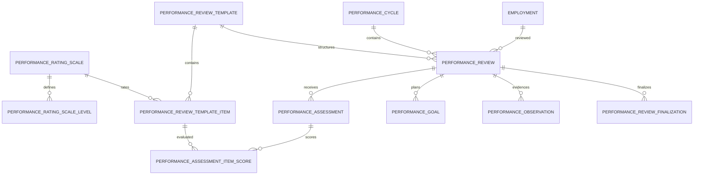
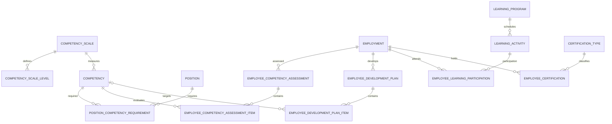

# HR-007 — Performance, PKG & Competency/PKB System/Data Design

**Version:** 1.0  
**Status:** Approved — Locked  
**Phase:** 2F — System Architecture & Data Design  
**Primary Module:** `Modules/HR`  
**Baseline Repository:** `26b475b695aa4511064b1410db03d1f0c8bdd6ce`  
**Depends On:** HR-001 (Approved), ADR-032 (Accepted), HR-002 (Approved), HR-003 (Approved), HR-004 (Approved), HR-005 (Approved), HR-006 (Approved)

---

# 1. Executive Summary

HR-007 mendesain fondasi **Performance Management, PKG-supporting workflow, Competency, PKB, Training, dan Certification** untuk EduCore tanpa meng-hardcode satu model penilaian nasional atau mencampurkan HR performance dengan Academic assessment.

Prinsip utamanya:

```text
HR owns
├── performance framework/template
├── performance cycle
├── employee performance review
├── self / supervisor / observer assessment
├── KPI / performance goal
├── observation & supervision evidence
├── final performance result/history
├── competency catalog
├── position competency requirement
├── employee competency assessment
├── development plan / PKB plan
├── training/workshop participation
└── certification / re-certification history

Academic owns
├── teaching assignment
├── lesson/class/subject context
├── student assessment
└── academic learning records

Core owns
├── Person
├── Membership
├── Organization / OrganizationalAssignment
├── Authorization / scoped RBAC
└── Audit foundation
```

Desain ini sengaja **framework-driven dan versioned**. Pada konteks pendidikan Indonesia, model pengelolaan kinerja guru/sekolah dapat berbeda berdasarkan regulator, jenis satuan pendidikan, status pegawai, dan periode kebijakan. Karena itu EduCore tidak menyimpan “PKG” sebagai satu rubric permanen di source code.

Kinerja final juga tidak otomatis mengubah:

```text
Position
Employment status
Compensation
Promotion
Authorization Role
```

Setiap perubahan employment/career/compensation tetap memerlukan workflow eksplisit pada domain pemiliknya.

---

# 2. Project Resource Audit

## 2.1 Resources reviewed

Resource Project/repository yang diperiksa ulang:

- `Modules/HR`
- `Modules/Core`
- `Modules/Academic`
- `Modules/Auth`
- existing migrations, models, services, tests, routes, module manifests
- `HR-001-human-resources-management.md`
- `ADR-032-hr-domain-boundary-workforce-architecture.md`
- `HR-002-workforce-foundation-system-data-design.md`
- `HR-003-recruitment-hiring-onboarding-system-data-design.md`
- `HR-004-leave-permit-system-data-design.md`
- `HR-005-workforce-attendance-system-data-design.md`
- `HR-006-compensation-benefit-payroll-input-system-data-design.md`
- existing Academic assessment implementation, to distinguish student academic assessment from employee performance assessment

## 2.2 Existing facts

**[FAKTA]** Repository belum memiliki persistence/model/service untuk:

- employee performance review;
- PKG/PKKM;
- supervisor observation;
- employee KPI;
- competency framework;
- development plan / PKB;
- training/workshop history;
- certification/re-certification history.

**[FAKTA]** `Modules/Academic` sudah mempunyai `AssessmentSetting` dan `StudentGrade`, tetapi keduanya adalah **student academic assessment**, bukan employee performance assessment.

Maka object Academic tersebut tidak boleh direuse sebagai performance engine HR.

**[FAKTA]** HR-002 sudah mengunci:

```text
Employee
  ↓
Employment
  ↓
Position Assignment / Placement
```

sebagai workforce context canonical.

**[FAKTA]** Position bukan authorization role.

**[FAKTA]** organizational scope tetap dibuktikan melalui Core OrganizationalAssignment/HR EmploymentPlacement, bukan melalui string jabatan.

## 2.3 Verified external regulatory context

External verification per 22 August 2026 menunjukkan:

1. Kemendikdasmen menggunakan konsep **Pengelolaan Kinerja** bagi Guru/Kepala Sekolah/Pengawas yang lebih luas daripada sekadar satu skor penilaian.
2. Guidance PKG Kemendikdasmen saat ini memuat beberapa variabel/komponen seperti tugas pokok, praktik kinerja, perilaku kerja, dan pengembangan kompetensi.
3. Untuk madrasah, Kemenag masih memiliki jalur PKG/PKKM tersendiri; JDIH Kemenag masih menandai Keputusan Dirjen Pendis No. 1843/2021 tentang Juknis PKG Madrasah sebagai berlaku, dan praktik PKG Madrasah tetap terlihat pada 2026.

**Implikasi desain:** EduCore harus mengakomodasi multiple performance framework/template yang versioned; tidak boleh hardcode satu rubric “PKG” yang diasumsikan universal dan permanen.

## 2.4 Resource gaps

**[RESOURCE GAP]** Belum tersedia di Project:

- rubric resmi yayasan yang akan dipakai sebagai default;
- apakah yayasan akan mengikuti persis framework Kemendikdasmen/Kemenag atau membuat internal performance model;
- formula predikat final yang disepakati per framework;
- apakah review performance harus dikirim langsung ke e-Kinerja/Simpatika;
- canonical Document Storage/e-signature architecture;
- canonical Notification module/service;
- promotion/rank/career-grade domain;
- exact statutory mapping untuk angka kredit/pangkat/golongan;
- training/LMS module;
- external learning provider integration contract.

Karena gap tersebut, Phase 2F mengunci **domain foundation**, bukan regulatory formula permanen atau direct-government synchronization.

---

# 3. Scope

## 3.1 IN SCOPE — Phase 2F

### Performance

- tenant-scoped performance framework/template;
- immutable template version;
- configurable rating scale;
- performance cycle;
- employee performance review;
- self-assessment;
- supervisor/manager assessment;
- observer/supervision assessment;
- optional peer assessment;
- KPI/performance goals;
- classroom/operational observation evidence;
- final review/finalization;
- performance history;
- performance result reporting;
- historical evidence for future promotion/career decisions.

### Competency / PKB

- competency catalog;
- competency proficiency scale;
- Position → competency requirement;
- employee competency assessment;
- competency gap;
- individual development/PKB plan;
- training/workshop catalog/activities;
- employee participation/completion;
- certificate/license type;
- employee certification/license;
- expiry/renewal metadata;
- reminder-ready expiry query;
- competency/training/certification reporting.

### Authorization

- performance self-service capability;
- evaluator capability;
- finalization capability;
- framework administration;
- competency/training/certification administration;
- scoped visibility based on existing Core/HR placement contracts.

## 3.2 OUT OF SCOPE

- student grades;
- Academic assessment rubric;
- Academic lesson schedule ownership;
- LMS content delivery;
- online course video/content;
- automatic promotion/pangkat/golongan;
- automatic compensation increase;
- automatic position mutation;
- generic organization-wide workflow/rules engine;
- direct e-Kinerja BKN implementation;
- direct Simpatika implementation;
- direct Dapodik/EMIS mutation;
- digital signature infrastructure;
- binary document storage implementation;
- government regulatory formula embedded permanently in source code.

## 3.3 FUTURE SCOPE

- external e-Kinerja adapter/export;
- Simpatika/Kemenag adapter/export;
- configurable calibration committee workflow;
- 360-degree feedback;
- succession planning;
- talent matrix / nine-box;
- promotion/career recommendation workflow;
- LMS integration;
- external certification provider verification;
- automated development recommendations;
- analytics correlation between performance, attendance, training, and outcomes.

## 3.4 DEFERRED

- exact government formula mapping;
- numeric KPI target baseline;
- competency taxonomy default per education type;
- automatic score conversion to rank/promotion;
- generic formula DSL;
- complex performance normalization/calibration.

---

# 4. Architectural Decisions Proposed for Approval

| ID | Decision |
|---|---|
| **OD-HR-PERF-001** | Performance configuration is **tenant-scoped, framework/template-driven, and versioned**. PKG/PKKM/internal KPI are configuration profiles, not hardcoded domain enums/formulas. |
| **OD-HR-PERF-002** | `PerformanceCycle` represents a review period; `PerformanceReviewTemplate` represents immutable evaluation structure. A Review references one immutable template version so historical meaning cannot change. |
| **OD-HR-PERF-003** | Review subject is an `Employment`, with historical snapshot/reference to applicable Position Assignment and Placement when relevant. Review is not attached directly to mutable `employees.jabatan`. |
| **OD-HR-PERF-004** | Self, supervisor/manager, observer, and optional peer assessments are separate submissions. Assessment channel does not grant authorization; evaluator eligibility is checked using Core permission + scope. |
| **OD-HR-PERF-005** | Phase 2F supports deterministic template-defined weighted scoring and/or manual/external final predicate, but **does not introduce a generic rules engine**. |
| **OD-HR-PERF-006** | Finalized reviews and submitted assessments are immutable historical evidence. Corrections use explicit revision/amendment evidence; old final result is never silently overwritten. |
| **OD-HR-PERF-007** | KPI/goals are employee performance facts attached to a Review/Cycle. Target values are tenant/business-configured; EduCore does not invent numeric targets. |
| **OD-HR-PERF-008** | Classroom/supervision observation may be stored as HR performance evidence, but HR does **not** own or duplicate Academic schedule/subject/class. Academic context integration is optional and adapter-based without creating HR → Academic dependency. |
| **OD-HR-PERF-009** | Competency is a tenant-scoped HR catalog with versioned proficiency scale. Position competency requirements reference canonical HR Position from HR-002. |
| **OD-HR-PERF-010** | Employee competency assessments are historical snapshots and may be derived from a finalized performance review or performed standalone. A change to competency catalog does not rewrite historical assessment. |
| **OD-HR-PERF-011** | Development/PKB planning links identified competency/performance gaps to explicit development actions. PKB is not implemented as a hardcoded government portal workflow. |
| **OD-HR-PERF-012** | Training/workshop participation is HR-owned history. Course content delivery/LMS is out of scope; future external providers integrate through contracts/adapters. |
| **OD-HR-PERF-013** | Employee certifications/licenses are effective/expiry-dated HR facts. Renewal creates history; certificate binary/document storage remains delegated to the future document capability. |
| **OD-HR-PERF-014** | Performance outcome does not automatically mutate Employment, Position, Compensation, Role, or authorization. Career/compensation consequences require explicit downstream decision/workflow. |
| **OD-HR-PERF-015** | Position title is not evaluator authority. Supervisor/evaluator actions require explicit `hr.performance.*` capability and valid organizational scope. Self-finalization is prohibited by default. |
| **OD-HR-PERF-016** | Government-specific integration (e-Kinerja/Simpatika/etc.) is modeled as future export/adapter contract; canonical HR records remain independent of external system availability. |
| **OD-HR-PERF-017** | Review participants/evaluators are snapshotted by Membership/Employment context so later mutation/transfer does not rewrite historical evaluator evidence. |
| **OD-HR-PERF-018** | Phase 2F does not create a separate `Modules/Performance`; capability remains inside `Modules/HR` because employee performance/competency lifecycle is HR-owned and current repository has no evidence requiring an independent bounded context. |

---

# 5. Domain Boundary & Dependency Topology

## 5.1 Module topology

Existing:

```text
Core
 ↑
HR
 ↑
Academic
```

Phase 2F preserves:

```text
Modules/HR
  dependencies:
  ├── Core
  └── Auth
```

No new backend dependency:

```text
HR → Academic   ❌
```

This avoids cycle because Academic already depends on HR.

## 5.2 Academic performance evidence integration

For classroom observation, HR owns the employee performance record but not academic topology.

Canonical boundary:

```text
Academic-owned optional context
TeachingAssignment / Schedule / Subject / Class
             │
             │ future adapter / projection
             ▼
HR Performance Observation
├── observed Employment
├── observer
├── observed_at
├── HR rubric/result
└── optional external context reference/snapshot
```

HR must remain functional even when Academic context is absent.

No database foreign key from HR performance tables to future Academic schedule tables is required in Phase 2F.

## 5.3 Core authorization boundary

```text
HR Performance action
       ↓
Core effective Permission
       +
organizational scope
       ↓
allow / deny
```

Position strings/titles are not used as authorization evidence.

---

# 6. Performance Domain Model



Concepts:

```text
PerformanceReviewTemplate
= immutable versioned rubric/structure

PerformanceCycle
= tenant review period/campaign

PerformanceReview
= one Employment reviewed in one cycle

PerformanceAssessment
= one evaluator-channel submission

PerformanceGoal
= KPI/RHK/target fact for review period

PerformanceObservation
= observation/supervision evidence

PerformanceReviewFinalization
= authoritative historical outcome
```

---

# 7. Performance Data Dictionary & Schema

## 7.1 `performance_rating_scales`

Purpose: tenant-scoped versionable scale, e.g. 1–4, 1–5, categorical predicate.

| Column | Type | Null | Notes |
|---|---|---:|---|
| `id` | UUID | No | PK |
| `tenant_id` | UUID | No | Tenant ownership |
| `code` | varchar(50) | No | Stable tenant code |
| `name` | varchar(150) | No | Display name |
| `version` | integer | No | Starts at 1 |
| `status` | varchar(20) | No | `DRAFT`, `ACTIVE`, `RETIRED` |
| `effective_from` | date | Yes | Optional effective start |
| `effective_to` | date | Yes | Optional end |
| timestamps | | | |

Constraints:

```text
UNIQUE (tenant_id, code, version)
CHECK version > 0
CHECK effective_to IS NULL OR effective_from IS NULL OR effective_to >= effective_from
```

Once referenced by an active/finalized template, scale version is immutable.

## 7.2 `performance_rating_scale_levels`

| Column | Type | Null | Notes |
|---|---|---:|---|
| `id` | UUID | No | PK |
| `tenant_id` | UUID | No | Tenant scope |
| `rating_scale_id` | UUID | No | Parent scale |
| `code` | varchar(50) | No | E.g. `ABOVE_EXPECTATION` |
| `label` | varchar(150) | No | Display label |
| `numeric_value` | numeric(9,4) | Yes | Optional numeric value |
| `rank_order` | integer | No | Display/order |
| `description` | text | Yes | Meaning |
| timestamps | | | |

Constraints:

```text
UNIQUE (tenant_id, rating_scale_id, code)
UNIQUE (tenant_id, rating_scale_id, rank_order)
```

## 7.3 `performance_review_templates`

Represents one immutable rubric version.

| Column | Type | Null | Notes |
|---|---|---:|---|
| `id` | UUID | No | PK |
| `tenant_id` | UUID | No | Tenant owner |
| `code` | varchar(60) | No | Stable framework/template code |
| `name` | varchar(200) | No | Example internal label |
| `version` | integer | No | Version |
| `audience_type` | varchar(30) | No | `TEACHER`, `NON_TEACHER`, `LEADER`, `GENERAL` baseline values; configurable mapping can be layered later |
| `framework_authority` | varchar(100) | Yes | Metadata only, e.g. internal/regulator name |
| `framework_reference` | varchar(200) | Yes | Regulation/guideline reference metadata |
| `calculation_mode` | varchar(30) | No | `WEIGHTED`, `MANUAL_FINAL`, `EXTERNAL_FINAL` |
| `status` | varchar(20) | No | `DRAFT`, `ACTIVE`, `RETIRED` |
| `effective_from` | date | Yes | Optional |
| `effective_to` | date | Yes | Optional |
| timestamps | | | |

Constraints:

```text
UNIQUE (tenant_id, code, version)
CHECK version > 0
```

`framework_authority/reference` are descriptive metadata, not authorization or external synchronization state.

## 7.4 `performance_review_template_items`

A normalized criterion/variable/indicator definition.

| Column | Type | Null | Notes |
|---|---|---:|---|
| `id` | UUID | No | PK |
| `tenant_id` | UUID | No | Tenant |
| `template_id` | UUID | No | Template version |
| `parent_item_id` | UUID | Yes | Optional hierarchy; same template |
| `code` | varchar(80) | No | Stable item code inside template |
| `section_label` | varchar(150) | Yes | Lightweight grouping without separate section aggregate |
| `label` | varchar(250) | No | Criterion name |
| `description` | text | Yes | Criterion guidance |
| `item_type` | varchar(30) | No | `RATING`, `NUMERIC`, `TEXT`, `BOOLEAN`, `EVIDENCE` |
| `rating_scale_id` | UUID | Yes | Required for `RATING` |
| `weight` | numeric(7,4) | Yes | Used only by `WEIGHTED` calculation |
| `is_required` | boolean | No | Default true |
| `allow_self` | boolean | No | Whether self channel answers this item |
| `allow_manager` | boolean | No | Manager channel |
| `allow_observer` | boolean | No | Observer channel |
| `allow_peer` | boolean | No | Optional peer channel |
| `sort_order` | integer | No | Ordering |
| timestamps | | | |

Constraints:

```text
UNIQUE (tenant_id, template_id, code)
CHECK weight IS NULL OR weight >= 0
```

Application validation:

- `RATING` requires rating scale.
- Weighted template must have a deterministic total-weight policy.
- Parent item must belong to same template/tenant.

## 7.5 `performance_cycles`

| Column | Type | Null | Notes |
|---|---|---:|---|
| `id` | UUID | No | PK |
| `tenant_id` | UUID | No | Tenant |
| `code` | varchar(60) | No | e.g. annual/semester cycle code |
| `name` | varchar(200) | No | Display |
| `period_start` | date | No | Review period |
| `period_end` | date | No | Review period |
| `status` | varchar(20) | No | `DRAFT`, `OPEN`, `CLOSED`, `CANCELLED` |
| `opened_at` | timestamptz | Yes | |
| `closed_at` | timestamptz | Yes | |
| timestamps | | | |

Constraints:

```text
UNIQUE (tenant_id, code)
CHECK period_end >= period_start
```

Phase 2F does not require one global cycle per tenant; different cycles may exist for different employee populations.

## 7.6 `performance_reviews`

One employee/Employment review in a cycle.

| Column | Type | Null | Notes |
|---|---|---:|---|
| `id` | UUID | No | PK |
| `tenant_id` | UUID | No | Tenant |
| `cycle_id` | UUID | No | Review period |
| `template_id` | UUID | No | Immutable template version |
| `employee_id` | UUID | No | Stable HR profile |
| `employment_id` | UUID | No | Subject employment |
| `employment_position_assignment_id` | UUID | Yes | Historical/applicable position context |
| `employment_placement_id` | UUID | Yes | Historical/applicable scope context |
| `status` | varchar(30) | No | `DRAFT`, `IN_PROGRESS`, `READY_FOR_FINALIZATION`, `FINALIZED`, `CANCELLED` |
| `subject_position_label_snapshot` | varchar(200) | Yes | Readable historical label; not source of truth |
| `subject_placement_label_snapshot` | varchar(250) | Yes | Historical display snapshot |
| `started_at` | timestamptz | Yes | |
| `ready_at` | timestamptz | Yes | |
| `finalized_at` | timestamptz | Yes | |
| timestamps | | | |

Constraints:

```text
UNIQUE (tenant_id, cycle_id, employment_id, template_id)
```

Cross-domain/application invariants:

- Employment belongs to Employee and Tenant.
- Position Assignment/Placement, if provided, belongs to same Employment.
- Review creation verifies subject Employment is relevant to cycle period.

## 7.7 `performance_assessments`

One evaluator/channel submission.

| Column | Type | Null | Notes |
|---|---|---:|---|
| `id` | UUID | No | PK |
| `tenant_id` | UUID | No | Tenant |
| `performance_review_id` | UUID | No | Review |
| `channel` | varchar(20) | No | `SELF`, `MANAGER`, `OBSERVER`, `PEER` |
| `evaluator_membership_id` | UUID | No | Historical actor identity in tenant |
| `evaluator_employee_id` | UUID | Yes | If actor is employee |
| `evaluator_position_label_snapshot` | varchar(200) | Yes | Historical display only |
| `status` | varchar(20) | No | `DRAFT`, `SUBMITTED`, `VOIDED` |
| `overall_comment` | text | Yes | |
| `submitted_at` | timestamptz | Yes | |
| timestamps | | | |

Baseline uniqueness:

```text
UNIQUE (tenant_id, performance_review_id, channel, evaluator_membership_id)
```

A template/policy may allow multiple observers/peers but each evaluator gets one assessment submission per channel.

## 7.8 `performance_assessment_item_scores`

| Column | Type | Null | Notes |
|---|---|---:|---|
| `id` | UUID | No | PK |
| `tenant_id` | UUID | No | Tenant |
| `assessment_id` | UUID | No | Parent assessment |
| `template_item_id` | UUID | No | Criterion |
| `rating_scale_level_id` | UUID | Yes | For `RATING` |
| `numeric_value` | numeric(19,4) | Yes | For numeric criterion |
| `boolean_value` | boolean | Yes | For boolean criterion |
| `text_value` | text | Yes | For text/evidence notes |
| `comment` | text | Yes | Evaluator notes |
| timestamps | | | |

Constraints:

```text
UNIQUE (tenant_id, assessment_id, template_item_id)
```

Application validates one compatible answer shape according to template item type.

## 7.9 `performance_goals`

Supports KPI/RHK/internal performance target without hardcoding numeric target values.

| Column | Type | Null | Notes |
|---|---|---:|---|
| `id` | UUID | No | PK |
| `tenant_id` | UUID | No | Tenant |
| `performance_review_id` | UUID | No | Review |
| `code` | varchar(80) | Yes | Optional tenant/business code |
| `title` | varchar(250) | No | Goal |
| `description` | text | Yes | |
| `measurement_type` | varchar(30) | No | `NUMERIC`, `PERCENTAGE`, `BOOLEAN`, `MILESTONE`, `QUALITATIVE` |
| `target_value` | numeric(19,4) | Yes | Numeric modes |
| `target_unit` | varchar(50) | Yes | e.g. `%`, `document`, `session`; tenant-defined |
| `actual_value` | numeric(19,4) | Yes | Numeric mode actual |
| `result_label` | varchar(150) | Yes | Qualitative/milestone result |
| `weight` | numeric(7,4) | Yes | Optional |
| `status` | varchar(20) | No | `PLANNED`, `IN_PROGRESS`, `COMPLETED`, `CANCELLED` |
| `due_date` | date | Yes | |
| `completed_at` | timestamptz | Yes | |
| timestamps | | | |

No default target is seeded unless approved by tenant/business policy.

## 7.10 `performance_observations`

Supports classroom supervision and non-teaching observation as HR performance evidence.

| Column | Type | Null | Notes |
|---|---|---:|---|
| `id` | UUID | No | PK |
| `tenant_id` | UUID | No | Tenant |
| `performance_review_id` | UUID | No | Review |
| `observer_membership_id` | UUID | No | Observer |
| `observation_type` | varchar(50) | No | Tenant/business classification |
| `observed_at` | timestamptz | No | Event time |
| `summary` | text | Yes | Observation summary |
| `strengths` | text | Yes | |
| `improvement_notes` | text | Yes | |
| `follow_up_notes` | text | Yes | |
| `external_context_provider` | varchar(50) | Yes | Optional future provider, e.g. Academic adapter |
| `external_context_reference` | varchar(150) | Yes | Opaque provider reference; no FK |
| `context_label_snapshot` | varchar(250) | Yes | Human-readable historical context |
| `status` | varchar(20) | No | `DRAFT`, `FINALIZED`, `VOIDED` |
| `finalized_at` | timestamptz | Yes | |
| timestamps | | | |

Important:

- HR does not resolve or mutate Academic schedule.
- `external_context_reference` is not treated as canonical HR ownership.
- finalized observation evidence is immutable; correction uses void + replacement/reference or audit revision pattern.

## 7.11 `performance_review_finalizations`

Authoritative outcome history.

| Column | Type | Null | Notes |
|---|---|---:|---|
| `id` | UUID | No | PK |
| `tenant_id` | UUID | No | Tenant |
| `performance_review_id` | UUID | No | Review |
| `revision_no` | integer | No | Starts at 1 |
| `finalized_by_membership_id` | UUID | No | Authorized actor |
| `calculated_score` | numeric(19,6) | Yes | When deterministic calculation exists |
| `final_rating_scale_level_id` | UUID | Yes | Optional final rating |
| `final_predicate` | varchar(150) | Yes | For manual/external predicate |
| `summary` | text | Yes | |
| `finalized_at` | timestamptz | No | |
| `supersedes_finalization_id` | UUID | Yes | Explicit amendment chain |
| `reason` | text | Yes | Required for revision > 1 |
| timestamps | | | |

Constraints:

```text
UNIQUE (tenant_id, performance_review_id, revision_no)
CHECK revision_no > 0
```

Latest revision is current result; older revisions remain historical evidence.

---

# 8. Performance Calculation Semantics

## 8.1 Supported baseline modes

Phase 2F supports only bounded calculation modes:

### `WEIGHTED`

Template item/rating values + weights can produce deterministic score.

```text
score = sum(normalized item result × configured weight)
```

Exact normalization must be explicit in template/service configuration and tested.

### `MANUAL_FINAL`

Assessments/goals/evidence are captured, but authorized finalizer assigns final predicate/rating according to business/regulatory guideline.

### `EXTERNAL_FINAL`

EduCore stores internal evidence/review but final predicate may be received from an external authoritative process in future.

## 8.2 Forbidden implementation

Do not create arbitrary formula source code or general-purpose expression evaluator such as:

```text
formula_text = "if(x > 4 && y...)"
```

in Phase 2F.

**Reason:** no validated requirement for a generic rules engine; high security/maintenance cost and regulatory formula changes can be handled through explicit versioned strategies.

## 8.3 Final score is not promotion decision

Even when a numerical score exists:

```text
Performance score
≠ automatic promotion
≠ automatic salary increase
≠ automatic position mutation
```

Those are separate future business decisions.

---

# 9. Performance Lifecycle

## 9.1 Template lifecycle

```text
DRAFT
  ↓ activate
ACTIVE
  ↓ retire
RETIRED
```

After first Review references an active template version, structural mutation is prohibited.

Change requires:

```text
Template CODE v1 → RETIRED
Template CODE v2 → ACTIVE
```

## 9.2 Cycle lifecycle

```text
DRAFT
  ↓
OPEN
  ↓
CLOSED
```

or:

```text
DRAFT/OPEN → CANCELLED
```

Closing a Cycle prevents new Reviews but does not delete historical data.

## 9.3 Review lifecycle

```text
DRAFT
  ↓
IN_PROGRESS
  ↓
READY_FOR_FINALIZATION
  ↓
FINALIZED
```

Alternative:

```text
DRAFT / IN_PROGRESS → CANCELLED
```

`FINALIZED` does not mean downstream promotion/compensation action has occurred.

## 9.4 Assessment lifecycle

```text
DRAFT
  ↓ submit
SUBMITTED
```

Submitted assessment is immutable.

Administrative invalidation:

```text
SUBMITTED → VOIDED
```

requires elevated capability, reason, and audit evidence. A replacement assessment is a new record.

---

# 10. Evaluator & Self-Assessment Rules

## 10.1 Self-assessment

Self-assessment actor must resolve to the same Membership as Review subject's Employee membership.

Baseline:

```text
channel = SELF
actor.membership_id == reviewed employee membership_id
```

## 10.2 Manager/supervisor assessment

The system does not infer evaluator from Position name.

Evaluator must:

1. have required permission;
2. have valid tenant context;
3. have organizational scope over subject placement where policy requires it;
4. not be the reviewed employee when independent evaluator is required.

## 10.3 Observer

Observer can be another Employee or authorized external/internal reviewer represented by a Membership.

`evaluator_employee_id` is optional because not every authorized evaluator needs a full Employee profile in all future scenarios, but `evaluator_membership_id` is mandatory.

## 10.4 Self-finalization

Baseline rule:

```text
subject employee membership
!=
finalized_by_membership_id
```

unless a future explicitly approved framework permits self-finalization. Phase 2F does not permit it by default.

---

# 11. Competency Domain Model



---

# 12. Competency Data Dictionary & Schema

## 12.1 `competency_scales`

| Column | Type | Null | Notes |
|---|---|---:|---|
| `id` | UUID | No | PK |
| `tenant_id` | UUID | No | Tenant |
| `code` | varchar(50) | No | Scale code |
| `name` | varchar(150) | No | |
| `version` | integer | No | |
| `status` | varchar(20) | No | `DRAFT`, `ACTIVE`, `RETIRED` |
| timestamps | | | |

```text
UNIQUE (tenant_id, code, version)
```

## 12.2 `competency_scale_levels`

| Column | Type | Null | Notes |
|---|---|---:|---|
| `id` | UUID | No | PK |
| `tenant_id` | UUID | No | Tenant |
| `competency_scale_id` | UUID | No | Scale |
| `code` | varchar(50) | No | Level code |
| `label` | varchar(150) | No | |
| `numeric_level` | numeric(9,4) | No | Ordered proficiency value |
| `description` | text | Yes | |
| timestamps | | | |

```text
UNIQUE (tenant_id, competency_scale_id, code)
UNIQUE (tenant_id, competency_scale_id, numeric_level)
```

## 12.3 `competencies`

| Column | Type | Null | Notes |
|---|---|---:|---|
| `id` | UUID | No | PK |
| `tenant_id` | UUID | No | Tenant |
| `code` | varchar(80) | No | Stable code |
| `name` | varchar(200) | No | |
| `category` | varchar(80) | Yes | Tenant-defined grouping |
| `description` | text | Yes | |
| `competency_scale_id` | UUID | No | Applicable scale version |
| `status` | varchar(20) | No | `ACTIVE`, `INACTIVE` |
| timestamps | | | |
| `deleted_at` | timestamptz | Yes | Only where existing conventions require soft delete; historical refs restrict destructive delete |

```text
UNIQUE (tenant_id, code)
```

Competency catalog is HR-owned; no implicit authorization semantics.

## 12.4 `position_competency_requirements`

Effective-dated requirement linking canonical Position from HR-002.

| Column | Type | Null | Notes |
|---|---|---:|---|
| `id` | UUID | No | PK |
| `tenant_id` | UUID | No | Tenant |
| `position_id` | UUID | No | HR Position |
| `competency_id` | UUID | No | Competency |
| `target_competency_level_id` | UUID | No | Target level |
| `effective_from` | date | No | |
| `effective_to` | date | Yes | |
| `is_mandatory` | boolean | No | Default true |
| timestamps | | | |

Constraints:

```text
CHECK effective_to IS NULL OR effective_to >= effective_from
```

Prevent overlapping open/current duplicate requirement per Position + Competency using PostgreSQL partial/exclusion strategy consistent with repository patterns.

## 12.5 `employee_competency_assessments`

| Column | Type | Null | Notes |
|---|---|---:|---|
| `id` | UUID | No | PK |
| `tenant_id` | UUID | No | Tenant |
| `employee_id` | UUID | No | Employee |
| `employment_id` | UUID | No | Employment context |
| `performance_review_id` | UUID | Yes | Optional source Review |
| `assessment_type` | varchar(30) | No | `PERFORMANCE_DERIVED`, `STANDALONE`, `EXTERNAL` |
| `assessed_by_membership_id` | UUID | No | Actor |
| `assessed_at` | timestamptz | No | |
| `status` | varchar(20) | No | `DRAFT`, `FINALIZED`, `VOIDED` |
| `summary` | text | Yes | |
| timestamps | | | |

Finalized assessment is immutable.

## 12.6 `employee_competency_assessment_items`

| Column | Type | Null | Notes |
|---|---|---:|---|
| `id` | UUID | No | PK |
| `tenant_id` | UUID | No | Tenant |
| `competency_assessment_id` | UUID | No | Parent |
| `competency_id` | UUID | No | Historical competency reference |
| `assessed_level_id` | UUID | No | Achieved/current level |
| `target_level_id` | UUID | Yes | Snapshot target at assessment time |
| `gap_numeric` | numeric(9,4) | Yes | Optional deterministic target-current difference |
| `evidence_summary` | text | Yes | |
| `comment` | text | Yes | |
| timestamps | | | |

```text
UNIQUE (tenant_id, competency_assessment_id, competency_id)
```

No catalog edit may reinterpret already finalized result; scale/level references must remain historically resolvable.

---

# 13. Development / PKB Model

## 13.1 `employee_development_plans`

| Column | Type | Null | Notes |
|---|---|---:|---|
| `id` | UUID | No | PK |
| `tenant_id` | UUID | No | Tenant |
| `employee_id` | UUID | No | Employee |
| `employment_id` | UUID | No | Employment |
| `source_performance_review_id` | UUID | Yes | Optional |
| `source_competency_assessment_id` | UUID | Yes | Optional |
| `title` | varchar(200) | No | |
| `period_start` | date | No | |
| `period_end` | date | Yes | |
| `status` | varchar(30) | No | `DRAFT`, `ACTIVE`, `COMPLETED`, `CANCELLED` |
| `approved_by_membership_id` | UUID | Yes | Optional approval actor |
| `approved_at` | timestamptz | Yes | |
| timestamps | | | |

## 13.2 `employee_development_plan_items`

| Column | Type | Null | Notes |
|---|---|---:|---|
| `id` | UUID | No | PK |
| `tenant_id` | UUID | No | Tenant |
| `development_plan_id` | UUID | No | Plan |
| `competency_id` | UUID | Yes | Optional competency gap target |
| `action_type` | varchar(30) | No | `TRAINING`, `WORKSHOP`, `COACHING`, `MENTORING`, `CERTIFICATION`, `SELF_LEARNING`, `OTHER` |
| `title` | varchar(250) | No | Action |
| `target_date` | date | Yes | |
| `status` | varchar(20) | No | `PLANNED`, `IN_PROGRESS`, `COMPLETED`, `CANCELLED` |
| `completion_evidence_summary` | text | Yes | |
| `completed_at` | timestamptz | Yes | |
| timestamps | | | |

PKB is represented by explicit development actions rather than a single opaque “PKB score” field.

---

# 14. Training / Workshop Model

## 14.1 `learning_programs`

Tenant catalog describing a reusable program.

| Column | Type | Null | Notes |
|---|---|---:|---|
| `id` | UUID | No | PK |
| `tenant_id` | UUID | No | Tenant |
| `code` | varchar(80) | No | |
| `name` | varchar(250) | No | |
| `category` | varchar(50) | No | `TRAINING`, `WORKSHOP`, `SEMINAR`, `COACHING`, `PKB`, `OTHER` |
| `provider_name` | varchar(200) | Yes | Internal/external provider display |
| `description` | text | Yes | |
| `status` | varchar(20) | No | `ACTIVE`, `INACTIVE` |
| timestamps | | | |

```text
UNIQUE (tenant_id, code)
```

## 14.2 `learning_activities`

One delivery/event/session of a program.

| Column | Type | Null | Notes |
|---|---|---:|---|
| `id` | UUID | No | PK |
| `tenant_id` | UUID | No | Tenant |
| `learning_program_id` | UUID | No | Program |
| `title` | varchar(250) | No | Activity/session name |
| `starts_at` | timestamptz | Yes | |
| `ends_at` | timestamptz | Yes | |
| `delivery_mode` | varchar(20) | Yes | `ONSITE`, `ONLINE`, `HYBRID`, `EXTERNAL` |
| `location_label` | varchar(250) | Yes | |
| `provider_reference` | varchar(150) | Yes | Optional external provider ref |
| `status` | varchar(20) | No | `PLANNED`, `OPEN`, `COMPLETED`, `CANCELLED` |
| timestamps | | | |

Phase 2F does not manage course lessons/content.

## 14.3 `employee_learning_participations`

| Column | Type | Null | Notes |
|---|---|---:|---|
| `id` | UUID | No | PK |
| `tenant_id` | UUID | No | Tenant |
| `employee_id` | UUID | No | Employee |
| `employment_id` | UUID | No | Employment |
| `learning_activity_id` | UUID | No | Activity |
| `development_plan_item_id` | UUID | Yes | Link to PKB plan |
| `status` | varchar(30) | No | `REGISTERED`, `ATTENDED`, `COMPLETED`, `FAILED`, `CANCELLED` |
| `completion_date` | date | Yes | |
| `hours` | numeric(9,2) | Yes | Verified learning hours where relevant |
| `result_label` | varchar(150) | Yes | Optional outcome |
| `evidence_reference` | varchar(200) | Yes | Document/provider reference metadata |
| timestamps | | | |

```text
UNIQUE (tenant_id, employee_id, learning_activity_id)
```

Participation does not automatically create Certification; if training produces a certificate, a separate explicit EmployeeCertification is created/linked.

---

# 15. Certification / Re-certification Model

## 15.1 `certification_types`

| Column | Type | Null | Notes |
|---|---|---:|---|
| `id` | UUID | No | PK |
| `tenant_id` | UUID | No | Tenant |
| `code` | varchar(80) | No | Stable code |
| `name` | varchar(200) | No | |
| `issuer_category` | varchar(80) | Yes | Regulatory/professional/internal grouping |
| `requires_expiry` | boolean | No | Default false |
| `default_validity_months` | integer | Yes | Optional convenience; not authoritative if certificate specifies expiry |
| `status` | varchar(20) | No | `ACTIVE`, `INACTIVE` |
| timestamps | | | |

```text
UNIQUE (tenant_id, code)
CHECK default_validity_months IS NULL OR default_validity_months > 0
```

## 15.2 `employee_certifications`

| Column | Type | Null | Notes |
|---|---|---:|---|
| `id` | UUID | No | PK |
| `tenant_id` | UUID | No | Tenant |
| `employee_id` | UUID | No | Employee |
| `employment_id` | UUID | Yes | Employment context when relevant |
| `certification_type_id` | UUID | No | Type |
| `certificate_number` | varchar(200) | Yes | Sensitivity policy may require encryption depending on identifier type |
| `issuer_name` | varchar(250) | No | |
| `issued_date` | date | No | |
| `expiry_date` | date | Yes | |
| `status` | varchar(30) | No | `VALID`, `EXPIRED`, `REVOKED`, `SUPERSEDED` |
| `source_learning_participation_id` | UUID | Yes | Optional |
| `document_reference` | varchar(200) | Yes | Future document capability reference |
| `supersedes_certification_id` | UUID | Yes | Renewal chain |
| `verified_by_membership_id` | UUID | Yes | Optional verifier |
| `verified_at` | timestamptz | Yes | |
| timestamps | | | |

Constraints:

```text
CHECK expiry_date IS NULL OR expiry_date >= issued_date
```

Renewal:

```text
old certification → SUPERSEDED
new certification → VALID
new.supersedes_certification_id = old.id
```

Historical certificate is never overwritten with new expiry date.

---

# 16. Reminder Semantics

HR-001 requires certificate/license expiry reminders.

Phase 2F provides **reminder-ready query semantics**, not a Notification implementation.

Example query contract:

```text
certification.status = VALID
expiry_date between business_date and business_date + threshold
```

Threshold is tenant policy/configuration and remains **[OPEN DECISION]**.

A future Notification capability can consume:

```text
CertificationExpiring
CertificationExpired
```

without becoming source of truth.

---

# 17. Authorization Catalog

Proposed capabilities:

```text
hr.performance.self.read
hr.performance.self.assess

hr.performance.read
hr.performance.manage
hr.performance.evaluate
hr.performance.observe
hr.performance.finalize
hr.performance.revise

hr.performance.framework.read
hr.performance.framework.manage
hr.performance.cycle.read
hr.performance.cycle.manage

hr.competency.self.read
hr.competency.read
hr.competency.manage
hr.competency.assess

hr.development.self.read
hr.development.read
hr.development.manage
hr.development.approve

hr.learning.self.read
hr.learning.read
hr.learning.manage
hr.learning.participation.manage

hr.certification.self.read
hr.certification.read
hr.certification.manage
hr.certification.verify
```

## 17.1 Sensitive separation

Recommended separation:

```text
framework.manage
≠ performance.finalize

performance.evaluate
≠ performance.revise

certification.manage
≠ certification.verify
```

This supports maker/checker where tenant governance requires it.

## 17.2 Scoped access

Tenant-wide permission:

```text
can see/mutate applicable workforce across tenant
```

Organization/unit-scoped permission:

```text
can see/mutate only subjects whose historical/applicable EmploymentPlacement is within effective organizational scope
```

A review without safe organizational proof is **not visible** to scoped-only actor by default.

## 17.3 Self-service

Self permission resolves target Employee through authenticated Membership.

User cannot pass arbitrary `employee_id` to access another employee's self-service record.

---

# 18. API Specification

All routes are additive under existing HR API versioning.

## 18.1 Rating scales

```text
GET  /api/v1/hr/performance/rating-scales
POST /api/v1/hr/performance/rating-scales
GET  /api/v1/hr/performance/rating-scales/{id}
POST /api/v1/hr/performance/rating-scales/{id}/activate
POST /api/v1/hr/performance/rating-scales/{id}/retire
```

## 18.2 Review templates

```text
GET  /api/v1/hr/performance/templates
POST /api/v1/hr/performance/templates
GET  /api/v1/hr/performance/templates/{id}
POST /api/v1/hr/performance/templates/{id}/activate
POST /api/v1/hr/performance/templates/{id}/retire
```

Structural update is allowed only while DRAFT.

## 18.3 Cycles

```text
GET  /api/v1/hr/performance/cycles
POST /api/v1/hr/performance/cycles
GET  /api/v1/hr/performance/cycles/{id}
POST /api/v1/hr/performance/cycles/{id}/open
POST /api/v1/hr/performance/cycles/{id}/close
POST /api/v1/hr/performance/cycles/{id}/cancel
```

## 18.4 Reviews

```text
GET  /api/v1/hr/performance/reviews
POST /api/v1/hr/performance/reviews
GET  /api/v1/hr/performance/reviews/{id}
POST /api/v1/hr/performance/reviews/{id}/start
POST /api/v1/hr/performance/reviews/{id}/ready-for-finalization
POST /api/v1/hr/performance/reviews/{id}/finalize
POST /api/v1/hr/performance/reviews/{id}/revise
POST /api/v1/hr/performance/reviews/{id}/cancel
```

Lifecycle status is command-driven, not generic arbitrary PATCH.

## 18.5 Assessments

```text
GET  /api/v1/hr/performance/reviews/{id}/assessments
POST /api/v1/hr/performance/reviews/{id}/assessments
GET  /api/v1/hr/performance/assessments/{id}
PATCH /api/v1/hr/performance/assessments/{id}      # DRAFT only
POST /api/v1/hr/performance/assessments/{id}/submit
POST /api/v1/hr/performance/assessments/{id}/void
```

## 18.6 Goals

```text
GET  /api/v1/hr/performance/reviews/{id}/goals
POST /api/v1/hr/performance/reviews/{id}/goals
PATCH /api/v1/hr/performance/goals/{id}
POST /api/v1/hr/performance/goals/{id}/complete
POST /api/v1/hr/performance/goals/{id}/cancel
```

Mutation policy should freeze goal target after review reaches configured execution stage unless authorized amendment workflow exists.

## 18.7 Observations

```text
GET  /api/v1/hr/performance/reviews/{id}/observations
POST /api/v1/hr/performance/reviews/{id}/observations
PATCH /api/v1/hr/performance/observations/{id}       # DRAFT only
POST /api/v1/hr/performance/observations/{id}/finalize
POST /api/v1/hr/performance/observations/{id}/void
```

## 18.8 Competency

```text
GET  /api/v1/hr/competencies
POST /api/v1/hr/competencies
PATCH /api/v1/hr/competencies/{id}

GET  /api/v1/hr/positions/{positionId}/competency-requirements
POST /api/v1/hr/positions/{positionId}/competency-requirements
POST /api/v1/hr/position-competency-requirements/{id}/end

GET  /api/v1/hr/employees/{employeeId}/competency-assessments
POST /api/v1/hr/employees/{employeeId}/competency-assessments
POST /api/v1/hr/competency-assessments/{id}/finalize
POST /api/v1/hr/competency-assessments/{id}/void
```

## 18.9 Development/PKB

```text
GET  /api/v1/hr/employees/{employeeId}/development-plans
POST /api/v1/hr/employees/{employeeId}/development-plans
PATCH /api/v1/hr/development-plans/{id}
POST /api/v1/hr/development-plans/{id}/approve
POST /api/v1/hr/development-plans/{id}/complete
POST /api/v1/hr/development-plans/{id}/cancel
```

## 18.10 Learning

```text
GET  /api/v1/hr/learning-programs
POST /api/v1/hr/learning-programs
PATCH /api/v1/hr/learning-programs/{id}

GET  /api/v1/hr/learning-activities
POST /api/v1/hr/learning-activities
PATCH /api/v1/hr/learning-activities/{id}

GET  /api/v1/hr/employees/{employeeId}/learning-participations
POST /api/v1/hr/learning-activities/{id}/participants
POST /api/v1/hr/learning-participations/{id}/complete
```

## 18.11 Certifications

```text
GET  /api/v1/hr/certification-types
POST /api/v1/hr/certification-types
PATCH /api/v1/hr/certification-types/{id}

GET  /api/v1/hr/employees/{employeeId}/certifications
POST /api/v1/hr/employees/{employeeId}/certifications
POST /api/v1/hr/certifications/{id}/verify
POST /api/v1/hr/certifications/{id}/renew
POST /api/v1/hr/certifications/{id}/revoke
```

## 18.12 Self-service

```text
GET  /api/v1/hr/self/performance/reviews
GET  /api/v1/hr/self/performance/reviews/{id}
POST /api/v1/hr/self/performance/reviews/{id}/self-assessment

GET  /api/v1/hr/self/competencies
GET  /api/v1/hr/self/development-plans
GET  /api/v1/hr/self/learning-history
GET  /api/v1/hr/self/certifications
```

---

# 19. Service Boundaries

Recommended application services:

```text
PerformanceTemplateService
PerformanceCycleService
PerformanceReviewService
PerformanceAssessmentService
PerformanceGoalService
PerformanceObservationService
PerformanceFinalizationService

CompetencyCatalogService
PositionCompetencyRequirementService
EmployeeCompetencyAssessmentService
DevelopmentPlanService
LearningProgramService
LearningParticipationService
CertificationService
```

Supporting ports/contracts:

```text
EmployeeRepositoryInterface
EmploymentRepositoryInterface
PositionRepositoryInterface
EmploymentPlacementRepositoryInterface

OrganizationalAuthorizationServiceInterface   (Core)
MembershipContext / tenant context            (Core/Auth existing pattern)
Audit service/foundation                      (Core)
```

Future optional adapters:

```text
AcademicPerformanceContextProviderInterface
ExternalPerformanceExportInterface
NotificationPublisherInterface
DocumentReferenceResolverInterface
LearningProviderAdapterInterface
```

These are not mandatory to implement Phase 2F foundation.

---

# 20. Lifecycle Invariants

## INV-HR-PERF-001 — Workforce ownership

Every Review/Competency/Development record must resolve to Employee/Employment in the same Tenant.

## INV-HR-PERF-002 — Template immutability

An active template version referenced by a Review cannot be structurally edited.

## INV-HR-PERF-003 — Historical review meaning

A historical Review continues to reference the original template/rating scale version even if newer versions exist.

## INV-HR-PERF-004 — Submitted assessment immutable

Submitted assessment and item scores cannot be overwritten.

## INV-HR-PERF-005 — Finalized result immutable

Correction creates a new Finalization revision; prior revision remains.

## INV-HR-PERF-006 — Position is not authorization

Position assignment cannot grant evaluator/finalizer permission.

## INV-HR-PERF-007 — Evaluator scope

Evaluator must have effective permission + allowed organizational scope at action time.

## INV-HR-PERF-008 — Self-assessment identity

Self assessment actor must be subject Membership.

## INV-HR-PERF-009 — Self-finalization prohibited

Subject may not finalize own Review in baseline Phase 2F.

## INV-HR-PERF-010 — Academic independence

Performance Observation does not require HR backend dependency on Academic.

## INV-HR-PERF-011 — No automatic career mutation

Final performance result does not automatically mutate Position/Employment/Compensation/Role.

## INV-HR-PERF-012 — Competency history stable

Catalog/scale changes never reinterpret finalized competency assessments.

## INV-HR-PERF-013 — Position competency requirement effective dating

Current requirements are effective-dated and cannot create ambiguous overlapping requirements for same Position + Competency.

## INV-HR-PERF-014 — Certification history preserved

Renewal/supersession does not overwrite old certificate history.

## INV-HR-PERF-015 — Learning completion explicit

Training registration/attendance is not automatically treated as completion or certification.

## INV-HR-PERF-016 — No invented KPI

System never generates numeric target values without tenant/business configuration.

## INV-HR-PERF-017 — Regulatory adaptability

Government-specific framework changes are represented by new configuration/template versions or adapters, not destructive history mutation.

## INV-HR-PERF-018 — Tenant isolation

Every aggregate and child row is tenant-scoped and validated against same-tenant parent relationships.

---

# 21. Indexing Strategy

Recommended indexes follow PostgreSQL semantics already present in latest repository design patterns.

## 21.1 Performance

```text
performance_review_templates
UNIQUE (tenant_id, code, version)
INDEX  (tenant_id, status, effective_from, effective_to)

performance_cycles
UNIQUE (tenant_id, code)
INDEX  (tenant_id, status, period_start, period_end)

performance_reviews
UNIQUE (tenant_id, cycle_id, employment_id, template_id)
INDEX  (tenant_id, employee_id, status)
INDEX  (tenant_id, employment_id, status)
INDEX  (tenant_id, employment_placement_id, status)
INDEX  (tenant_id, cycle_id, status)

performance_assessments
UNIQUE (tenant_id, performance_review_id, channel, evaluator_membership_id)
INDEX  (tenant_id, evaluator_membership_id, status)

performance_review_finalizations
UNIQUE (tenant_id, performance_review_id, revision_no)
INDEX  (tenant_id, performance_review_id, finalized_at)

performance_goals
INDEX (tenant_id, performance_review_id, status)

performance_observations
INDEX (tenant_id, performance_review_id, observed_at)
INDEX (tenant_id, observer_membership_id, observed_at)
```

## 21.2 Competency

```text
competencies
UNIQUE (tenant_id, code)
INDEX  (tenant_id, status, category)

position_competency_requirements
INDEX (tenant_id, position_id, effective_to)
INDEX (tenant_id, competency_id, effective_to)

employee_competency_assessments
INDEX (tenant_id, employee_id, assessed_at)
INDEX (tenant_id, employment_id, status)

employee_development_plans
INDEX (tenant_id, employee_id, status)
INDEX (tenant_id, employment_id, period_start, period_end)
```

## 21.3 Learning/certification

```text
learning_programs
UNIQUE (tenant_id, code)

learning_activities
INDEX (tenant_id, status, starts_at)

employee_learning_participations
UNIQUE (tenant_id, employee_id, learning_activity_id)
INDEX  (tenant_id, employee_id, status)

certification_types
UNIQUE (tenant_id, code)

employee_certifications
INDEX (tenant_id, employee_id, status)
INDEX (tenant_id, expiry_date, status)
INDEX (tenant_id, certification_type_id, status)
```

---

# 22. Concurrency & Idempotency

## 22.1 Assessment submission

Transaction:

```text
lock assessment
→ verify DRAFT
→ validate all required template items
→ verify authorization/scope
→ mark SUBMITTED
→ commit
```

Concurrent second submit must return idempotent success/current state or conflict, never duplicate assessment.

## 22.2 Finalization

```text
lock performance review
→ verify READY_FOR_FINALIZATION
→ verify required assessment channels complete
→ verify goals/evidence conditions defined by template/policy
→ recalculate deterministic score if applicable
→ create finalization revision #1
→ mark review FINALIZED
→ commit
```

Database uniqueness on `(review_id, revision_no)` prevents duplicate final revision under race.

## 22.3 Revision

Revision requires:

- finalized Review;
- elevated `hr.performance.revise` capability;
- reason;
- new revision number under lock;
- supersedes prior current finalization.

Review history remains traceable.

## 22.4 Certification renewal

Under transaction:

```text
lock current certification
→ verify renewable/current state
→ create new certification
→ mark old SUPERSEDED
→ link supersedes_certification_id
```

No in-place expiry overwrite.

---

# 23. Audit & Privacy

Performance data can be sensitive employment information.

Audit events should include at minimum:

```text
performance.template.created
performance.template.activated
performance.cycle.opened
performance.review.created
performance.assessment.submitted
performance.assessment.voided
performance.observation.finalized
performance.review.finalized
performance.review.revised

competency.assessment.finalized
development.plan.approved
learning.participation.completed
certification.created
certification.verified
certification.renewed
certification.revoked
```

Audit metadata should include IDs/status changes and actor, but avoid placing full free-text confidential assessment content in generic audit payload unless security policy explicitly allows it.

## 23.1 Privacy principles

- self-service employee sees own permitted records;
- evaluator comments may have visibility policy separate from final result;
- peer feedback anonymity, if ever required, is **future scope** and must not be simulated merely by hiding UI fields;
- certificate numbers/documents follow least privilege;
- performance export is permission-controlled;
- tenant isolation applies to all reports/search/export.

---

# 24. Error Semantics

Recommended domain errors:

| HTTP | Code | Meaning |
|---:|---|---|
| 400 | `HR_PERFORMANCE_INVALID_STATE` | Command invalid for lifecycle state |
| 400 | `HR_PERFORMANCE_INCOMPLETE_ASSESSMENT` | Required items/channels incomplete |
| 403 | `AUTHORIZATION_DENIED` | Permission/scope denied |
| 404 | `HR_PERFORMANCE_REVIEW_NOT_FOUND` | Not found or not visible in scope |
| 409 | `HR_PERFORMANCE_REVIEW_CONFLICT` | Duplicate review/current concurrent mutation |
| 409 | `HR_PERFORMANCE_TEMPLATE_IMMUTABLE` | Attempt to edit locked version |
| 409 | `HR_PERFORMANCE_ASSESSMENT_IMMUTABLE` | Submitted assessment mutation |
| 409 | `HR_PERFORMANCE_SELF_FINALIZATION_FORBIDDEN` | Subject attempts finalization |
| 409 | `HR_COMPETENCY_REQUIREMENT_CONFLICT` | Overlapping requirement |
| 409 | `HR_CERTIFICATION_STATE_CONFLICT` | Invalid renewal/revocation state |
| 422 | `HR_PERFORMANCE_INVALID_RATING` | Rating not valid for template item |
| 422 | `HR_PERFORMANCE_INVALID_GOAL_VALUE` | Goal value incompatible with measurement type |
| 422 | `HR_CERTIFICATION_INVALID_DATES` | Invalid issue/expiry date |

404 may intentionally be used instead of exposing cross-tenant/cross-scope existence.

---

# 25. Migration Strategy

There is no existing performance/competency data in repository migrations, so migration is additive.

## Step 1 — Preserve existing HR

No destructive change to:

```text
employees
employments
positions
employment_placements
employment_position_assignments
```

## Step 2 — Add Performance catalogs

Add:

```text
performance_rating_scales
performance_rating_scale_levels
performance_review_templates
performance_review_template_items
performance_cycles
```

## Step 3 — Add Review persistence

Add:

```text
performance_reviews
performance_assessments
performance_assessment_item_scores
performance_goals
performance_observations
performance_review_finalizations
```

## Step 4 — Add Competency/PKB persistence

Add:

```text
competency_scales
competency_scale_levels
competencies
position_competency_requirements
employee_competency_assessments
employee_competency_assessment_items
employee_development_plans
employee_development_plan_items
```

## Step 5 — Add Learning/Certification

Add:

```text
learning_programs
learning_activities
employee_learning_participations
certification_types
employee_certifications
```

## Step 6 — Seed permissions only

Seed capability definitions into Core permission catalog.

Do **not** automatically assign permissions to Position names.

## Step 7 — Do not seed regulatory rubric blindly

No default Kemendikdasmen/Kemenag scoring rubric should be inserted until exact applicable business/regulatory configuration is approved.

A tenant may start with internal configurable template.

---

# 26. Change Impact Analysis

## 26.1 HR-001

Satisfies:

- FR-028 configurable performance cycle;
- FR-029 self/manager/observation/final review;
- FR-030 historical performance evidence;
- FR-031 training/workshop/PKB/certification;
- FR-032 certificate expiry reminder foundation;
- FR-042 performance/competency reporting foundation.

## 26.2 ADR-032

Aligned:

- HR remains workforce lifecycle owner;
- Core remains Person/Membership/Organization/Authorization owner;
- Position remains non-authorization;
- Academic remains separate.

No ADR change required.

## 26.3 HR-002 Workforce Foundation

Uses canonical:

```text
Employee
Employment
PositionAssignment
EmploymentPlacement
```

No duplicate workforce placement fields introduced.

## 26.4 HR-003 Recruitment/Onboarding

No direct schema change.

Future onboarding may create initial development/certification requirements, but that is not required for Phase 2F.

## 26.5 HR-004 Leave

No change.

Performance may consume attendance/leave summary only as future evidence through appropriate domain contracts; no current dependency is introduced.

## 26.6 HR-005 Attendance

No direct dependency added.

Attendance may be a future performance evidence source but remains Attendance-owned.

## 26.7 HR-006 Compensation

No automatic compensation mutation from performance finalization.

Future compensation decision may reference performance result as evidence through explicit workflow, but HR-006 canonical compensation history remains independent.

## 26.8 Academic

No database schema change.

Existing `AssessmentSetting` and `StudentGrade` remain student academic assessment only.

No reuse as employee performance rubric.

## 26.9 Core

No schema change required for foundation.

Existing authorization/audit contracts are reused.

---

# 27. Traceability

| Business/PRD | Design | Data/API/Test Evidence |
|---|---|---|
| FR-028 configurable performance cycle | OD-HR-PERF-001/002 | template + cycle + review lifecycle |
| FR-029 self/manager/observation/final review | OD-HR-PERF-004/008/015 | assessments, observations, finalizations |
| FR-030 immutable history | OD-HR-PERF-006 | submitted assessment immutability + finalization revision chain |
| FR-031 training/PKB/certification | OD-HR-PERF-009–013 | competency, development, learning, certification tables |
| FR-032 reminder expiry | OD-HR-PERF-013 | employee_certifications expiry query |
| BR Position != Role | OD-HR-PERF-015 | evaluator capability checks, no position-based auth |
| Multi-unit scoped access | OD-HR-PERF-003/017 | placement reference/snapshot + Core scope |
| Regulatory adaptability | OD-HR-PERF-001/016 | versioned template + future adapter |
| No auto career mutation | OD-HR-PERF-014 | finalization invariant/test |

---

# 28. Test Contract

## 28.1 Template/versioning

Tests must prove:

1. tenant cannot access another tenant template;
2. code/version unique per tenant;
3. DRAFT template editable;
4. ACTIVE/referenced template structural mutation rejected;
5. new version does not alter historical Review result.

## 28.2 Review creation

Tests:

1. Employment must belong to Employee/Tenant;
2. Position/Placement reference must belong to same Employment;
3. duplicate Review same cycle/employment/template rejected;
4. scoped actor cannot create review outside scope;
5. legacy `employees.jabatan` is never used as canonical context.

## 28.3 Assessments

Tests:

1. self assessment actor must equal subject membership;
2. evaluator without permission rejected;
3. evaluator out of scope rejected;
4. rating must belong to item's rating scale;
5. required item completeness enforced;
6. submitted assessment cannot be edited;
7. concurrent submission does not duplicate.

## 28.4 Observation

Tests:

1. authorized observer required;
2. finalized observation immutable;
3. external Academic context is optional;
4. invalid/missing external reference does not corrupt canonical HR performance record;
5. HR does not query Academic directly in domain service.

## 28.5 Finalization

Tests:

1. cannot finalize incomplete Review;
2. subject cannot finalize own Review;
3. finalizer requires permission/scope;
4. deterministic score recalculates from submitted evidence under locked template;
5. revision requires reason + elevated capability;
6. old finalization remains after revision;
7. performance finalization does not mutate Employment/Position/Compensation/Role.

## 28.6 Competency

Tests:

1. Position requirement references same-tenant Position/Competency;
2. overlapping current requirement rejected;
3. finalized employee competency assessment immutable;
4. catalog version/change does not rewrite historical results;
5. competency gap calculation uses compatible scale.

## 28.7 Development/learning

Tests:

1. development plan belongs to same Employment;
2. plan item may link competency gap;
3. training registration does not equal completion;
4. completion must be explicit;
5. completion does not automatically create certification.

## 28.8 Certification

Tests:

1. expiry cannot precede issued date;
2. renewal creates new row and supersedes old;
3. old history preserved;
4. cross-tenant certificate access rejected;
5. sensitive certificate metadata obeys capability;
6. expiry query only includes valid applicable certificate records.

## 28.9 Tenant isolation

Feature tests must cover deliberate cross-tenant UUID injection for every major mutation endpoint.

---

# 29. Security & Privacy Requirements

1. Every query/mutation tenant scoped.
2. Scoped reviewers may access only organizationally authorized subjects.
3. Self-service target resolved server-side from Membership.
4. Submitted/finalized review evidence immutable.
5. Revision/void operations require elevated permissions and reason.
6. Free-text assessment comments are not exposed outside permitted audience.
7. Certificate identifiers/documents use least privilege.
8. No sensitive performance content placed in URL/query logs.
9. Exports require explicit capability.
10. External system references are treated as untrusted identifiers; they do not grant access.
11. Cross-domain adapter input must be validated by tenant and subject context.
12. Audit records must not become a second unrestricted copy of confidential assessment content.

---

# 30. Non-Functional Requirements

## NFR-HR-PERF-001 — Historical integrity

A finalized review/certification/competency result must remain reproducible and interpretable after framework/catalog evolution.

## NFR-HR-PERF-002 — Tenant isolation

All persistence/API operations must enforce tenant isolation at application + database relationship level where possible.

## NFR-HR-PERF-003 — Regulatory adaptability

A new government/internal performance rubric should normally be represented by configuration/version, not destructive schema rewrite.

## NFR-HR-PERF-004 — Authorization correctness

Performance evaluator authority is permission/scope based, not position-title based.

## NFR-HR-PERF-005 — Maintainability

No generic formula/rules engine is introduced without a concrete requirement.

## NFR-HR-PERF-006 — Module acyclicity

HR must not add backend dependency on Academic solely for observation context.

## NFR-HR-PERF-007 — Auditability

Finalization, revision, certification renewal, and sensitive mutations must be actor/time/reason traceable.

## NFR-HR-PERF-008 — Privacy

Performance narrative, evaluator feedback, certification data, and development gaps are permission-controlled employment data.

## NFR-HR-PERF-009 — Queryability

Indexes must support employee history, active cycle workload, evaluator queue, competency gap, certificate expiry, and scoped reporting without table scans at expected enterprise scale.

## NFR-HR-PERF-010 — Backward compatibility

No existing HR/Academic API or table must be destructively changed by Phase 2F foundation.

---

# 31. Risks

## [RISK] R-001 — Hardcoded PKG becomes obsolete

Regulatory performance models can change.

**Mitigation:** versioned templates/framework metadata; no permanent rubric in code.

## [RISK] R-002 — Academic/HR boundary collapse

Classroom observation can tempt HR to own class/schedule/subject.

**Mitigation:** HR owns observation evaluation; Academic context remains optional external reference/projection.

## [RISK] R-003 — Position used as evaluator authorization

“Kepala Sekolah” title may be incorrectly treated as permission.

**Mitigation:** Core capability + scope only.

## [RISK] R-004 — Historical score changes after template update

Mutable rubric would invalidate old result.

**Mitigation:** immutable template/rating version referenced by Review.

## [RISK] R-005 — Performance causes hidden employment change

Automation could incorrectly promote/change salary.

**Mitigation:** explicit downstream workflow; no automatic mutations.

## [RISK] R-006 — Reviewer conflict of interest/self-finalization

Actor could finalize own performance.

**Mitigation:** default subject != finalizer invariant; capability separation.

## [RISK] R-007 — Generic rule engine overengineering

Trying to encode every future regulator formula into expression DSL creates unnecessary complexity/security surface.

**Mitigation:** bounded calculation strategies + template versions.

## [RISK] R-008 — Competency catalog mutation destroys history

Changing scale meanings can reinterpret past gaps.

**Mitigation:** historical assessment references stable scale/level records; no destructive delete.

## [RISK] R-009 — Training history mistaken for competency evidence

Attendance at training does not guarantee mastery.

**Mitigation:** participation, completion, certification, and competency assessment remain separate concepts.

## [RISK] R-010 — Sensitive performance commentary leakage

Narrative feedback may be exposed via report/search/export.

**Mitigation:** capability-specific response shaping, export controls, privacy-safe audit.

---

# 32. Open Items

The following do **not block Phase 2F foundation**:

1. **[OPEN DECISION]** Default tenant performance framework/rubric.
2. **[OPEN DECISION]** Exact Kemendikdasmen PKG/Performance Management mapping required for the institution.
3. **[OPEN DECISION]** Exact Kemenag Madrasah PKG/PKKM mapping required for applicable units.
4. **[OPEN DECISION]** Final predicate calculation per regulatory/internal framework.
5. **[OPEN DECISION]** Required assessment channels per employee category.
6. **[OPEN DECISION]** Whether peer/360 feedback is needed.
7. **[OPEN DECISION]** Whether calibration committee is required.
8. **[OPEN DECISION]** Reminder threshold for certificate expiry.
9. **[OPEN DECISION]** Document storage/e-signature implementation.
10. **[OPEN DECISION]** Notification infrastructure.
11. **[OPEN DECISION]** Direct e-Kinerja/Simpatika integration vs export-only.
12. **[OPEN DECISION]** Promotion/rank/golongan domain and mapping.
13. **[OPEN DECISION]** Default competency catalog/scale.
14. **[OPEN DECISION]** LMS/provider integrations.
15. **[OPEN DECISION]** retention policy for narrative performance evidence.

---

# 33. Reviewer Assessment — Phase 2F

**Quality Score:** 9.5/10

**Gaps:**

- exact institutional performance rubric not yet provided;
- regulatory mapping may differ between formal school and madrasah contexts;
- government/external integration contract not yet verified;
- document/notification platform capability not yet designed;
- promotion/career domain not yet designed.

**Risks:**

- hardcoded PKG becoming stale;
- reusing Academic student assessment for HR employee assessment;
- evaluator authority inferred from job title;
- mutable historical performance result;
- hidden performance → compensation/promotion automation;
- competency/training/certification concepts being collapsed into one status.

**Recommendations:**

1. approve the framework-driven/versioned model before implementing performance tables;
2. keep performance/competency inside `Modules/HR` for now;
3. do not add `HR → Academic` dependency;
4. do not seed a regulatory rubric until applicable institutional policy is verified;
5. separate self/evaluator/finalizer capabilities;
6. preserve immutable performance/certification history;
7. keep development activity, training completion, competency assessment, and certification as distinct facts;
8. defer promotion/pay-grade automation to explicit future design.

**Status: APPROVED — LOCKED**

---

# 34. Recommended Next Phase

After HR-007 approval, recommended continuation is:

```text
Phase 2G — HR Documents, Contract Administration, Discipline & Offboarding
```

Reason:

- HR documents/SK/contracts are prerequisites for mature employment lifecycle governance;
- discipline records can consume employee/performance context without changing performance source of truth;
- offboarding was defined in PRD but only partially covered by Employment ending semantics;
- document/contract expiry also complements certification expiry/reminder architecture;
- completing this phase will leave Reporting/Government Export as a more coherent final Phase 2 capability before moving to Phase 3 UI/Security/Deployment.
