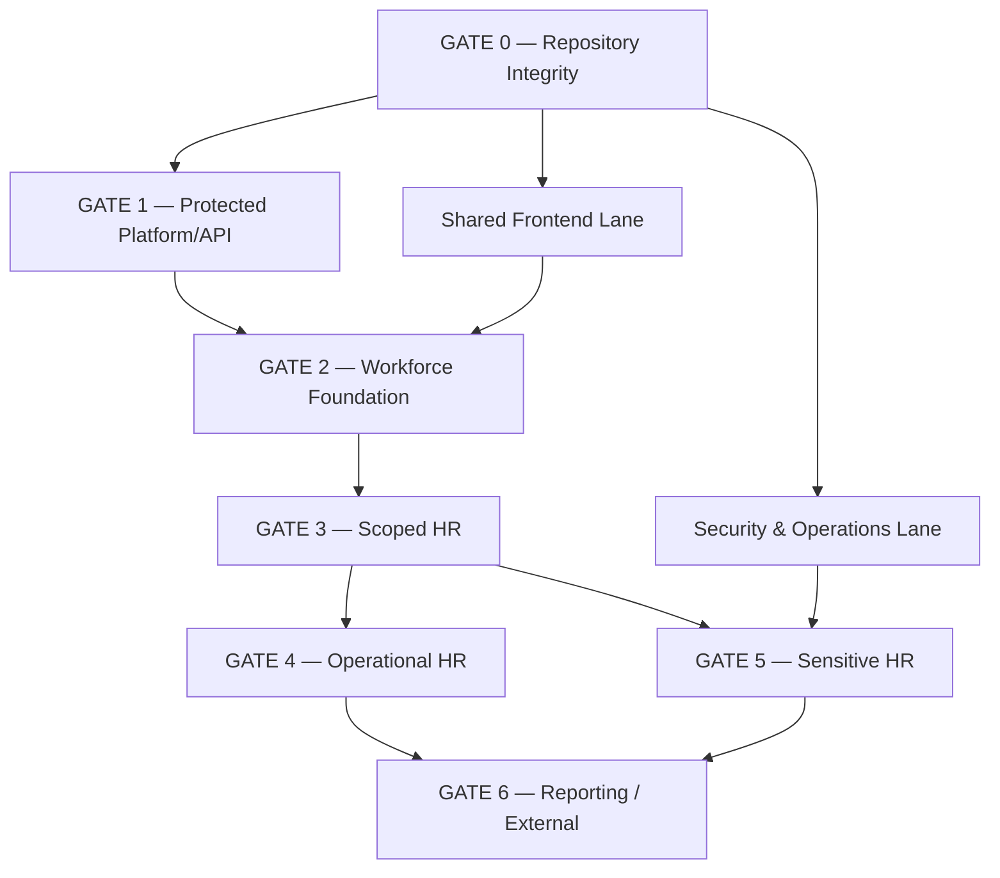

# HR-020 — Phase 4C Technical Implementation Sequencing

**Version:** 0.1 Draft
**Phase:** 4C — Technical Implementation Sequencing
**Status:** APPROVED / LOCKED
**Approval Date:** 2026-08-23
**Depends On:** HR-001–HR-019 + ADR-032
**Repository Baseline:** `26b475b695aa4511064b1410db03d1f0c8bdd6ce`

---

# 1. Purpose

HR-020 menentukan **urutan teknis eksekusi** dari 211 engineering tasks HR-019.

Tujuannya bukan mengerjakan task secara linear:

```text
TASK-001
→ TASK-002
→ ...
→ TASK-211
```

tetapi menyusun:

```text
Dependency Batch
+
Parallel Lane
+
Exit Gate
```

sehingga engineering mengetahui:

- apa yang wajib selesai lebih dahulu;
- apa yang dapat berjalan paralel;
- apa yang tidak boleh diaktifkan sebelum dependency siap;
- kapan sebuah capability dianggap aman untuk dilanjutkan.

---

# 2. Sequencing Principles

Urutan engineering mengikuti:

```text
Repository Integrity
→ Authorization / API Safety
→ Workforce Foundation
→ Organizational Scope
→ Business Capabilities
→ Sensitive Capabilities
→ Reporting / External
```

Cross-cutting work:

```text
Security / Operations
Frontend Foundation
```

berjalan paralel sepanjang dependency dipenuhi.

---

# 3. Four Engineering Lanes

## Lane A — Platform / Backend Foundation

Mencakup:

```text
repository hygiene
authorization
API contracts
organizational scope
database foundation
```

---

## Lane B — Security / Operations

Mencakup:

```text
queue privacy
identifier encryption
health
correlation
deployment
backup / recovery
```

---

## Lane C — Shared Frontend

Mencakup:

```text
application shell
authentication UX
Tenant / Workspace
capability projection
route guard
error/loading
observability
```

---

## Lane D — HR Domain

Mencakup:

```text
Employee / Employment
Recruitment
Leave
Attendance
Compensation
Performance
Documents
Discipline
Offboarding
Reporting / Export
```

---

# 4. Sequence Overview



---

# 5. Gate 0 — Repository Integrity

## Batch B0-A — Repository Hygiene

**Tasks:**

```text
HR-TASK-001 → HR-TASK-013
```

Scope:

- casing reconciliation;
- PostgreSQL environment alignment;
- CI portability baseline;
- documentation integration.

### Must complete before

```text
shared multi-engineer implementation
schema evolution
CI enforcement
production-oriented API hardening
```

### Exit Criteria

- no tracked casing conflict;
- migration discovery works on case-sensitive environment;
- PostgreSQL authoritative environment documented;
- HR canonical documents integrated or repository location agreed;
- repository clean enough to become implementation baseline.

### Gate Status

```text
GATE-0 PASS
→ repository may become active engineering baseline
```

---

# 6. Gate 1 — Protected Platform / API

Gate 1 establishes minimum security before HR surface expands.

---

## Batch B1-A — HR Authorization Catalog & Current Routes

**Tasks:**

```text
HR-TASK-014 → HR-TASK-027
```

Includes:

- 53 HR permissions;
- `hr.employees.view`;
- `hr.employees.create`;
- Employee route enforcement;
- authorization regression tests.

### Dependency

```text
B0-A
```

### Exit Criteria

```text
unauthenticated
→ 401

authenticated without permission
→ 403

authorized tenant user
→ expected result
```

and:

```text
Employee.jabatan
→ no authorization effect
```

---

## Batch B1-B — Canonical HR API Contract

**Tasks:**

```text
HR-TASK-035 → HR-TASK-041
```

Can run **parallel with late B1-A** once route behavior is understood.

Includes:

- canonical `ApiErrorResponse`;
- Employee response DTO;
- sensitive-field minimization;
- OpenAPI hardening;
- contract tests.

### Exit Criteria

Current Employee API is no longer considered an undocumented/deferred ad-hoc contract.

---

## Batch B1-C — Organizational Permission Middleware

**Tasks:**

```text
HR-TASK-028 → HR-TASK-034
```

Can run in parallel with B1-A/B1-B.

Owned primarily by Core.

Target:

```text
InjectTenantContext
→ InjectOrganizationalContext
→ organizational.permission:<permission>
```

### Important

Completion of B1-C **does not authorize use against tenant-wide Employee queries**.

That requires Gate 3.

---

# 7. Parallel Security Lane — Foundation

This lane starts after Gate 0 and continues beside Gate 1–3.

---

## Batch S1 — Queue Privacy

**Tasks:**

```text
HR-TASK-042 → HR-TASK-047
```

Priority:

**P0 before any sensitive HR async job.**

### Exit Criteria

```text
QueueWatchdog
→ no raw input_payload

HR job convention
→ identifier-only
```

---

## Batch S2 — After-Commit / Idempotency Foundation

**Tasks:**

```text
HR-TASK-048 → HR-TASK-052
```

Can proceed after S1.

This establishes pattern, not every future job.

---

## Batch S3 — Person Identifier Security

**Tasks:**

```text
HR-TASK-053 → HR-TASK-059
```

Must complete before production usage of national/government identifiers.

---

## Batch S4 — Diagnostics & Correlation

**Tasks:**

```text
HR-TASK-060 → HR-TASK-066
```

Includes:

```text
/up
→ liveness

Core health
→ sanitized readiness

HTTP request
→ safe correlation ID
```

---

## Batch S5 — Deployment / Recovery Foundation

**Tasks:**

```text
HR-TASK-067 → HR-TASK-074
```

Can proceed in parallel with domain development.

It is **not a blocker for local development**, but becomes mandatory for production readiness.

---

# 8. Parallel Frontend Lane

---

## Batch FE1 — Shared Frontend Runtime

**Tasks:**

```text
HR-TASK-075 → HR-TASK-083
```

May begin after Gate 0.

Does not depend on Employment implementation.

Includes:

```text
Application Shell
Authentication
Tenant
Workspace
Capabilities
Route Guard
Error / Loading
Cache invalidation
Observability
```

### Constraint

FE1 must implement existing FE architecture.

It must not create:

```text
HR-only authentication
HR-only tenant switch
HR-only authorization store
```

---

## Batch FE2 — HR Module Entry

**Tasks:**

```text
HR-TASK-084 → HR-TASK-089
```

Dependencies:

```text
FE1
+
B1-A permission catalog
```

HR navigation may expose only implemented capabilities.

---

# 9. Gate 1 Exit

Gate 1 passes when:

- repository integrity gate passed;
- HR permission catalog exists;
- Employee GET/POST protected;
- canonical HR API error envelope exists;
- OpenAPI/contract test baseline exists;
- organizational middleware is implemented or ready for scoped endpoints.

### Explicit Non-Requirement

Gate 1 does **not** require all Phase 3 operational infrastructure to be production complete.

---

# 10. Gate 2 — Workforce Foundation

This is the first major HR domain gate.

---

## Batch B2-A — Employee Foundation Hardening

**Tasks:**

```text
HR-TASK-090 → HR-TASK-096
```

Dependency:

```text
GATE 1
```

Focus:

- preserve existing Employee foundation;
- separate ordinary/sensitive DTO;
- prepare `jabatan` deprecation;
- avoid new client dependency on legacy `jabatan`.

### Important Migration Rule

Do not drop:

```text
employees.jabatan
```

yet.

First:

```text
new canonical structures
→ application migration
→ legacy read/write removal
→ contract verification
→ later column removal
```

---

## Batch B2-B — Employment Core

**Tasks:**

```text
HR-TASK-097 → HR-TASK-105
```

Can begin in parallel with B2-A after core authorization foundation is stable.

Primary invariants:

```text
Employee
→ many Employment historically

max one ACTIVE Employment

rehire
→ new Employment

Employment ENDED
≠ Membership inactive
```

---

# 11. Employment Open-Decision Handling

Some Employment details remain open:

- Employment Type/Classification catalog;
- future-effective scheduling.

### Rule

Do not block the entire Employment foundation.

Engineering may implement:

```text
identity
relationship
history
state machine
active uniqueness
rehire semantics
```

while policy-dependent catalog behavior remains deferred.

If schema requires a field whose canonical values are unresolved:

```text
do not invent permanent hardcoded catalog
```

---

# 12. Gate 2 Exit

Gate passes when:

- canonical Employee foundation no longer depends architecturally on `jabatan`;
- Employment persistence/lifecycle exists;
- max-one-ACTIVE invariant is enforced;
- Employment history works;
- rehire creates new Employment;
- tests cover lifecycle and concurrency.

At this point:

```text
Workforce Domain Foundation
→ usable
```

---

# 13. Gate 3 — Scoped HR

Gate 3 prevents the most dangerous authorization failure:

```text
scoped permission
+
tenant-wide query
```

---

## Batch B3-A — Scope-Aware Employee Query

**Tasks:**

```text
HR-TASK-106 → HR-TASK-113
```

Dependencies:

```text
B1-C organizational middleware
+
B2-A Employee foundation
+
Core OrganizationalAssignment
```

Target order:

```text
verified workspace
→ permission
→ scope-aware query
→ pagination
```

not:

```text
tenant-wide query
→ pagination
→ filter later
```

---

## Batch B3-B — HR / OrganizationalAssignment Integration

**Tasks:**

```text
HR-TASK-114 → HR-TASK-118
```

Can run parallel with B3-A.

Rules:

- Employee placement read uses Core;
- no HR organization table;
- no duplicate `organization_id` shortcut on Employee;
- placement mutation remains Core-owned.

---

# 14. Gate 3 Exit

Required tests:

```text
Organization A
→ authorized target A succeeds

Organization A
→ Organization B target denied

Unit A
→ Unit B sibling denied

inactive assignment
→ denied

stale assignment
→ denied
```

Only after Gate 3:

```text
organizationally scoped HR APIs
```

may be exposed.

---

# 15. Gate 4 — Operational HR

Gate 4 implements everyday HR workflows.

It contains **two parallel branches**.

---

# 16. Branch 4A — Recruitment

## Batch D4-A1 — Recruitment Lifecycle

**Tasks:**

```text
HR-TASK-119 → HR-TASK-126
```

Dependencies:

```text
Gate 2
+
Gate 3 where organization scope applies
```

---

## Batch D4-A2 — Identity Resolution / Conversion

**Tasks:**

```text
HR-TASK-127 → HR-TASK-134
```

Dependency:

```text
D4-A1
+
Employment
+
Person/Membership foundation
```

Must preserve:

```text
Candidate
≠ Person
≠ Employee
```

and:

```text
weak match
→ no auto merge
```

---

# 17. Branch 4B — Leave

## Batch D4-B1 — Leave Ledger & Request

**Tasks:**

```text
HR-TASK-135 → HR-TASK-142
```

Dependencies:

```text
Gate 2
+
Gate 3
```

The following can begin:

- ledger persistence;
- request lifecycle;
- approval authorization;
- self-service boundaries.

Exact calendar computation remains dependent on `[OPEN DECISION]`.

---

# 18. Branch 4C — Attendance

## Batch D4-C1 — Attendance Reconciliation

**Tasks:**

```text
HR-TASK-143 → HR-TASK-151
```

Dependencies:

```text
Employment
+
Leave approved-fact contract
+
Attendance expectation contract
```

Therefore:

```text
Leave foundation
→ precedes full attendance reconciliation
```

Raw-event intake foundations may be started earlier if they do not assume final attendance semantics.

---

# 19. Gate 4 Parallelism

Allowed:

```text
Recruitment
|| Leave
```

After Leave approved-fact contract stabilizes:

```text
Attendance
```

can proceed.

These do not need to wait for Compensation/Documents/etc.

---

# 20. Gate 4 Exit

Operational HR gate passes when at least targeted release capabilities have:

- canonical domain persistence;
- authorization;
- scope;
- business-state validation;
- API contract;
- tests;
- frontend contract where exposed.

Gate does not require all three capabilities to launch simultaneously.

---

# 21. Gate 5 — Sensitive HR

This gate requires stronger security controls.

Mandatory prerequisite:

```text
S1 Queue Privacy
+
appropriate HR-014 privacy controls
+
Gate 2/3 Workforce Foundation
```

Private-storage-dependent capability additionally requires private storage implementation.

---

# 22. Branch 5A — Compensation

## Batch D5-A1

**Tasks:**

```text
HR-TASK-152 → HR-TASK-159
```

May proceed independently of Documents.

Requirements:

```text
Employment
+
restricted permission
+
effective history
```

Finance calculation is not dependency for baseline HR facts.

---

# 23. Branch 5B — Performance

## Batch D5-B1

**Tasks:**

```text
HR-TASK-160 → HR-TASK-167
```

Can run parallel with Compensation.

Framework/rating versioning may be implemented before exact PKG regulatory mapping.

Do not hardcode a final PKG rubric while mapping remains open.

---

# 24. Branch 5C — Documents

## Batch D5-C1

**Tasks:**

```text
HR-TASK-168 → HR-TASK-176
```

Prerequisite:

```text
private storage abstraction
+
sensitive authorization
```

Production activation additionally depends on:

- production storage provider;
- malware policy/provider if required;
- e-sign provider for signing flows.

Metadata/versioning work can proceed before provider selection.

---

# 25. Branch 5D — Discipline

## Batch D5-D1

**Tasks:**

```text
HR-TASK-177 → HR-TASK-183
```

Can start:

- tenant catalog model;
- case model;
- evidence boundary;
- authorization.

Cannot finalize tenant production workflow until disciplinary/SP policy is authoritative.

Do not invent:

```text
SP1 → SP2 → SP3
```

as universal lifecycle.

---

# 26. Branch 5E — Offboarding

## Batch D5-E1

**Tasks:**

```text
HR-TASK-184 → HR-TASK-193
```

Dependencies:

```text
Employment
+
authorization
```

Core offboarding case can proceed without completed Finance/Asset integrations.

Integrations remain independent downstream contracts.

Do not block core offboarding on:

```text
Finance implementation
Asset implementation
```

unless specific feature requires them.

---

# 27. Gate 5 Parallelism

After prerequisites:

```text
Compensation
||
Performance
||
Documents
||
Discipline
||
Offboarding
```

can largely run in parallel across engineering squads.

### Shared constraints

All must reuse:

```text
HR authorization
sensitivity rules
Employee / Employment
shared API/error foundation
```

---

# 28. Gate 6 — Reporting & External

This is intentionally downstream.

---

# 29. Batch D6-A — HR Reporting

**Tasks:**

```text
HR-TASK-194 → HR-TASK-201
```

Start only when enough source capabilities exist for the target report.

Does **not** require all HR capabilities to be complete.

Example:

```text
Workforce reporting
```

can launch when Workforce source data is authoritative.

But Reporting must never invent missing source domain data.

Baseline:

```text
direct query first
```

Projection task `HR-TASK-201` is conditional on performance evidence.

---

# 30. Batch D6-B — Government Export

**Tasks:**

```text
HR-TASK-202 → HR-TASK-211
```

Prerequisites:

```text
authoritative source domains
+
report/export authorization
+
queue privacy
+
private storage
+
frozen dataset
+
official field mapping
```

### Hard Block

Production Dapodik / EMIS export cannot complete without authoritative:

```text
field-level mapping
official format/workflow contract
```

These remain `[RESOURCE GAP]`.

---

# 31. Simpatika

Task:

```text
HR-TASK-211
```

is an explicit **negative implementation requirement**:

```text
DO NOT build new Simpatika integration
```

unless future approved change request alters legacy classification.

---

# 32. Cross-Cutting Production Readiness Gate

This is **not an eighth implementation sequence gate**.

It is evaluated against every capability intended for production.

Required cross-cutting work includes:

```text
S4 diagnostics/correlation
S5 deployment/recovery

authorization
privacy
API contract
tests
private storage where applicable
backup coverage
operational monitoring
```

A capability may be:

```text
implemented
```

but still:

```text
NOT PRODUCTION ENABLED
```

until this gate passes.

---

# 33. Batch Dependency Matrix

| Batch                      | Primary Dependency         | Can Run Parallel With          |
| -------------------------- | -------------------------- | ------------------------------ |
| B0-A Repository            | None                       | —                              |
| B1-A Authorization         | B0-A                       | B1-B, B1-C, S1, FE1            |
| B1-B API Contract          | B0-A / route knowledge     | B1-A, B1-C                     |
| B1-C Org Middleware        | B0-A                       | B1-A, B1-B                     |
| S1 Queue Privacy           | B0-A                       | B1-\* / FE1                    |
| S2 After Commit            | S1                         | B2-\*                          |
| S3 Identifier Security     | B0-A                       | B1/B2                          |
| S4 Diagnostics             | B0-A                       | Domain work                    |
| S5 Deployment/Recovery     | B0-A                       | All non-production domain work |
| FE1 Shared Frontend        | B0-A                       | B1/S1                          |
| FE2 HR Entry               | FE1 + B1-A                 | B2                             |
| B2-A Employee              | Gate 1                     | B2-B                           |
| B2-B Employment            | Gate 1                     | B2-A                           |
| B3-A Scoped Query          | B1-C + B2-A                | B3-B                           |
| B3-B Placement Integration | B2-A + Core Org            | B3-A                           |
| D4-A Recruitment           | Gate 2/3                   | Leave                          |
| D4-B Leave                 | Gate 2/3                   | Recruitment                    |
| D4-C Attendance            | Leave fact + Employment    | Recruitment                    |
| D5-A Compensation          | Gate 2/3 + security        | D5-B/C/D/E                     |
| D5-B Performance           | Gate 2/3 + security        | D5-A/C/D/E                     |
| D5-C Documents             | Private storage + security | D5-A/B/D/E                     |
| D5-D Discipline            | Gate 2/3 + security        | D5-A/B/C/E                     |
| D5-E Offboarding           | Employment + security      | D5-A/B/C/D                     |
| D6-A Reporting             | Source domain(s)           | late D5                        |
| D6-B Gov Export            | Source + storage + mapping | —                              |

---

# 34. Critical Path

The minimum architectural critical path is:

```text
B0-A
↓
B1-A + B1-B
↓
B2-A + B2-B
↓
B3-A + B3-B
↓
Operational/Sensitive Capability
↓
Reporting / External
```

Supporting paths:

```text
S1/S3/S4/S5
```

and:

```text
FE1/FE2
```

run in parallel.

---

# 35. What Does NOT Belong on Critical Path

Do not delay Workforce foundation waiting for:

- Dapodik mapping;
- EMIS mapping;
- Finance payroll engine;
- e-sign provider;
- AV provider;
- PKG final regulatory mapping;
- RPO/RTO number;
- centralized observability vendor;
- advanced reporting projection.

Those block only the capabilities that actually require them.

---

# 36. Frontend / Backend Coordination Rule

Frontend may begin page scaffolding only against a stable contract.

Recommended:

```text
Backend API
→ documented contract
→ frontend integration
```

For still-unimplemented API:

frontend may build:

```text
route
layout
loading/empty/error states
mock boundary
```

but mock shape must follow approved contract and must not silently become canonical API design.

---

# 37. Migration Sequencing Rule

For every new HR capability:

```text
Migration / constraints
→ Model/repository
→ Domain service
→ Authorization/resource scope
→ API
→ Contract tests
→ Frontend
```

Not:

```text
Frontend
→ invent API
→ retrofit DB
```

---

# 38. Legacy `jabatan` Sequencing

Recommended migration stages:

### Stage J1

```text
Existing jabatan
→ preserved
```

while Employment/Position foundation is added.

### Stage J2

New writes stop treating `jabatan` as canonical.

### Stage J3

Consumers migrate to:

```text
Employment
Position
OrganizationalAssignment
```

### Stage J4

Legacy field becomes read-unused.

### Stage J5

Drop only in later safe contract migration.

No immediate destructive migration.

---

# 39. Testing Sequence per Batch

Each implementation batch should follow:

```text
Unit / invariant tests
→ Repository/service tests
→ Authorization tests
→ API/contract tests
→ Integration tests
→ Frontend tests where applicable
→ E2E critical path later
```

A batch is not “done” because only its happy-path controller works.

---

# 40. Open Decision Handling During Execution

Classification:

## TYPE A — Does not block technical foundation

Example:

```text
Employment Type catalog
```

May allow base Employment schema/state work.

## TYPE B — Blocks specific business rule

Example:

```text
Leave calendar
```

Blocks canonical calculation behavior.

## TYPE C — Blocks production provider integration

Example:

```text
storage provider
AV provider
e-sign provider
```

Does not block adapter/domain contracts.

## TYPE D — Blocks final external release

Example:

```text
Dapodik / EMIS mapping
```

Government export cannot be production-complete without it.

---

# 41. Stop Conditions

Engineering must pause a particular task/batch when it discovers:

```text
locked requirement conflict
domain ownership conflict
security model contradiction
migration with unavoidable data loss
external contract required but absent
```

Then perform:

```text
impact analysis
→ explicit change request
```

Do not solve by undocumented implementation shortcut.

---

# 42. Forbidden Sequencing

## Do not do this

```text
Build HR UI
→ then decide permissions
```

Correct:

```text
Permission contract
→ API authorization
→ frontend affordance
```

---

## Do not do this

```text
Add organizational.permission
→ reuse tenant-wide list query
```

Correct:

```text
scope middleware
+
scope query
```

together.

---

## Do not do this

```text
Build government dashboard/export first
→ later create HR domains
```

Correct:

```text
source domain
→ reporting
→ export
```

---

## Do not do this

```text
Drop jabatan
→ hope new Employment implementation works
```

Correct:

```text
expand
→ migrate
→ switch
→ contract
```

---

# 43. Suggested Engineering Pull-Request Boundaries

Phase 4C does not mandate exact PR count, but recommended PR boundaries are small and independently reviewable.

Examples:

```text
PR: repository casing cleanup

PR: HR permission catalog

PR: Employee route authorization

PR: HR canonical API errors/OpenAPI

PR: Core organizational permission middleware

PR: QueueWatchdog privacy remediation

PR: Employment schema/invariants

PR: Employment lifecycle APIs

PR: scoped Employee query
```

Avoid mega-PR:

```text
“Implement complete HR module”
```

---

# 44. Recommended First Execution Order

If engineering begins immediately, recommended first sequence is:

### Batch 1

```text
HR-TASK-001 → 013
Repository baseline
```

### Batch 2 — Parallel

```text
HR-TASK-014 → 027
Authorization

HR-TASK-035 → 041
API hardening

HR-TASK-042 → 047
Queue privacy

HR-TASK-060 → 066
Health/correlation

HR-TASK-075 → 083
Shared frontend foundation
```

### Batch 3 — Parallel

```text
HR-TASK-028 → 034
Organizational middleware

HR-TASK-053 → 059
Identifier security

HR-TASK-090 → 096
Employee hardening
```

### Batch 4

```text
HR-TASK-097 → 105
Employment
```

### Batch 5 — Parallel

```text
HR-TASK-106 → 113
Scoped Employee queries

HR-TASK-114 → 118
Placement integration

HR-TASK-084 → 089
HR frontend entry
```

Then operational domain branches may begin.

---

# 45. Production Sequencing Difference

Development order and production activation order are not necessarily identical.

Example:

```text
Discipline persistence
```

may be implemented internally before policy approval, but:

```text
Discipline production feature
```

must remain disabled until policy-dependent requirements are resolved.

Similarly:

```text
Government export engine skeleton
```

may exist, but no official export is released without authoritative mapping.

---

# 46. Definition of Phase 4C Complete

Phase 4C is complete when:

- 211 tasks no longer appear as one flat sequence;
- dependencies are grouped into executable batches;
- parallel lanes are identified;
- critical path is explicit;
- scope/security gates are explicit;
- production readiness is separated from coding completion;
- open decisions block only relevant capability;
- no domain redesign was introduced.

All criteria are satisfied by this draft.

---

# 47. Reviewer Assessment

**Quality Score:** **9.8/10**

## Gaps

Phase 4C deliberately does not yet define:

- database/API implementation specification per batch;
- exact PR count;
- effort estimates;
- developer allocation;
- sprint capacity;
- calendar dates.

These belong to subsequent Phase 4 work.

## Risks

**[RISK — CRITICAL]**

Gate 3 cannot be bypassed. Scoped authorization without scoped queries remains the highest potential horizontal-access defect.

**[RISK — HIGH]**

If shared frontend foundation lags, HR UI teams may be tempted to create domain-local infrastructure.

**[RISK — HIGH]**

Sensitive capabilities must not enable queued processing before S1 Queue Privacy passes.

**[RISK — HIGH]**

Attempting all business branches simultaneously without Workforce/Employment stability will multiply migration/API rework.

**[RISK]**

Production operations work running in parallel can be incorrectly treated as optional indefinitely; it must become release gate before production activation.

## Recommendations

1. Lock HR-020 as canonical technical sequence.
2. Start Gate 0 and Gate 1 first.
3. Run Security/Operations and Shared Frontend as parallel lanes.
4. Make Workforce/Employment the first domain implementation.
5. Do not expose organizational HR until Gate 3 passes.
6. Parallelize Recruitment/Leave after Workforce.
7. Parallelize sensitive domains after security prerequisites.
8. Reporting/External remains downstream of canonical source domains.

**Status:** **READY FOR APPROVAL**
