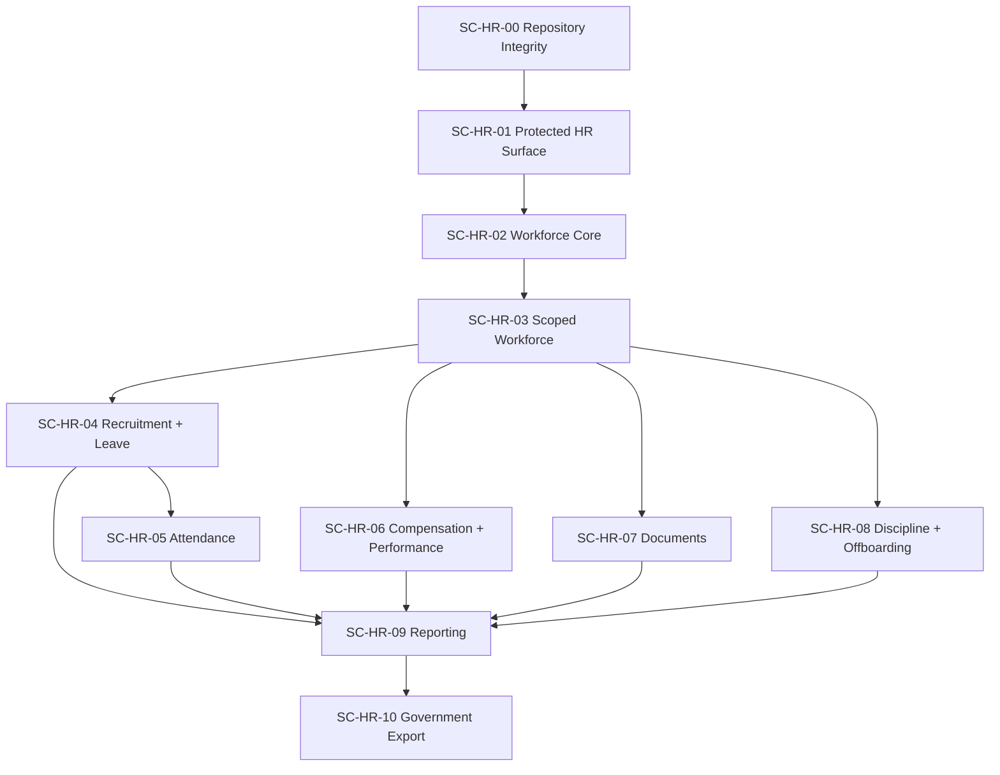

# HR-022 — Phase 4E Risk-Based Sprint Planning

**Version:** 0.1 Draft
**Phase:** 4E — Risk-Based Sprint Planning
**Status:** APPROVED / LOCKED
**Approval Date:** 2026-08-24
**Depends On:** HR-001–HR-021 + ADR-032
**Repository Baseline:** `26b475b695aa4511064b1410db03d1f0c8bdd6ce`

---

# 1. Purpose

HR-022 mengubah technical sequence HR-020/HR-021 menjadi **Sprint Candidate Plan berbasis dependency dan risk**.

Dokumen ini **tidak** mengarang:

- story point;
- jumlah developer;
- velocity;
- sprint duration;
- calendar date;
- target completion date.

Sprint Candidate adalah:

```text
logical delivery package
≠ guaranteed one timeboxed sprint
```

Jika kapasitas aktual tidak cukup, candidate dapat dipecah menjadi:

```text
SC-HR-xx.A
SC-HR-xx.B
```

tanpa mengubah dependency order.

---

# 2. Project Sprint Documentation Rule

Repository mempunyai:

```text
docs/sprint/
```

tetapi sprint existing diklasifikasikan sebagai:

```text
HISTORICAL
```

dan bukan current architecture contract.

Untuk sprint HR baru, setiap dokumen wajib menyatakan:

```text
Status
Specification Baseline
Repository Baseline
Included Scope
Excluded Scope
Dependencies
Open Decisions
```

Sprint tidak boleh menjadi authority yang mengubah HR-001–HR-022.

---

# 3. Additive Backlog Correction — Domain Frontend

## [GAP — TRACEABILITY]

HR-021 menetapkan frontend implementation untuk setiap HR capability, tetapi task backlog belum memberi task eksplisit setelah shared HR navigation.

Tambahkan:

### HR-TASK-221 — Workforce Frontend

Implement authorized Employee / Employment / Position pages dan transaction states sesuai HR-010–HR-012.

### HR-TASK-222 — Recruitment Frontend

Implement Candidate/Application/Selection/Hiring/Onboarding/Identity Resolution UX.

### HR-TASK-223 — Leave Frontend

Implement self-service Leave, approval worklist, entitlement/balance UX.

### HR-TASK-224 — Attendance Frontend

Implement `frontend/src/modules/attendance/` reconciliation/record UX.

### HR-TASK-225 — Compensation Frontend

Implement restricted Compensation/Benefits/Payroll Input UX.

### HR-TASK-226 — Performance Frontend

Implement Performance/Competency/Development UX.

### HR-TASK-227 — Documents & Agreements Frontend

Implement private document/version/agreement interaction UX.

### HR-TASK-228 — Discipline Frontend

Implement highly restricted Discipline case workspace.

### HR-TASK-229 — Offboarding Frontend

Implement Offboarding case/checklist/handover/access-review workspace.

### HR-TASK-230 — Reporting Frontend

Implement authorized HR dashboards/reports and freshness state UX.

### HR-TASK-231 — Government Export Frontend

Implement export run/status/generate/download UX.

---

# 4. Updated Engineering Baseline

Previous:

```text
HR-021
→ 220 tasks
```

Updated:

```text
HR-022
→ 231 tasks
```

No existing task ID is removed or renumbered.

---

# 5. Risk-Based Planning Model

Sprint prioritization follows:

```text
Security / Data Integrity Risk
        ↓
Architectural Rework Risk
        ↓
Dependency Criticality
        ↓
Operational Risk
        ↓
Business Capability Value
```

Not:

```text
feature visibility
→ priority
```

---

# 6. Risk Classes

## R0 — Critical Blocker

Can cause:

- unauthorized data exposure;
- cross-Tenant leakage;
- corrupted canonical state;
- destructive migration;
- insecure sensitive persistence.

R0 work must precede affected feature expansion.

---

## R1 — High Rework / Architecture Risk

Can cause:

- duplicate source of truth;
- wrong module ownership;
- legacy coupling;
- circular module dependency;
- costly migration rework.

---

## R2 — High Operational Risk

Implementation can work locally but cannot safely operate in production.

Examples:

- backup unavailable;
- worker deployment unclear;
- health leaks details;
- private storage unavailable.

---

## R3 — Domain Delivery Risk

Business capability is incomplete or policy dependent but does not threaten existing platform integrity.

---

# 7. Sprint Candidate Overview

| Candidate | Main Goal                   | Primary Risk | Readiness                           |
| --------- | --------------------------- | ------------ | ----------------------------------- |
| SC-HR-00  | Repository Integrity        | R1/R2        | **READY NOW**                       |
| SC-HR-01  | Protect Existing HR Surface | **R0**       | **READY AFTER SC-00**               |
| SC-HR-02  | Workforce Core              | R0/R1        | READY AFTER SC-01                   |
| SC-HR-03  | Scoped Workforce            | **R0**       | READY AFTER SC-02                   |
| SC-HR-04  | Recruitment & Leave         | R1/R3        | READY AFTER SC-03                   |
| SC-HR-05  | Attendance Boundary         | R1           | CONDITIONAL                         |
| SC-HR-06  | Compensation & Performance  | R0/R3        | READY AFTER SECURITY + WORKFORCE    |
| SC-HR-07  | Documents & Agreements      | R0/R2        | CONDITIONAL                         |
| SC-HR-08  | Discipline & Offboarding    | R0/R3        | POLICY-CONDITIONAL                  |
| SC-HR-09  | HR Reporting                | R1/R3        | SOURCE-CONDITIONAL                  |
| SC-HR-10  | Government Export           | R0/R2        | **RESOURCE-BLOCKED FOR PRODUCTION** |

---

# 8. SC-HR-00 — Repository Integrity

## Objective

Membuat repository menjadi baseline engineering yang reproducible sebelum migration/API baru berkembang.

## Included Tasks

```text
HR-TASK-001 → HR-TASK-013
```

### Scope

- filename casing;
- PostgreSQL alignment;
- case-sensitive CI;
- HR documentation integration.

## Risk Reduced

```text
Linux/CI deployment failure
migration inconsistency
stale SQLite-driven design
conversation-only traceability
```

## Entry

None beyond current repository baseline.

## Candidate Exit Evidence

- Git working tree mempunyai canonical casing;
- migration discovery bekerja di case-sensitive environment;
- PostgreSQL tercatat sebagai authoritative integration persistence;
- canonical HR documentation memiliki repository location;
- existing tests tidak rusak akibat repository hygiene.

## OUT

No HR feature development.

---

# 9. SC-HR-01 — Protect Existing HR Surface

## Objective

Menutup security/API risk **sebelum** Employee functionality diperluas.

## Backend Critical Lane

```text
HR-TASK-014 → HR-TASK-041
```

Includes:

- HR permission catalog;
- Employee GET permission;
- Employee POST permission;
- Core organizational permission middleware;
- canonical error contract;
- Employee DTO;
- OpenAPI hardening.

## Security/Ops Parallel Lane

```text
HR-TASK-042 → HR-TASK-047
HR-TASK-060 → HR-TASK-066
```

Includes:

- QueueWatchdog privacy;
- safe liveness/readiness;
- request correlation.

## Frontend Parallel Lane

```text
HR-TASK-075 → HR-TASK-083
```

Shared frontend foundation may begin concurrently.

## Primary Risks

**[R0]** Existing HR route authenticated but insufficiently authorized.

**[R0]** Raw sensitive queue payload may later be copied to Audit.

**[R2]** Health endpoint may leak infrastructure exception detail.

## Exit Gate

Minimum mandatory:

```text
GET Employee
→ permission protected

POST Employee
→ permission protected

canonical HR ApiError
→ active

OpenAPI
→ matches exposed contract

jabatan
→ no authorization effect
```

Organizational middleware must be tested but is not yet used on tenant-wide Employee collection until SC-HR-03.

---

# 10. SC-HR-01 Risk Rule

This candidate **cannot be skipped** in favor of Employment/Recruitment UI.

Forbidden sequence:

```text
new HR API
→ permission later
```

Required:

```text
authorization foundation
→ new HR API
```

---

# 11. SC-HR-02 — Workforce Core

## Objective

Membentuk canonical Workforce foundation sehingga implementation berhenti bergantung pada legacy `jabatan`.

## Domain Tasks

```text
HR-TASK-090 → HR-TASK-105
HR-TASK-212 → HR-TASK-219
HR-TASK-221
```

Includes:

- Employee hardening;
- Employment persistence/lifecycle;
- Position persistence;
- Position Assignment;
- Workforce frontend.

## Security Parallel Work

```text
HR-TASK-048 → HR-TASK-059
```

Includes:

- after-commit pattern;
- Person identifier encryption/fingerprint implementation.

## Operational Parallel Work

```text
HR-TASK-067 → HR-TASK-074
```

Deployment/recovery planning begins early to avoid end-of-project operational debt.

It is not required to complete all production operations before local Workforce development concludes.

---

# 12. SC-HR-02 Critical Invariants

Sprint candidate must preserve:

```text
Person
→ Membership
→ Employee
→ Employment
```

and:

```text
one Employee
→ many historical Employments
→ max one ACTIVE
```

and:

```text
rehire
→ new Employment
```

and:

```text
Position
≠ Role
```

---

# 13. `jabatan` Rule During SC-HR-02

SC-HR-02 may:

- introduce canonical Position;
- introduce Position Assignment;
- stop new canonical clients using `jabatan`.

SC-HR-02 must **not** automatically:

```text
DROP employees.jabatan
```

Legacy migration remains expand/migrate/switch/contract.

---

# 14. Position Open Decision Handling

Position persistence may proceed.

Position mutation API cannot be considered fully ready until the permission decision is resolved:

```text
hr.employments.manage
```

versus additive explicit Position permission.

This must not be guessed inside implementation.

---

# 15. SC-HR-02 Exit Gate

Required evidence:

- Employment history persistence;
- max-one-ACTIVE invariant;
- activate/end domain action;
- rehire semantics;
- Position foundation;
- no Position-to-RBAC coupling;
- no automatic Membership deactivation;
- canonical Workforce frontend uses approved APIs/states;
- legacy `jabatan` still safely compatible where required.

---

# 16. SC-HR-03 — Scoped Workforce & HR Entry

## Objective

Enable organizational HR access without horizontal data exposure.

## Included Tasks

```text
HR-TASK-084 → HR-TASK-089
HR-TASK-106 → HR-TASK-118
```

HR-TASK-221 may continue if UI integration spans candidates.

## Primary Risk

**[R0 — CRITICAL]**

```text
organizational permission
+
tenant-wide query
=
data exposure
```

## Required Sequence

```text
Verified Workspace
→ Permission
→ Scope-aware Query
→ Pagination
```

## Candidate Exit Evidence

Tests prove:

- tenant-wide permission works where intended;
- Organization A cannot expose Organization B;
- Unit A cannot expose sibling Unit B;
- inactive assignment denied;
- stale assignment denied;
- cross-Tenant denied;
- HR navigation/capabilities update with Workspace;
- organizational placement comes from Core.

---

# 17. SC-HR-03 Activation Rule

No organizationally scoped Employee list/detail is production-enabled until both are complete:

```text
organizational.permission
AND
scope-aware repository query
```

One without the other is insufficient.

---

# 18. SC-HR-04 — Recruitment & Leave

These capabilities can be developed in parallel once Workforce/Scope foundations are stable.

---

## Lane A — Recruitment

Tasks:

```text
HR-TASK-119 → HR-TASK-134
HR-TASK-222
```

### Highest Risks

- duplicate Person;
- weak-match auto merge;
- duplicate Candidate conversion;
- wrong Employment provisioning.

### Exit Evidence

```text
Candidate
≠ Person

weak match
→ explicit resolution

conversion
→ idempotent

successful hire
→ Employment PLANNED
```

---

## Lane B — Leave

Tasks:

```text
HR-TASK-135 → HR-TASK-142
HR-TASK-223
```

### Highest Risks

- mutable balance becoming source of truth;
- double approval;
- self-service horizontal access;
- approval outside organizational scope.

### Exit Evidence

- append-only entitlement ledger;
- derived balance;
- explicit request lifecycle;
- scoped approval;
- final approval consumes entitlement once;
- self permission cannot access another Employee.

---

# 19. SC-HR-04 Open Decision Rule

Exact:

```text
leave/work calendar
```

is still open.

Therefore engineering can complete:

- ledger structure;
- request workflow;
- approval mechanics;
- authorization;

without inventing final calendar calculation.

If calculation depends on unresolved policy, that portion remains incomplete.

---

# 20. SC-HR-05 — Attendance Boundary

## Readiness

**CONDITIONAL**

Requires:

1. canonical Employment foundation;
2. Leave approved-fact contract;
3. acyclic Attendance integration direction.

## Included Tasks

```text
HR-TASK-143 → HR-TASK-151
HR-TASK-220
HR-TASK-224
```

## Technical Owner

```text
Modules/Attendance
frontend/src/modules/attendance
```

not `Modules/HR`.

## Primary Risk

**[R1]** Creating HR ↔ Attendance circular dependency.

## Required Contract

```text
Expectation
+
Raw Event
+
Approved Leave Fact
→ Attendance
```

Raw event does not equal final fact.

---

# 21. SC-HR-05 Exit Gate

- Attendance module loads via canonical module architecture;
- module dependency graph remains acyclic;
- raw event storage/evidence separate from final record;
- leave fact consumed via approved contract;
- reconciliation lifecycle exists;
- source failure does not become ABSENT;
- frontend is owned by Attendance module.

Fingerprint/QR/GPS remains future.

---

# 22. SC-HR-06 — Compensation & Performance

May be executed in parallel lanes.

Requires:

```text
Workforce foundation
+
Authorization
+
Sensitive DTO controls
```

---

## Lane A — Compensation

Tasks:

```text
HR-TASK-152 → HR-TASK-159
HR-TASK-225
```

### Risk Controls

- no payroll calculation;
- no payment/accounting;
- restricted responses;
- compensation history preserved.

---

## Lane B — Performance

Tasks:

```text
HR-TASK-160 → HR-TASK-167
HR-TASK-226
```

### Risk Controls

- versioned framework;
- versioned rating scale;
- no hardcoded universal PKG;
- finalization immutable;
- no automatic salary/promotion/Role changes.

---

# 23. SC-HR-06 Policy Constraint

Exact PKG/regulatory mapping may remain unresolved.

Allowed:

```text
generic versioned assessment foundation
```

Blocked:

```text
claiming one unverified rubric is canonical PKG
```

---

# 24. SC-HR-07 — Documents & Employment Agreements

## Included Tasks

```text
HR-TASK-168 → HR-TASK-176
HR-TASK-227
```

## Entry Dependency

- sensitive authorization baseline;
- private storage abstraction.

## Risk Level

**R0/R2**

because document exposure can disclose highly restricted employee data.

## Candidate Exit Evidence

- metadata in database;
- bytes in private storage;
- no DB BLOB;
- no public file URL;
- versioning;
- finalized/signed immutability;
- authorized retrieval;
- Employment Agreement distinct from file.

---

# 25. SC-HR-07 Production Constraint

Domain/storage adapter implementation may complete before vendor selection.

Production activation may remain blocked by:

- production object-storage provider;
- AV/malware policy/provider;
- e-sign provider for signing capability.

Do not invent vendor to close sprint scope.

---

# 26. SC-HR-08 — Discipline & Offboarding

Two parallel but related case-oriented capabilities.

---

## Lane A — Discipline

Tasks:

```text
HR-TASK-177 → HR-TASK-183
HR-TASK-228
```

Risk:

**R0/R3** due highly sensitive data and unresolved tenant policy.

Required invariants:

```text
no universal SP1→SP2→SP3
no automatic Employment mutation
no automatic Compensation mutation
no automatic RBAC mutation
```

---

## Lane B — Offboarding

Tasks:

```text
HR-TASK-184 → HR-TASK-193
HR-TASK-229
```

Required invariants:

```text
Employment ENDED
≠ Offboarding COMPLETED
```

and:

```text
Offboarding
≠ automatic Membership deactivation
≠ automatic role wipe
```

---

# 27. SC-HR-08 Policy Constraint

Final production flow remains conditional on:

- disciplinary policy;
- appeal/review;
- offboarding approval chain;
- role-grant provenance;
- Membership deactivation policy.

Engineering may build domain case foundations without inventing these policies.

---

# 28. SC-HR-09 — HR Reporting

## Readiness

SOURCE-CONDITIONAL.

A report family may be implemented only when its source domain is authoritative.

## Included Tasks

```text
HR-TASK-194 → HR-TASK-201
HR-TASK-230
```

## Sequence

```text
Source Domain
→ Direct Query
→ Authorized Report
```

Projection remains conditional.

## Risk

**R1** duplicate source of truth.

## Exit Evidence

- metric definition/version traceable;
- snapshot vs period semantics;
- authorization before aggregation;
- aggregate ≠ sensitive detail;
- View ≠ Export;
- freshness semantics represented;
- no generic EAV metric store.

---

# 29. SC-HR-09 Projection Rule

`HR-TASK-201` is not automatically executed simply because it exists.

It requires evidence of:

- repeated expensive query;
- unacceptable measured latency;
- justified freshness requirement.

Otherwise:

```text
projection
→ NOT IMPLEMENTED
```

is the correct outcome.

---

# 30. SC-HR-10 — Government Export

## Readiness

**RESOURCE-BLOCKED FOR PRODUCTION**

because authoritative field-level:

```text
Dapodik
EMIS / EMIS GTK
```

mapping is still unavailable. The handoff explicitly keeps these government interface specifications as a resource gap.

## Included Tasks

```text
HR-TASK-202 → HR-TASK-211
HR-TASK-231
```

## Hard Prerequisites

- source domains available;
- mapping version available;
- export authorization;
- queue privacy;
- private storage;
- frozen dataset model;
- official workflow/format known.

---

# 31. SC-HR-10 Commit Rule

SC-HR-10 must **not** become a committed production sprint while official mapping remains unavailable.

Potential preparatory work may include provider-neutral export-run/frozen-dataset architecture only where it does not invent government fields.

Forbidden:

```text
guess Dapodik schema
guess EMIS schema
build new Simpatika integration
```

---

# 32. Simpatika

Locked:

```text
LEGACY
DO NOT BUILD NEW DIRECT INTEGRATION
```

No sprint planning item may silently reactivate it.

---

# 33. Cross-Cutting Security Track

Some work is intentionally scheduled early even when production is later.

| Work                  | Earliest Candidate | Required Before                 |
| --------------------- | ------------------ | ------------------------------- |
| Queue privacy         | SC-HR-01           | sensitive async jobs            |
| After-commit pattern  | SC-HR-02           | async transactional jobs        |
| Identifier encryption | SC-HR-02           | legal identifier production use |
| Health sanitization   | SC-HR-01           | production exposure             |
| Request correlation   | SC-HR-01           | production diagnostics          |
| Deployment runbook    | SC-HR-02           | production deployment           |
| Backup/restore        | SC-HR-02 onward    | production readiness            |

This prevents security/operations becoming a final-sprint afterthought.

---

# 34. Shared Frontend Track

Frontend work is scheduled by dependency:

```text
SC-HR-01
→ shared application foundation

SC-HR-03
→ HR navigation + Workforce integration

SC-HR-04 onward
→ domain feature UI
```

Every domain UI reuses:

- auth;
- Tenant;
- Workspace;
- capability projection;
- routing;
- API client;
- error/loading framework.

No feature team creates alternative foundation.

---

# 35. Candidate Dependency Graph



Reporting does not necessarily wait for every upstream capability; individual report families may start when their specific source is ready.

---

# 36. Parallelization Model

After SC-HR-03:

```text
Recruitment/Leave
||
Compensation/Performance
||
Documents
||
Discipline/Offboarding
```

can be parallelized if team capacity permits.

However:

```text
team capacity unknown
```

therefore Phase 4E does not assert that they should all execute simultaneously.

---

# 37. First Three Candidate Priority

Regardless of team size, recommended first sequence remains:

```text
SC-HR-00
→ SC-HR-01
→ SC-HR-02
```

Reason:

### SC-HR-00

Removes repository/reproducibility risk.

### SC-HR-01

Removes current security exposure.

### SC-HR-02

Builds canonical Workforce foundation needed by almost every HR capability.

This is the **highest-risk-adjusted delivery path**.

---

# 38. Items Explicitly Not Planned Into Early Sprints

Do not consume early delivery capacity with:

- generic Reporting module;
- generic metric/EAV engine;
- Redis cache without evidence;
- Elasticsearch/OpenSearch;
- data warehouse;
- microservice extraction;
- Kubernetes architecture;
- direct Dapodik synchronization;
- Simpatika;
- generic workflow engine.

None solves the current highest risks.

---

# 39. Sprint Commitment Rule

A Sprint Candidate may move to a **committed sprint** only after:

```text
dependency available
+
blocking open decision resolved where required
+
artifact scope clear
+
test strategy identified
```

Full Definition of Ready will be formalized in **Phase 4F**.

HR-022 intentionally does not preempt that phase.

---

# 40. Sprint Completion Rule

Candidate completion requires evidence that its primary risk is actually reduced.

Example:

SC-HR-01 is not complete because:

```text
permission classes exist
```

It is complete only when:

```text
route protected
+
denial tested
+
OpenAPI aligned
```

Likewise SC-HR-03 requires actual cross-scope denial tests.

Full Definition of Done remains Phase 4F.

---

# 41. Policy-Blocked Story Handling

If a candidate contains policy-dependent work:

```text
ready foundation tasks
→ may enter sprint

blocked policy behavior
→ remains out of commitment
```

Example:

SC-HR-08 may build Offboarding Case persistence while Membership automatic-deactivation policy remains deferred.

Do not fill missing policy with assumption just to close sprint.

---

# 42. Risk Burn-Down Expectations

| After Candidate | Expected Risk Reduction                                   |
| --------------- | --------------------------------------------------------- |
| SC-HR-00        | repository portability/reproducibility                    |
| SC-HR-01        | current HR API authorization/privacy exposure             |
| SC-HR-02        | identity/workforce legacy coupling                        |
| SC-HR-03        | organizational horizontal data exposure                   |
| SC-HR-04        | recruitment identity duplication + leave ledger integrity |
| SC-HR-05        | attendance evidence/final-fact ambiguity                  |
| SC-HR-06        | compensation/performance disclosure & side effects        |
| SC-HR-07        | private document exposure                                 |
| SC-HR-08        | sensitive case lifecycle/cross-domain mutations           |
| SC-HR-09        | reporting source-of-truth duplication                     |
| SC-HR-10        | government export privacy/integration risk                |

---

# 43. Sprint Review Evidence

At review, demonstrate behavior instead of only task status.

Examples:

### SC-HR-01

```text
user without permission
→ Employee API 403

user with permission
→ succeeds
```

### SC-HR-02

```text
rehire
→ historical Employment retained
→ new Employment created
```

### SC-HR-03

```text
Unit A actor
→ cannot read Unit B employee
```

### SC-HR-04

```text
same Candidate conversion retried
→ no duplicate Employee
```

### SC-HR-07

```text
public document URL
→ unavailable
```

Review evidence should map back to locked acceptance criteria.

---

# 44. Roll-Forward Planning

If a candidate exposes a migration change, sprint plan must note:

```text
migration
+
compatibility
+
roll-forward/rollback implication
```

Particularly:

- `employees.jabatan`;
- Employment;
- Position;
- sensitive artifact metadata.

Do not treat migration `down()` as automatic recovery strategy.

---

# 45. Sprint Branch / PR Strategy

Within one candidate, use small reviewable PRs.

Example SC-HR-01:

```text
PR A
HR permission catalog

PR B
Employee route authorization

PR C
canonical API error/DTO

PR D
OpenAPI + contract tests

PR E
QueueWatchdog privacy

PR F
health/correlation
```

Sprint Candidate is not equivalent to one mega-PR.

---

# 46. Capacity Handling

Because team capacity is not available:

**[RESOURCE GAP]**

HR-022 does not define:

```text
developer count
story point
velocity
work hours
sprint duration
```

When capacity becomes available:

1. preserve candidate dependency order;
2. select ready task subset;
3. split oversized candidate;
4. do not pull downstream work merely to fill capacity if blockers remain.

---

# 47. Priority When Capacity Is Small

If only limited capacity exists:

```text
Security / Integrity
→ Workforce
→ Scope
→ one business capability at a time
```

Recommended:

```text
SC-00
SC-01
SC-02
SC-03
```

before parallel domain expansion.

---

# 48. Priority When Multiple Squads Exist

If sufficient independent squads later exist:

After SC-HR-03:

```text
Squad A
→ Recruitment / Leave

Squad B
→ Compensation / Performance

Squad C
→ Documents / Discipline / Offboarding

Platform
→ Security/Ops/Frontend foundation
```

This is only an execution option.

No assumption is made that those squads currently exist.

---

# 49. Milestone Relationship

Sprint Candidates roll into future release milestones.

Conceptual:

```text
Foundation Milestone
SC-00 → SC-03

Operational HR Milestone
SC-04 → SC-05

Sensitive HR Milestone
SC-06 → SC-08

Intelligence / External Milestone
SC-09 → SC-10
```

Milestone dates remain Phase 4G scope.

---

# 50. Open Decision Escalation

During sprint planning, an unresolved decision is classified:

### OD-A — Does not block candidate

Record and continue.

### OD-B — Blocks subset

Remove blocked story/task from sprint commitment.

### OD-C — Blocks entire candidate

Candidate remains `NOT READY`.

### OD-D — Contradicts locked requirement

Trigger change-impact review.

---

# 51. Current Candidate Readiness

## READY / NEXT

```text
SC-HR-00
```

After it:

```text
SC-HR-01
```

## NOT YET READY DUE TO DEPENDENCY

```text
SC-HR-02 onward
```

They are specified but depend on earlier gates.

## RESOURCE-BLOCKED

```text
SC-HR-10 production export
```

until official Dapodik/EMIS mapping resources exist.

---

# 52. Change Impact on Prior Artifacts

## HR-019

Add:

```text
HR-TASK-221 → HR-TASK-231
```

No renumbering.

## HR-020

Parallel frontend lane now explicitly follows each domain candidate.

## HR-021

Frontend artifacts now have explicit engineering task traceability.

Updated backlog baseline:

```text
231 tasks
```

No domain ownership or architecture decision changes.

---

# 53. Phase 4E Scope

## IN SCOPE

- sprint candidate ordering;
- risk-based prioritization;
- parallelization;
- candidate readiness;
- dependency gates;
- sprint review evidence;
- policy-blocked story handling;
- task-to-candidate mapping.

## OUT OF SCOPE

- story points;
- hours;
- dates;
- developer assignment;
- team velocity;
- full DoR;
- full DoD;
- release dates;
- implementation code.

## DEFERRED

- exact sprint capacity;
- sprint duration;
- developer/team assignment;
- release calendar.

---

# 54. Phase 4E Definition of Completion

Phase 4E is complete when:

- backlog is sequenced into sprint candidates;
- security risks precede feature expansion;
- critical path is explicit;
- parallel tracks are visible;
- policy/resource blockers are not hidden;
- unknown capacity does not become fabricated estimate;
- candidate completion is evidence-based;
- every engineering task category has a planning home.

All criteria are satisfied by this draft.

---

# 55. Reviewer Assessment

**Quality Score:** **9.8/10**

## Gaps

- actual team capacity unknown;
- sprint duration unknown;
- velocity unknown;
- some business/provider decisions remain open;
- government mappings remain unavailable.

These gaps prevent calendar/commitment estimation, not risk-based sequencing.

## Risks

**[RISK — CRITICAL]**

Starting SC-HR-02 before SC-HR-01 would expand an inadequately authorized HR surface.

**[RISK — CRITICAL]**

Starting organizational capability before SC-HR-03 scope enforcement can create horizontal employee disclosure.

**[RISK — HIGH]**

Running too many domain candidates in parallel before Workforce stabilizes increases migration/API rework.

**[RISK — HIGH]**

Treating SC-HR-10 as committed while government schema is unknown would force engineering to invent external contracts.

**[RISK]**

Treating Sprint Candidate as fixed one-sprint scope despite unknown capacity would create artificial schedule pressure.

## Recommendations

1. Lock HR-022 with the updated **231-task baseline**.
2. First committed execution sequence should remain:

   ```text
   SC-HR-00
   → SC-HR-01
   → SC-HR-02
   → SC-HR-03
   ```

3. Parallel domain delivery begins only after scoped Workforce is stable.
4. Keep security/operations work running early and continuously.
5. Never commit policy/resource-blocked work merely to fill sprint capacity.
6. Treat SC-HR-10 as contingent until government mapping authority is available.

**Status:** **READY FOR APPROVAL**
